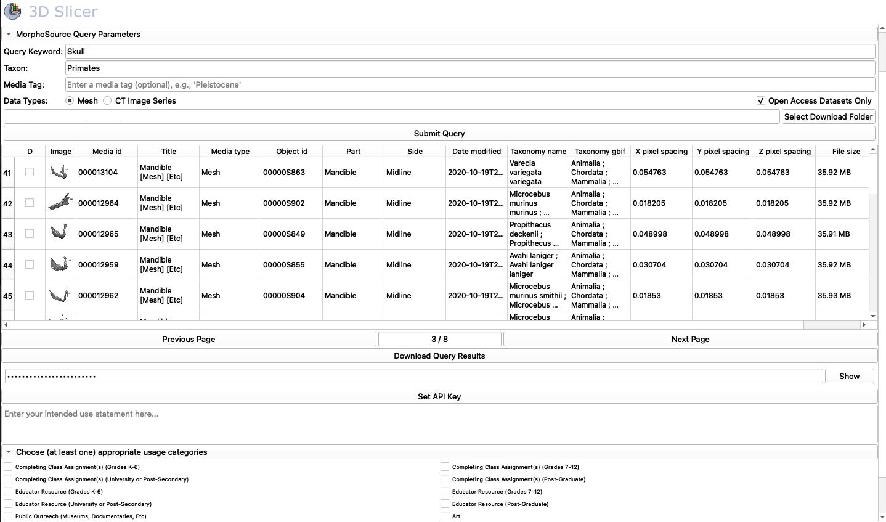

## MorphoSourceImport
This SlicerMorph specific module provides one-click access to the 3D models that are distributed publicly by MorphoSource. You can find the list of all models in public domain in this [Google Sheet by Morphosource and oVert project](https://docs.google.com/spreadsheets/d/1fhdVv2JwvUJAC4dvSgKZi2pwSl7dPGaB-ksYsB64k4U/edit#gid=0). As of summer 2020, there are over 20,000 specimens.

**NOTE: MorphoSourceImport is currently not functional due to changes MorphoSource API after 2.0 Beta is introduced in early 2021. We will update this module once MorphoSource team finalize their API changes.**

To access these specimens, you will still need an email address registered by MorphoSource. The module is fairly trivial to use:

1. Enter your username and password for your MorphoSource account (HINT. open the python console to receive confirmation about successul login). 
2. At this point only **Order** level queries are supported. Enter an order you would like to search for specimens (please use MorphoSource conventions). 
3. Enter the element you would like to search. To search for everything available, use the wild card ( * ). Note that if there are many elements, query may take very long. So start small. The maximum number returned is capped at 1,000 elements. 
4. Once the table is populated with query results, highlight the row (or rows) you would like to download, and hit **Load Selected Models**
5. Alternatively, you can highlight a single row and hit **Open Specimen Page**, which will bring the relevant page from MorphoSource as a separate web page. 
6. Specimens are automatically saved into the **Cache** folder. If you don't remember the **Cache** folder settings, review the [**SlicerMorph Preferences Tutorial**](https://github.com/SlicerMorph/Tutorials/tree/main/MorphPrefs). Alternatively, you can use SlicerMorph's `ExportAs` plugin to save downloaded modules, in different formats and to different folders. 

