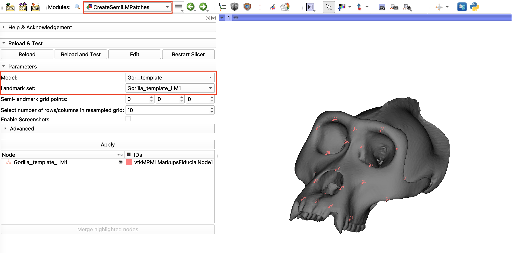
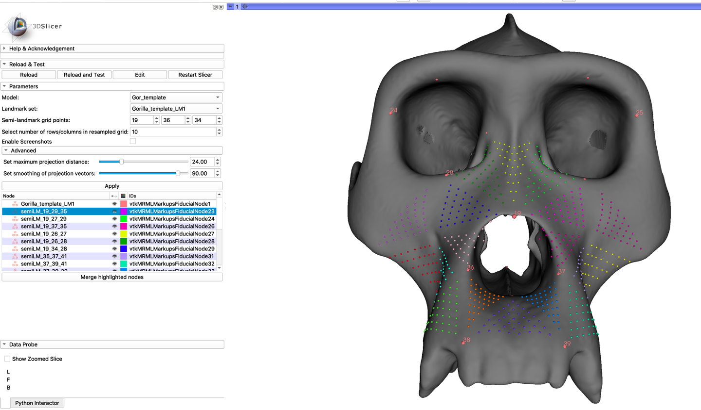
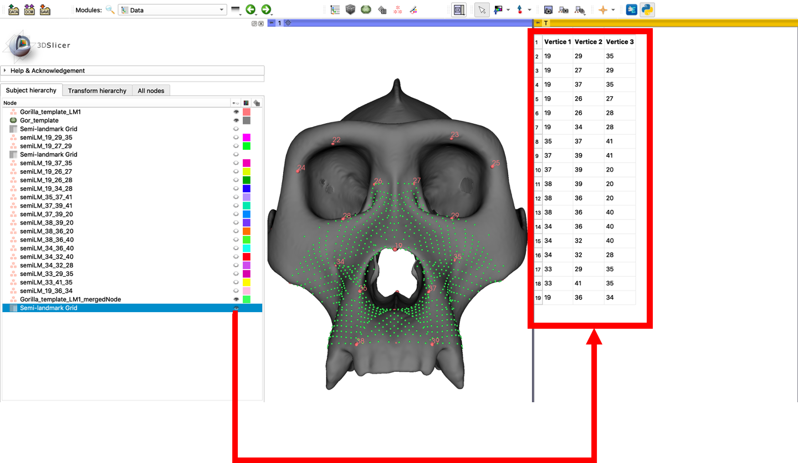

## Patch-based landmarking
This tutorial describes how to create a series of triangular patches of semi-landmarks that are then combined in a merged semilandmark node (`CreateSemiLMPatches` module) and describes how the connectivity table and merged landmarks can be applied to place semi-landmarks on new 3D models. 

To use this method, yu will need a 3D model(s) and its accompanying set of fixed landmarks. In this tutorial we use the Gorilla Skull Reference Model from the SlicerMorph tab of the `Sample Data` module (you will need the SlicerMorph extention installed to see this option in the menu).

----

### CreateSemiLMPatches
Users generate, visualize, and edit the patches of semi-landmarks by specifying triplets of fixed landmarks that form a triangle. A template triangular grid with a user-specified number of semi-landmark points is registered to the vertices of the bounding triangle using a thin-plate-spline deformation. The vertices of the triangular sampling grid are then projected to the surface of the specimen along the estimated normal vectors. After placement, the patches can be merged together into a single landamark node and a table is generated specifying the final landmark point connectivity.

1. After loading your mesh and landmark points into the scene, Go to the `CreateSemiLMPatches` module and use the selection boxes to select the loaded mesh as the model and the loaded landmarks as the active landmark set.

2. Enter the landmark numbers of three points to place the first patch. In the *Semi-landmark grid points* field (19, 29, 35 in the example below). You will see that a triangular patch is placed at this point, and a new landmark node shows up in the landmark node viewer, named by the bounding landmark points of the triangle. 
    * The *Select number of rows/columns in resampled grid* option allows useres to set the number of points that are placed in each triangle patch. This number can be adjusted for each patch, but if the grid is reconstructed using the `PlaceSemiLandmarkPatches` module, one sampling value will be used for all patches. 
    * You can edit this node using the right-click menu, or by switching to the 'Markups' module. From here, the glyph size and color can be adjusted for visibility and the landmark points can be edited.
    * The advanced parameters are settings that can be adjusted to improve the performance of the module. Most users will not need to change the default settings.
      * *Set maximum projection distance:* The maximum projection distance specifies the maximum search distance used to project a point to the surface, as a percentage of the image length. This value may need to be decreased in cases where there are multiple structures in an image and the points from one stucture are being projected to a more external surface.
      * *Set smoothing of projection vectors:* The projection vectors are estimated from the vertices of a triangular patch. Increasing the smoothing parameter of the projection vectors will larger area around the vertices. This will help improve the performance when the mesh surface may contain noise or holes.

3. Apply patches of semi-landmarks until the region of interest is covered (18 triangular patches are shown in the example below). 
    * Each node can be deleted or replaced.  

4.  In the landmark node viewer, select the nodes to be merged into the final set of semi-landmarks. Click the **Merge highlighted nodes** button.
    * Depending on the number of semi-landmarks, this step may take a few minutes.
    * A new, merged semi-landmark node is created and displayed in the landmark node viewer containing the patch landmarks and curves placed along each unique triangle edge.

5. Switch to the data browser and find the table 'Semi-landmark Grid' displayed in the 'Subject hierarchy' menu. Click the eye next to the table to view a list that specifies the landmark number at each patch vertex in the merged landmark set. This can be used to apply semi-landmarks to new images using the same patch-placement and exported as an .fcsv file. 
 

----

#### Using the CreateSemiLMPatches output
* After generating the patches and merging, save the merged semi-landmark node and the landmark connectivity table.
* The landmark connectivity table can be used to apply the same semi-landmark patches across a data set using the `PlaceSemiLandmarkPatches` module. Each image will need to have manual landmarks placed.
* The merged semi-landmarks can be projected to other images in a data set using the `ProjectSemiLM` module. Each image is required to have manual landmarks placed.
* The merged semi-landmarks can be transferred to other images in a data set using the `ALPACA` module. The images in the data set are not required to have manual landmarks for this method. 

----

### Links to Learn More:
CreateSemiLMPatches video tutorials:
1. [Creating Patches](https://www.youtube.com/watch?v=SArudRq-M4A)
2. [Applying Patches to new samples](https://www.youtube.com/watch?v=UD2tmFuaSJg)

