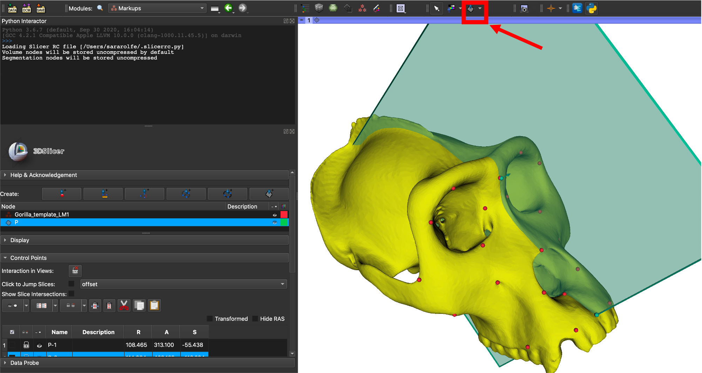
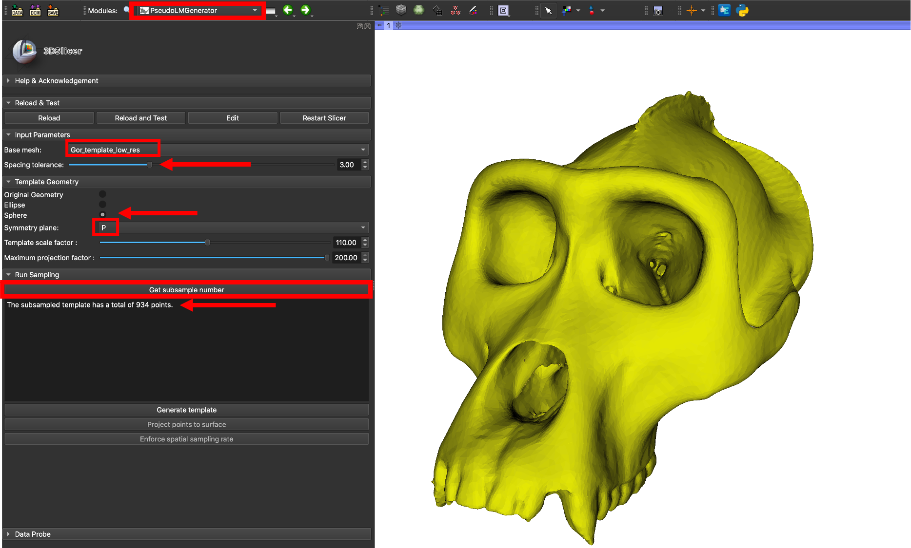
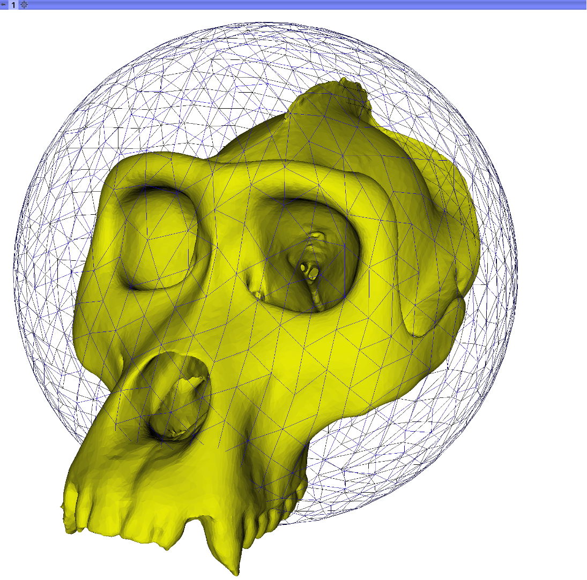
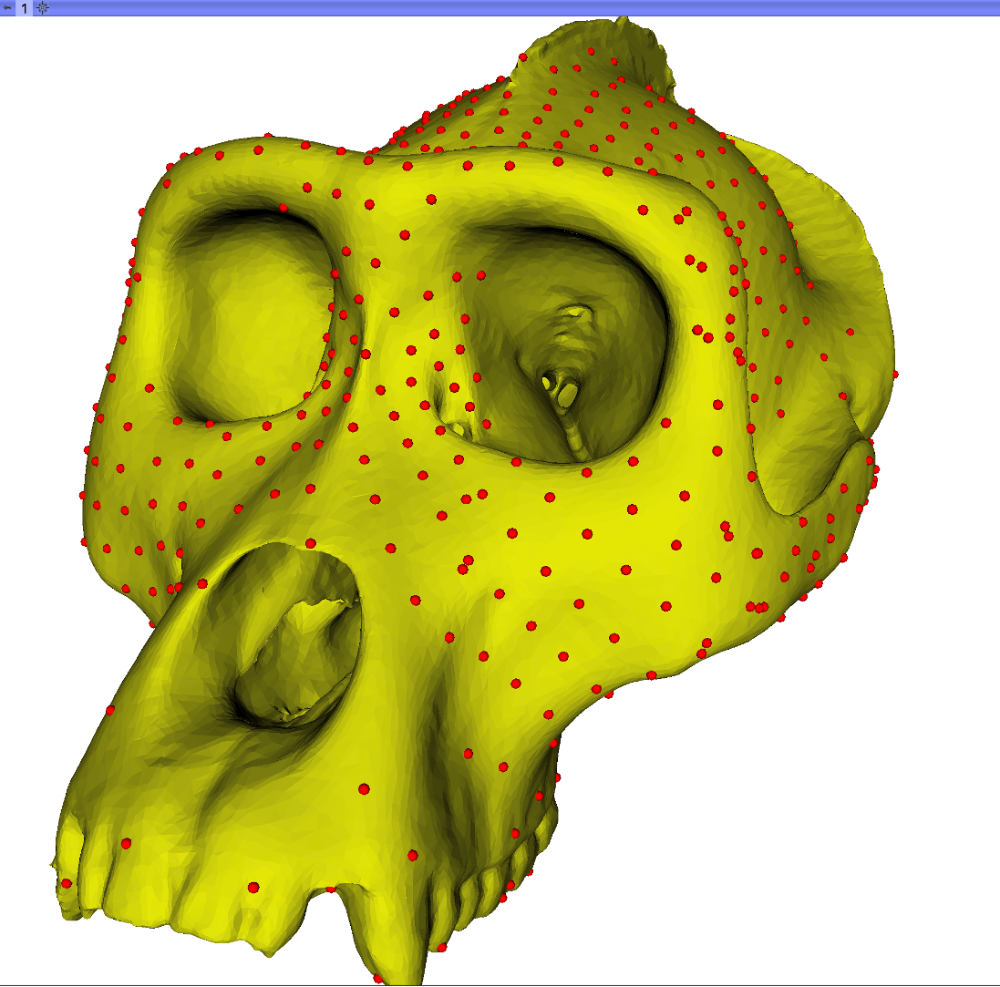
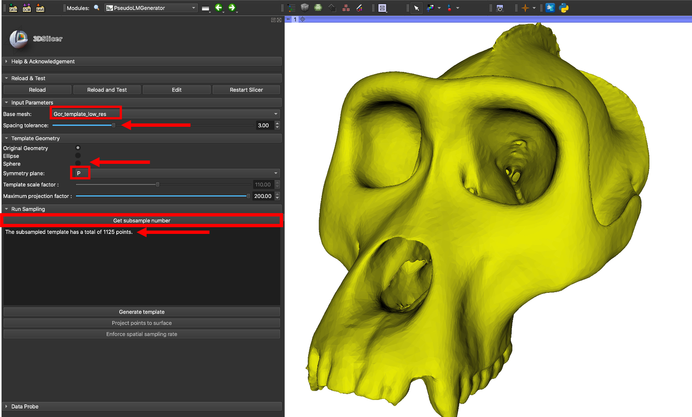
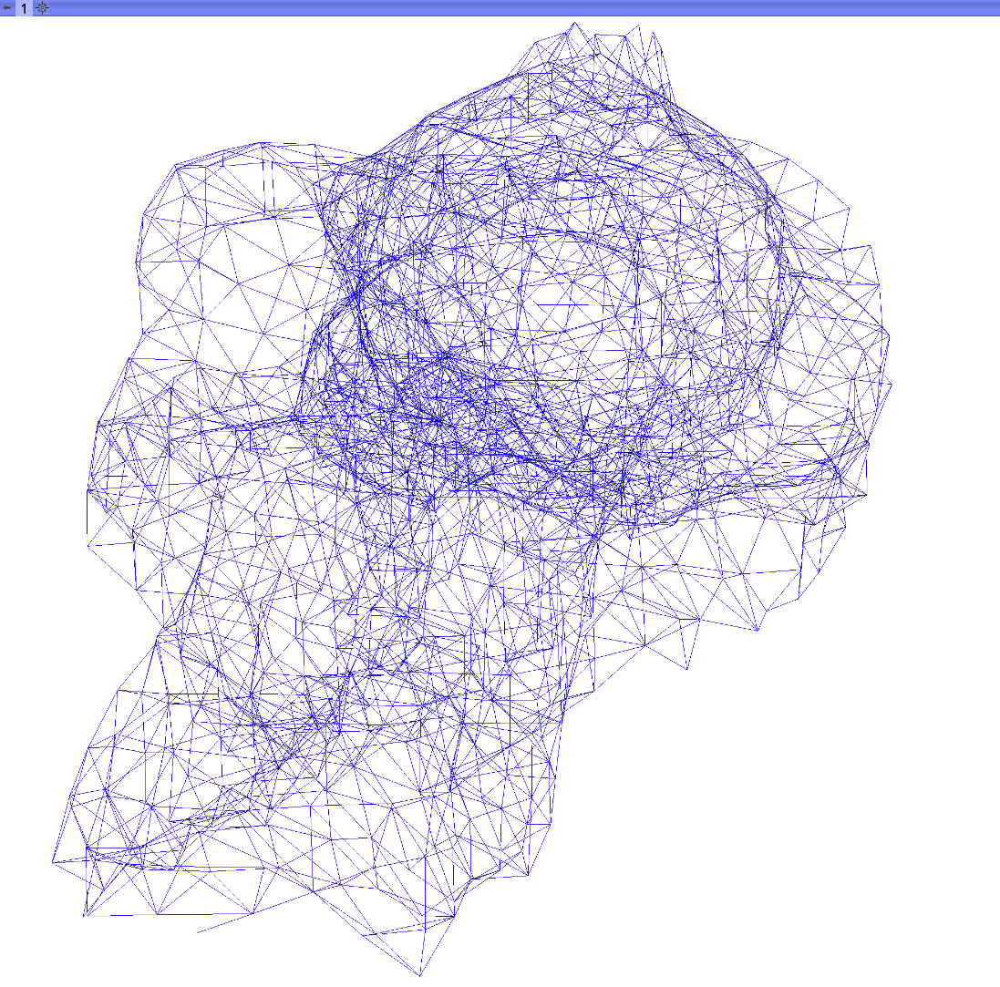
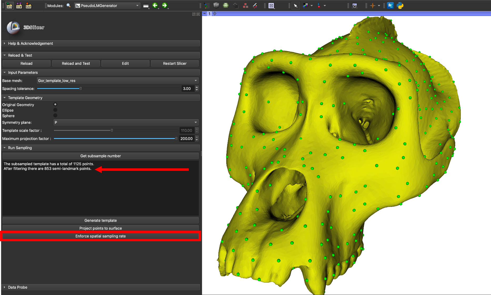
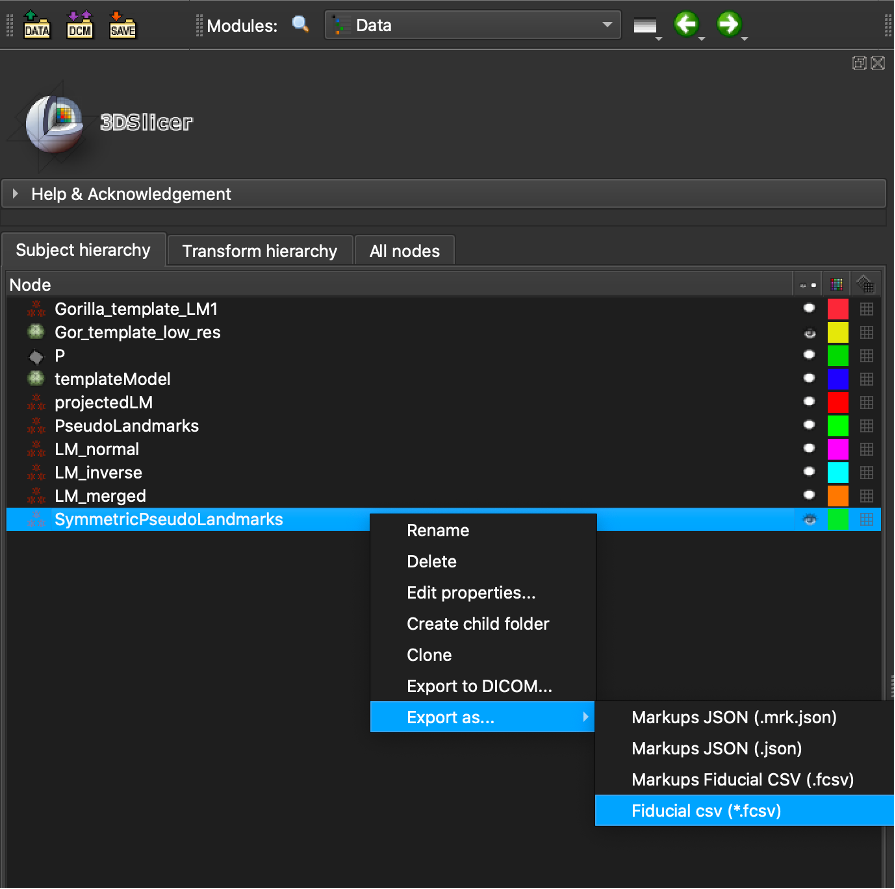

# Pseudo-Landmark Generator Tutorial

The PseudoLMGenerator module uses a sampled template to place pseudo-landmark points on the surface of a model. Here we use the term 'pseudo-landmark' to refer to points generated on a model surface automatically, without relationship to landmarks placed manually at locations of known biological homology (Type I). The module is used to create a dense landmark template that can be transferred to individual specimens, enforcing 'geometric homology' between the points on each specimen.  The landmark transfer can be done using the 'TransferSemiLM' module if each specimen has manual landmarks,  or the 'ALPACA' module when no landmarks are available.

Pseudo-landmark placement is constrained to the external surface of the model, enforcing spherical topology. Points sampled on the template are projected to the model surface along the surface normals of the template. Once the initial intersections are found with the base mesh, a second projection is done along the surface normals of the model to locate the most external model intersections. The projected points are then filtered to remove those witin the sample spacing distance, improving regularity of sampling. 

The template used to place the pseudo-landmarks can be generated from the geometry of the model or a sampled geometric shape (sphere or ellipse). If the model surface has regions of high curvature, the original geometry template will provide better sampling coverage. If the model has an irregular mesh (large or uneven cell sizes) the sphere or ellipse option can improve sampling regularity. In this tutorial we will show an example using each template style. 

The pseudo-landmark set can optionally be symmetrized. If this option is selected, the user will specify a plane of symmetry using the 'Create and place plane' tool. Four output landmark sets will be generated, containing: landmarks on the normal side of the plane, landmarks on the inverse side of the plane, midline landmarks, and the total landmark set. Individual landmark names contain an 'n' 'i', or 'm' prefix indicating their relationship to the symmetry plane. It is reccommended that this option be used with a symmetric model as the placement of the plane on a non-symmetric model is challenging and can lead to variable results.

## Sphere template
1. Download the Gorilla Skull Reference Model from the 'Sample Data'. Load the skull model (PLY) into Slicer.

2. Place a plane of symmetry on the model using the 'Create and place plane' tool. For this example, the plane was placed using three midline landmarks from the Gorilla Skull Reference Landmarks (this will be in your Cache folder and can be loaded into Slicer).

3. Navigate to the 'Spherical Sampling' module, located in the SlicerMorph Labs folder. Select the loaded gorilla skull as the base mesh. The spacing tolerence will set the spacing of the sampled points as a factor of the diagonal length of the selected image. For this example, select a spacing tolerance of 3%. 

The template geometry will determine the shape of the estimted sampling template. For this example, choose the 'Sphere' option. With the parameters of the template set, you can check the initial number of sampled points on the template that will be projected to the base mesh. This number will be greater than or equal to the final number of sampled points since the final spatial filtering step will remove some points. Change the 'Symmetry plane' option from 'None' to the name of the plane you created in step 2.

Select the 'Get subsample number' button to display the number of points on the sampling sphere in the 'Sampling Information' window. You should have a spherical template with 934 points. This step can be repeated with a different spacing tolerance if the number of points displayed is to high or low.

4. Click the 'Generate template' button to display the sphere template. The template is centered at the arithmatic center of the loaded mesh and has radius defined by the image diagonal. This default radius can be adjusted using the 'Template scale factor' slider. For this example, you can use the default scale factor, 110%.

>

5. Click the 'Project points to surface' button to project the points from the sphere to the base mesh. The first step in this process inflates or deflates the point position along the normal vector of the sphere at that point until the most external intersection with the mesh is found. The second step takes this initial point placement on the base mesh and again inflates and deflates the point position, this time along the normal vector of the base mesh to find the most external point. The projected points are displayed on the base mesh.

6. Select the 'Enforce spatial sampling rate' button to remove samples with a point-to-point distance lower than the spatial sampling rate. This improves the regularity of the sampling over the mesh surface. If the symmetry option has been selected, the final point set will be cropped with the plane selected, mirrored across, and the mirrored points will be projected to the image surface, creating a symmetric landmark set. These steps may take a couple minutes and will increase with the size of the sampled point set. The final number of points after filtering will be diplayed in the 'Sampling Information' window. There should be 793 points remaining.  The final landmark set will be displayed on the base mesh. The points have been placed over the external surface area of the mesh, but some areas of the skull with high curvature have a low sample density.

## Template from the specimen geometry
To address the low sampling rate in areas of high curvature, the sampling rate could be increased, but this will significantly increase processing time. One solution is to use a template with geometry closer to that of the specimen. 

1. As in the previous example, select the loaded gorilla skull as the base mesh and set the spacing tolerance to 3%. Select the 'Original Geometry' option for the template geometry and change the 'Symmetry plane' option from 'None' to the name of the plane you created in the first exercise. Check the number of sampled points by clicking the 'Get subsample number' button. You should see 1125 sampled points.

2. Click the 'Generate template' button. This time, you will see a template mesh that is an approximation of the gorilla skull.

3. Select the 'Project points' button, followed by the 'Enforce spatial sampling rate' button. The spatial filtering may take a few minutes. When complete, the final spherically sampled point set will be displayed on the base mesh. There should be 853 points remaining. This point set provides more complete sampling of the mesh surface, especially in areas of high curvature. 

4. The output points can be saved from the 'Data' module by right clicking the node named 'symmetricPseudoLandmarks', selecting 'Export as' and choosing the export file type as .CSV.

