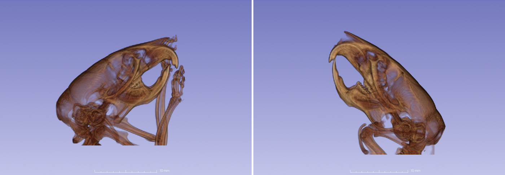
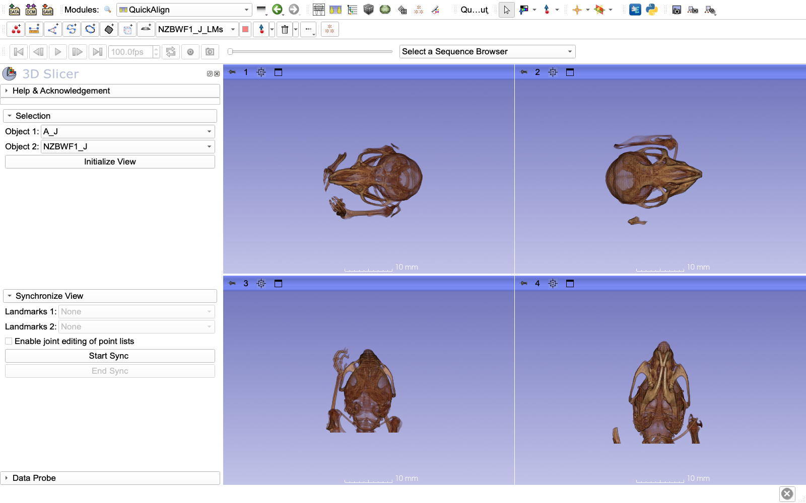
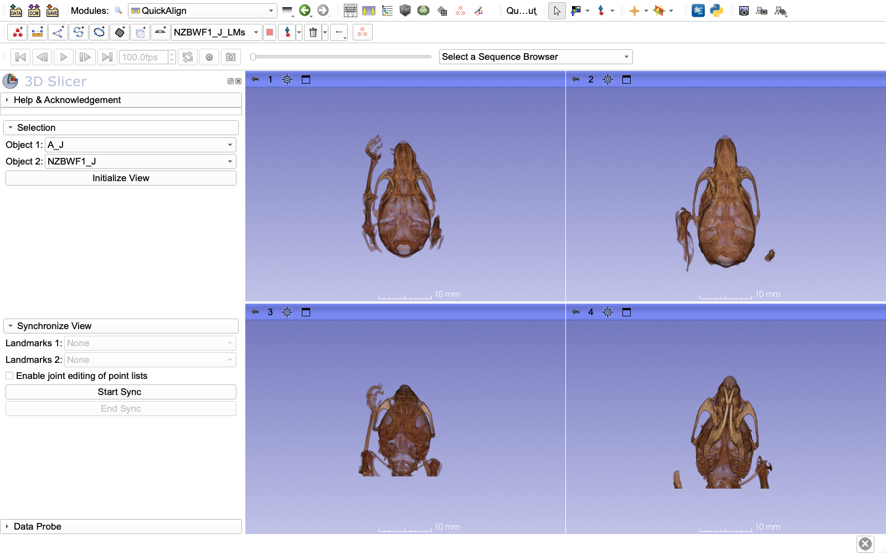
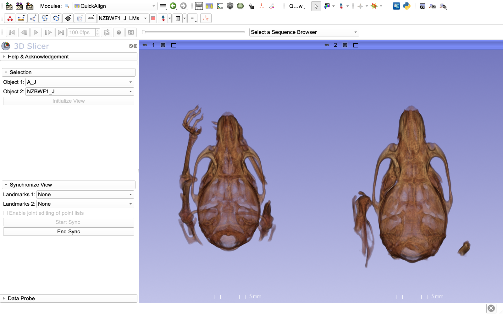
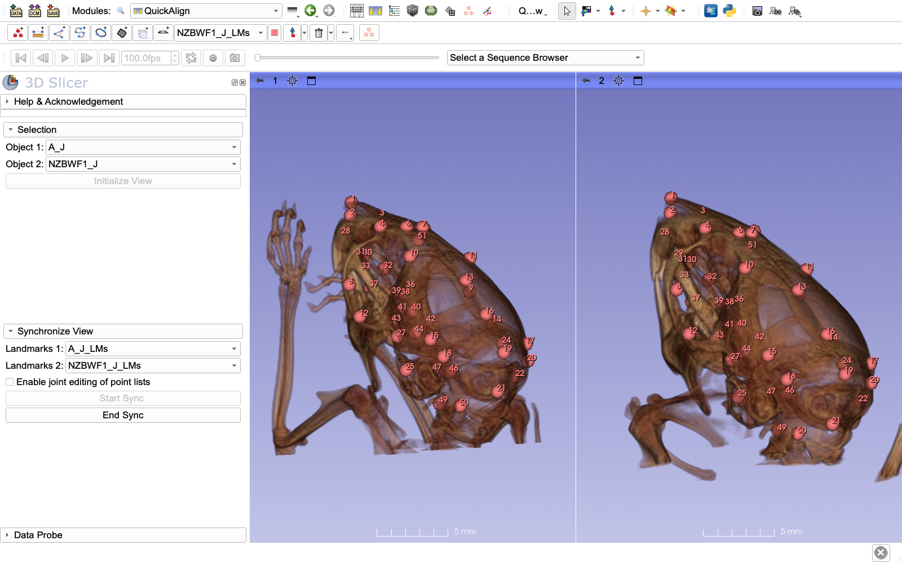
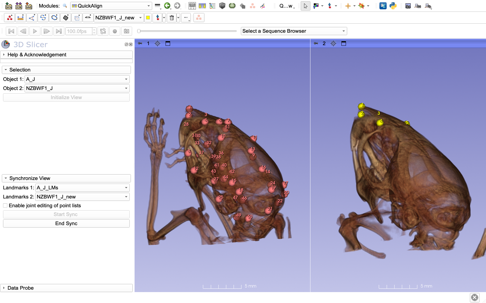

# QuickAlign: compare two specimens side by side

Specimens are rarely scanned in the same position. Comparing two of them is hard when one faces left and the other right, or one lies on its side. **QuickAlign** shows two specimens (volumes, models or landmark sets) side by side in linked 3D views. You turn each one to roughly the same anatomical orientation, and from then on the two views move together: rotate, zoom or pan one, and the other follows.

QuickAlign does not change your data. The alignment is temporary and is removed when you end the session. It is by eye, so it is only as good as your orientation of the two specimens. When you need a precise alignment, use a registration tool instead: rigid registration in [ALPACA](../ALPACA/README.md) for models, or image registration for volumes.

QuickAlign can also show a landmark set on each specimen and link them, so that selecting a landmark on one specimen selects the same landmark on the other. And you can place new landmarks on one specimen while you look at the other, already landmarked one, in the same orientation.

## Get the data

We use two micro-CT scans of mouse heads, from the inbred strains A/J and NZBWF1/J, and their landmarks (45 per specimen). They come from the [mouse CT atlas](https://github.com/muratmaga/mouse_CT_atlas) repository ([Maga et al., 2017](https://www.ncbi.nlm.nih.gov/pubmed/28656622)). The scans are small: 0.14 mm voxels, under 1 MB each.

Open the Python console (**View → Python Console**, or the Python icon in the toolbar), paste the code below, and press Enter:

```python
import SampleData
base = "https://raw.githubusercontent.com/muratmaga/mouse_CT_atlas/master/data/"
nodes = SampleData.downloadFromURL(
    uris=[base + "targets/A_J_.nii.gz", base + "targets/NZBWF1_J_.nii.gz",
          base + "target_LMs/A_J_.mrk.json", base + "target_LMs/NZBWF1_J_.mrk.json"],
    fileNames=["A_J_.nii.gz", "NZBWF1_J_.nii.gz", "A_J_.mrk.json", "NZBWF1_J_.mrk.json"],
    nodeNames=["A_J", "NZBWF1_J", "A_J_LMs", "NZBWF1_J_LMs"])
```

This loads four nodes: the volumes `A_J` and `NZBWF1_J`, and their landmark sets `A_J_LMs` and `NZBWF1_J_LMs`. The files are kept in Slicer's download cache, so running the code again loads them without downloading.

The two heads were scanned in very different positions. Seen from the same direction, A/J faces right and NZBWF1/J faces left:



## 1. Set up the views

1. Open the **QuickAlign** module (**Modules → SlicerMorph → Utilities → QuickAlign**, or search for it with the module finder, Ctrl+F or Cmd+F on macOS).
2. Set **Object 1** to `A_J` and **Object 2** to `NZBWF1_J`.
3. Click **Initialize View**.



The layout changes to four 3D views. Object 1 is shown in views 1 and 3, object 2 in views 2 and 4. Everything else in the scene is hidden for now.

- Volumes are shown with volume rendering. If a volume does not have one yet, QuickAlign creates it with the **MR-Default** preset, which works well for these scans. For a different look, set up the volume rendering in the **Volume Rendering** module before you click **Initialize View**.
- Both objects are moved to the center of the scene, and all four views are zoomed to fit the larger of the two. All views get the same zoom, so the two specimens keep their true relative size.
- Views 1 and 2 look at the scene from above, views 3 and 4 from its right side. These are directions of the scene, not of the specimens, so what you see depends on how each specimen was scanned. Here, view 4 shows NZBWF1/J from below.

## 2. Orient each specimen

In **view 1**, rotate A/J with the mouse until you look at the top (dorsal side) of the skull, with the snout pointing up. In **view 2**, do the same for NZBWF1/J.



Take your time here: QuickAlign aligns the two specimens exactly as you oriented them in views 1 and 2. Views 3 and 4 do not rotate with views 1 and 2; they keep showing each object from the same side, and only follow the zoom. Use them to check that the skull is not tilted.

Do not zoom views 1 and 2 differently unless you want to (see [Specimens of different size](#specimens-of-different-size)).

## 3. Start the sync

Click **Start Sync**. The layout changes to views 1 and 2, and NZBWF1/J is turned to match the orientation of A/J in view 1:



The two views are now linked. Rotate, zoom or pan either view, and the other follows, so you always see both specimens from the same direction. The next screenshots show both rotated together to a side view.

### Specimens of different size

When you click **Start Sync**, QuickAlign compares how far views 1 and 2 are zoomed in, and scales object 2 by that ratio. If you did not zoom them differently, nothing is scaled and the specimens keep their true relative size, as here. If the two specimens are of very different sizes, for example a mouse and a gorilla skull, zoom views 1 and 2 separately in step 2 so that each specimen fills its view. After **Start Sync**, both are shown at the size you gave them. Their relative size is then no longer true, and the scale bar in view 2 does not apply to object 2.

## 4. Add the landmarks

The landmark selectors become available once the sync is running.

1. In **Synchronize View**, set **Landmarks 1** to `A_J_LMs` and **Landmarks 2** to `NZBWF1_J_LMs`.

Each landmark set is shown in its specimen's view and moves with it:



The objects themselves cannot be selected here: if an object is a point list, it is left out of these lists.

### Select a landmark on both specimens at once

Two landmark sets with the same number of points can be linked, so that selecting or unselecting a point on one specimen does the same to the point with the same number on the other.

1. Check **Enable joint editing of point lists**.
2. In view 2, hover over a landmark until it is highlighted, right-click, and choose **Toggle select control point**. The landmark changes color from red (selected) to light blue (unselected), and so does the same landmark on A/J in view 1.

Here we unselected landmarks 10, 13 and 32 on NZBWF1/J:


Use this to check that a landmark was placed at the same anatomical location on both specimens. To select or unselect many landmarks at once, use the [MarkupEditor](../MarkupsEditor/README.md) module.

Only the selection is linked, not the positions. While joint editing is on, points cannot be added to or deleted from either set; uncheck the box to add or delete points again.

### Place new landmarks with a landmarked specimen as a guide

A common use of QuickAlign is to landmark a new specimen while you look at one that is already landmarked, in the same orientation. Suppose NZBWF1/J had no landmarks yet:

1. Leave **Enable joint editing of point lists** unchecked.
2. Create a new, empty point list: click the first button of the **Markups** toolbar (**Create new Point List**), and rename the new list (e.g. `NZBWF1_J_new`) in the **Data** module.
3. Set **Landmarks 2** to the new point list, and **Landmarks 1** to `A_J_LMs`, the guide.
4. With the new point list active in the Markups toolbar, place points on NZBWF1/J in view 2, in the same order as on A/J. Rotate either view to see the next landmark; both turn together.



The points are stored in NZBWF1/J's own coordinates. When you end the sync, they stay on the skull where you placed them. Save the point list as usual (**File → Save Data**).

## 5. End the sync

Click **End Sync**. The two objects and their landmarks go back to their original positions, the views are unlinked, and everything that QuickAlign hid is shown again. The layout stays as it is; switch back with the layout button in the toolbar.

## Landmark sets without a scan

**Object 1** and **Object 2** can also be point lists, e.g. two landmark files without their scans. Then **Enable joint editing of point lists** is checked automatically, joint editing starts when you click **Start Sync**, and the landmark selectors are not needed.

