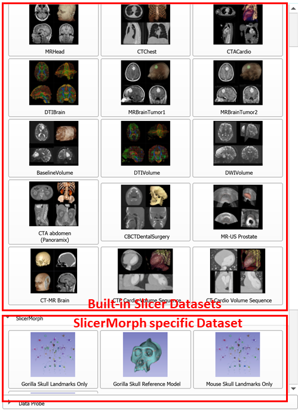

## Sample Data Module
`Sample Data` is a core Slicer module that lets you download sample datasets bundled with Slicer. Extensions, such as SlicerMorph, can register their own sample datasets with `Sample Data` module. 

Go to **File->Download Sample Data** (or search for Sample Data in Module finder) and review the displayed datasets. First 15 datasets are bundled with Slicer and second part is available only after you install the SlicerMorph extension. 

One key difference between Slicer's default sample data and SlicerMorph's ones, we do not automatically load the SlicerMorph specific sample data into active scene. The user needs to navigate to the folder where they are downloaded (and unzipped if they are archives) and manually add it to the scene, if they want to visualize the contents. 

If you do not know where to find data Slicer downloads from internet, please review the [`SlicerMorph Preferences` module tutorial](). 

Currently there are 7 datasets distributed by SlicerMorph:

1. **Gorilla Skull Landmarks only:** This archive contains fcsv (landmark) files from 23 Gorilla gorilla skulls housed at the Smithsonion Institution National Museum of Natural History. Each fcsv file contains 41 LMs and labeled with USNM specimen number. You can drag and drop these files directly into Slicer. When downloaded, this archive unzips automatically to a folder called **Gorilla_Skull_LMs** under the Slicer's download folder.    

2. **Gorilla Reference Model:** This contains a 3D model (*Gor_template_low_res.ply*) of a gorilla skull averaged from a number of male and female gorilla skulls. It also contains the associated skull LM for the specimen (*Gorilla_template_LM1.fcsv*). We use this sample for interactive visualization of shape deformation and other tutorials. When downloaded, these two files can be found directly under the Slicer's download folder.    

3. **Mouse Skull Landmarks only:** This archive contains 3D coordinates of 55 LMs from 126 C57Bl6/J laboratory mice in fcsv format. When downloaded, this archive unzips automatically to a folder called **Mouse_Skull_LMs** under the Slicer's download folder.    

4. **Mouse Reference Model:** This sample data contains a 3D model of one of the skulls from the previous dataset(*4074_skull.vtk*). It also contains the associated skull LM for the specimen (*4074_S_lm1.fcsv*). We use this sample pair for interactive visualization of shape deformation and other tutorials. When downloaded, these two files can be found directly under the Slicer's download folder.    

5. **Bruker/Skyscan microCT Recon sample:** This archive contains a PNG stack of a mouse skull scanned via Bruker/Skyscan microCT system. There are 488 PNG files and a reconstruction log file saved by Bruker Nrecon software. We use this sample data in `ImageStacks`, `SkyscanReconImport` and various other tutorials. When downloaded, this archive unzips to a folder called **sample_Skyscan_mCT_reconstruction** under the Slicer's download folder. 

6. **Auto3DM sample data:** This archive contains five 3D models of primate molars in PLY format. When downloaded, this archive unzips to a folder called **sample** under the Slicer's download folder. It is used exclusively in `auto3Dgm tutorial`.

7. **Gorilla semiLM patches: ** This archive contains pairs of fixed (anatomical) and semi-landmark files from 6 Gorilla gorilla skulls housed at the Smithsonion Institution National Museum of Natural History. Anatomical LMs are the same ones in sample data #1 (contains 41 LMs). Patches are created from Sample Data #2 using the [`CreateSemiLMPatches` module](link) and transferred to those six subjects using the [`PlaceSemiLMPatches`](link) module. When downloaded, this archive unzips to a folder called **Gorilla patch semi-landmarks** under the Slicer's download folder. Top level folder contains the template fixed and SemiLM pairs and the subfolder **sample_batch** contains the files to be used in `MergeMarkups` tutorial. 
