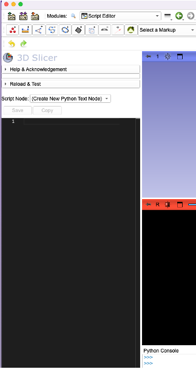
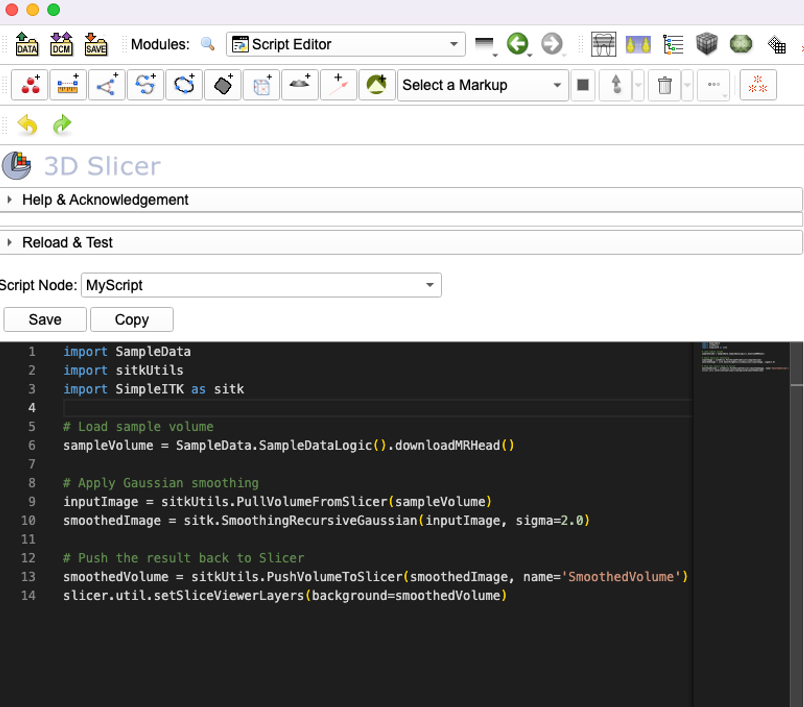
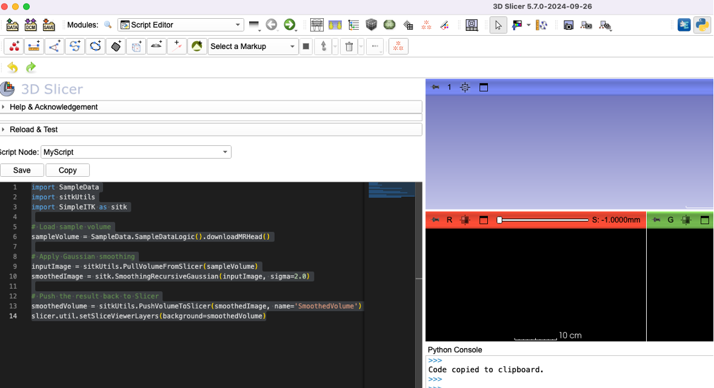
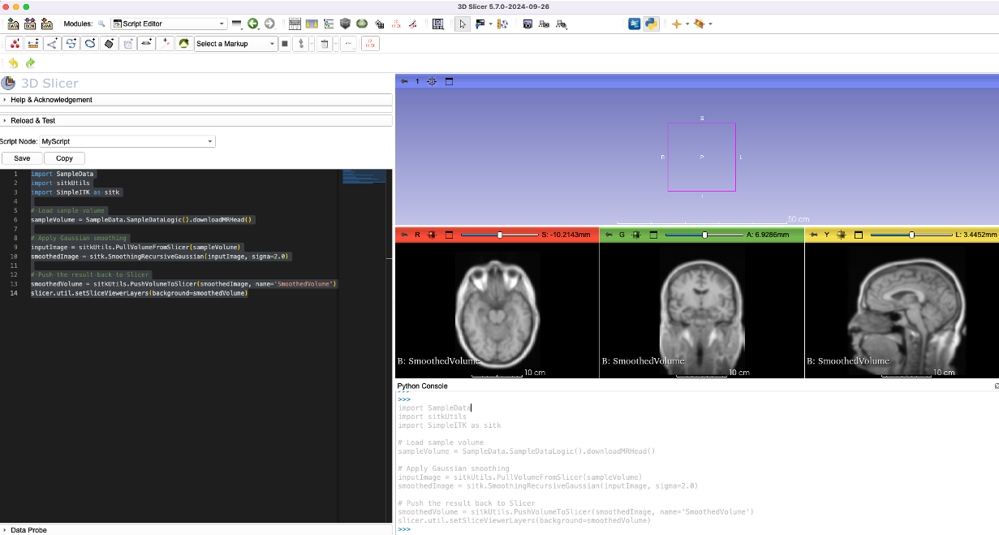
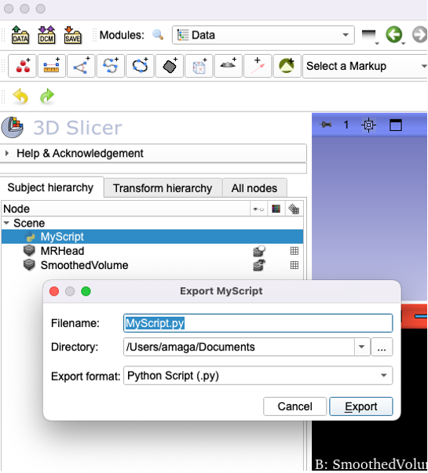

# Script Editor

## Slicer and Python
You can use the internal python console of  Slicer to:
  * Automate things (run the same things over a number of specimens)
  * Implement customization (e.g., assign certain keys as shortcuts to your favorite tools)
  * Extend the functionality of Slicer by implementing new 
  * Document the workflow for posterity
  
A good place to start with simple scripting and programming in Slicer is the [Slicer Script Repository](https://slicer.readthedocs.io/en/latest/developer_guide/script_repository.html), where you can find code examples for specific modules, as well as examples of how to put together functions to do complex tasks. From here you can copy the code and paste into the Slicer's python console directly to execute. However, to apply these examples to your data or project, you often need to change the file path, file names or variables, which can be done using any text editor. However, Python is pretty strict with the indentations and how whitespaces (space or tab) is used to nest functions or loops. In such cases it is preferable to use a coding editor, which typically offer additional benefits such as syntax highlighting or auto-completion. There are many editors out there that you can explore. The primary issue with using a separate application, you end up having a file (your python script) independent of your data in Slicer.

Slicer's `ScriptEditor` extension provides a such simple programming editor inside the Slicer. Your scripts end up objects inside the Slicer scene, much like your volumes, models or markups. You can save them with your Slicer scene or package them along with the data using MRB format of the Slicer. You can even use the `ScriptEditor` to make short texts or readmes for your future self. ScriptEditor is a separate extension. 

## Getting Started

For proper functionality, you need a Slicer revision 33050 or higher (October 2024 or later), as it relies on certain specific functionality only found in releases after that revision. After you make sure you have the right revision number, go to the extension manager, search for **ScriptEditor** and install the extension. Restart Slicer for changes to take affect. Once Slicer is restarted search for ScriptEditor (CTRL/CMD +F). When initialized first time ScriptEditor is going to install a few dependencies. So it may take a minute for your module pane to get activated.

Once the ScriptEditor is activated it should look like this:



You can switch between **dark** and **light** themes, and also adjust the font size. 

You can set the default location for the script objects to be saved via the **Save Location:** 

Go ahead and click on the **Script Node** selector and choose **Create New Text as** and then name the object as **MyScript**

Then copy and paste the following code into the editor:

```Python
import SampleData
import sitkUtils
import SimpleITK as sitk

# Load sample volume
sampleVolume = SampleData.SampleDataLogic().downloadMRHead()

# Apply Gaussian smoothing
inputImage = sitkUtils.PullVolumeFromSlicer(sampleVolume)
smoothedImage = sitk.SmoothingRecursiveGaussian(inputImage, sigma=2.0)

# Push the result back to Slicer
smoothedVolume = sitkUtils.PushVolumeToSlicer(smoothedImage, name='SmoothedVolume')
slicer.util.setSliceViewerLayers(background=smoothedVolume) 
```


You can expand the width of the editor window, by dragging the module pane to the right.  

You can highlight any section of the code by clicking the left mouse button and dragging the text, then use the right mouse click to bring the context menu, which will allow you to execute the highlighted section in the python console (CTRL+Enter). If your python console is not visible in the application window, you can make it visible by pressing `CTRL+3` (on macs `CMD+3`). 


 
When you paste the full code into the python console, it should download the MRHead sample file, and apply a smoothing filter to the image. Your Slicer window should look like this:



It is important to understand that your scripts are saved into your scene like any other object in Slicer. To save the script object to the disk, go to `Data` module, and right-click on MyScript object (it should have the Python icon to distinguish it from other text objects). Then, in the pop-up dialog box, chose the directory to be saved (it should default to the location specified in the Save Location, but double check), and set the Export format to **Python Script (.py)** from the default .txt. 




