# Introduction to Image Segmentation with 3D Slicer
Segmentation is one of the most useful things you can do with Slicer! A segmentation is an abstract representation of structures in an image. It usually contains more than one segment (usually non-overlapping) annotated with different colors in 2D and 3D.

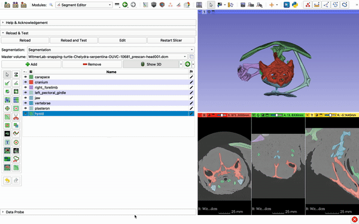

In Slicer, there two complementary modules that are used hand-in-hand for segmentation tasks.

1. `Segment Editor` is the module for creating segmentations of volumes. Segmentation (also known as contouring) delineate structures of interest. There are various manual and semiautomatic methods for generating your segmentations which we cover in the tutorial below.  
2. `Segmentations` is the module that allows you to control how the segmentations generated by `Segment Editor` are saved and exported. Some of the key functionality is to import/export segmentations into **LabelMap** or **3D Model** representations, adjust and edit display properties, copy/move segments across different segmentations, and so forth. 

------

If you are new to image segmentation, it is a good ideas to read the [official **Image Segmentation** documentation from 3D Slicer.](https://slicer.readthedocs.io/en/latest/user_guide/image_segmentation.html) Even if you have previous experience with other 3D segmentation programs, it might be good to take a minute to read the Slicer specific functionalities and how different types of data types relate to each other (see figure below).

------

### Segmentation vs. LabelMap vs. Model
A **segmentation** is a *group of segments*. Segmentations need a "Master Volume" or image to use as a reference because segments are defined based on the intensities of voxels (or pixels) of the maser volume. Segments can overlap with each other and do not need to cover every pixel/voxel in the master volume. 

A **LabelMap** is an *image* that is the same size/dimensions as the master volume, but instead of voxels/ pixels having intensity values (as they do in the master volume), LabelMaps assigns exactly one label to all voxels/pixels, the value of which is determined by the segment that a voxel/pixel belongs. Usually 0 is assigned to the background. LabelMaps are very useful for storing segmentations because they are the same size as images and usually have very few pixel values. For example, a 5-segment segmentation needs only 6 integers to encode and can be compressed efficiently. LabelMaps are also useful for some analysis methods. 

A **model** is a *surface mesh* with points and polygons (usually triangles) and a very useful representation for segments. Usually, the outer surface of a 3D segment is represented with a closed surface mesh. Models are good for visualization and some analysis methods. However, they can be quite large and cumbersome to read and write. (Side note: existing mesh formats are inefficient for I/O and they don't have "units" and "physical space" which are critical for medical applications. One needs to be very careful playing with meshes converted from volumes.)

In Slicer, you will first create a Segmentation - which can be converted to LabelMap or a model depending on your analysis needs.

# Segmentation Tutorial 
In this tutorial we will first introduce the different tools in the `Segment Editor` module by asking you to perform a segmentation on a sample dataset. Then we will explain how to export your segmentation using the `Segmentations` module.

------

### Part 1: `Segment Editor` Introduction

1. Load MRBrainTumor1 data from `Sample Data` module. In this part of the tutorial our goal is to segment the tumor. 

2. Navigate to the `Segment Editor` module through the search function or from the Core Modules shortcuts (the button in the orange square in the image below). 

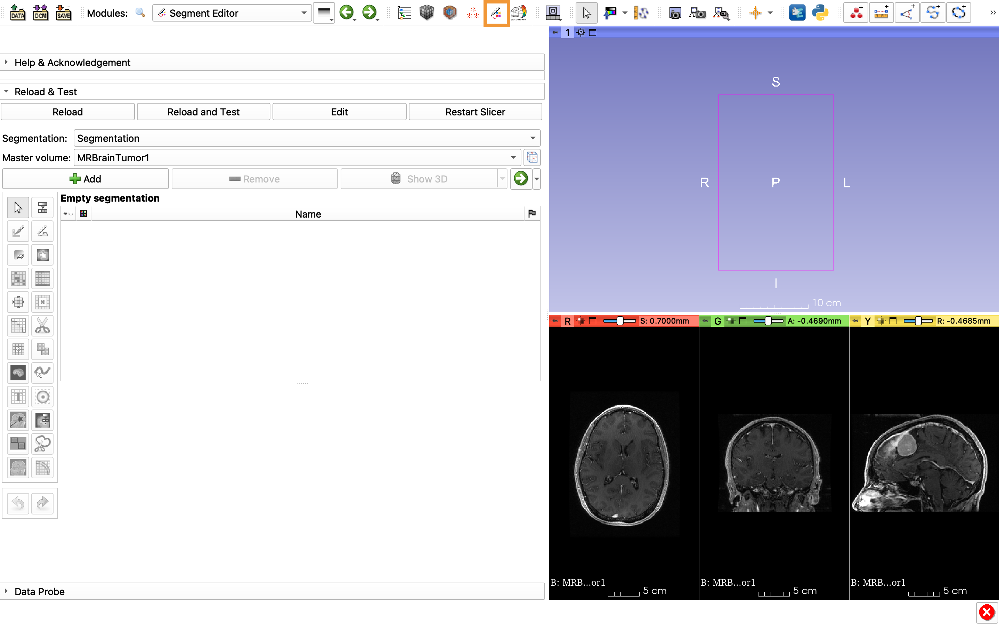

3. Name your segmentation (optional) and select your master volume, MRBrainTumor1 in this case. 

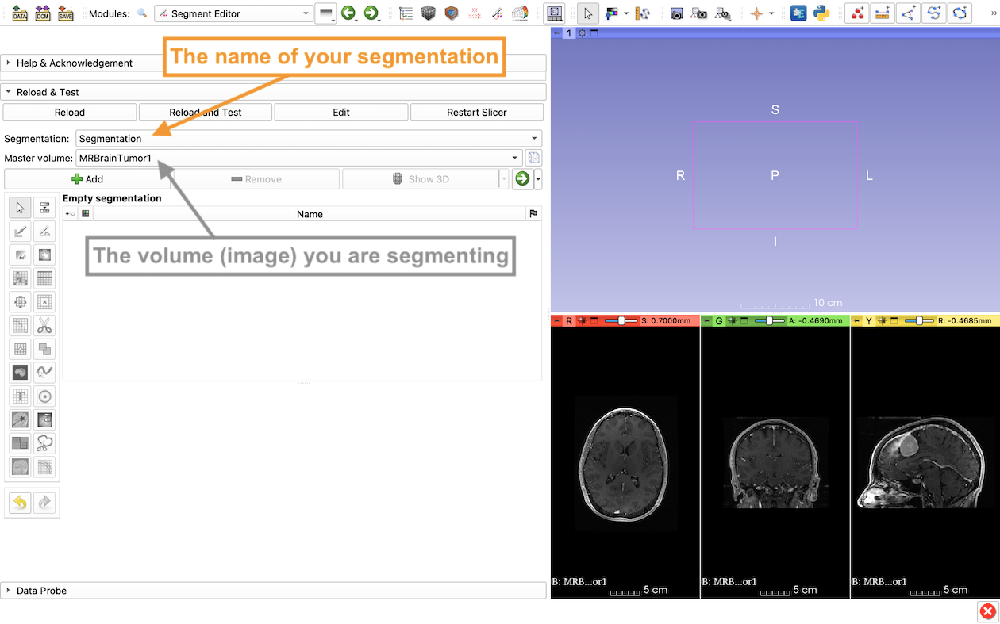

4. Add a segment by clicking the *+Add* button. Your new segment will be named *Segment_1* if it is the first segment you created and the numbers will keep increasing as you add more segments. 
  * Let's segment the tumor in Segment_1 so rename the segment properly (I've renamed mine tumor for example). You can rename the segment by double-clicking on its name. 
  * You can also change the color of the segment by double clicking on the color next to its name, it is nice to have contrasting colors for the segments so that your visualization is easy to look at. The colors do not mean anything other than your personal preference for visualizations. Slicer has many predefined colors that you can choose from, listed in the terminology popup window. Or if you want to pick your own color, double click the box to the right of *Color:* and be as creative as you want to with your color scheme! 

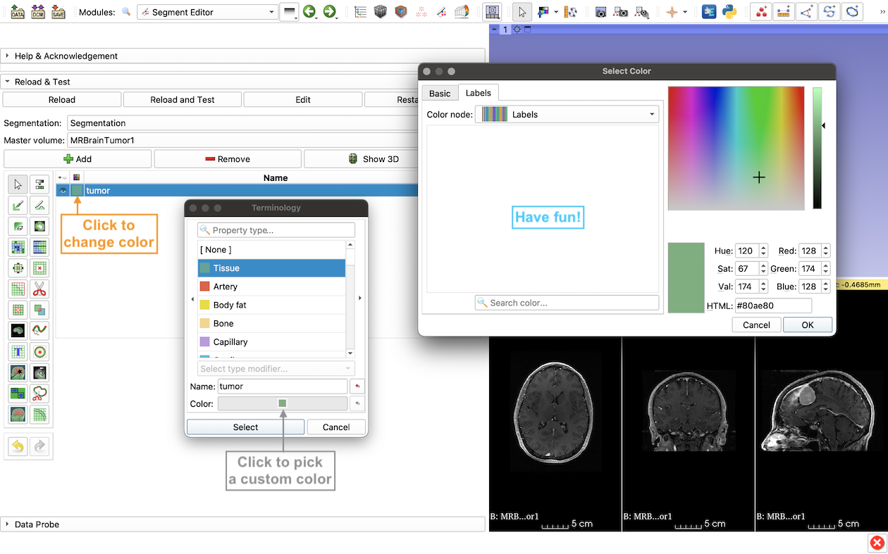

5. As soon as you add a segment, the tools (orange box in the image below) in the `Segment Editor` are enabled. Click on the paint tool icon (the yellow box in the image below).
  * Slicer gives you parameters and options for each tool (grey box in the image below). If you don't know what an option is for click the blue **Show details** text and a description for all the options will appear. 
  * Undo/Redo buttons (blue box in the image below) allow you to take back some steps but they are limited so save your segmentations frequently!

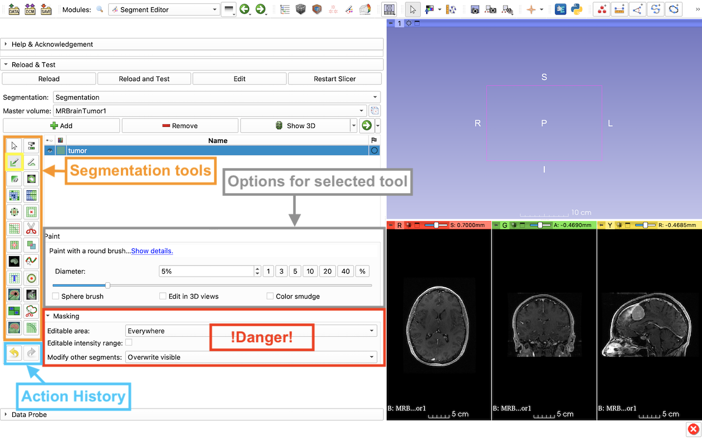

  * **Masking is important!** Hence the red danger box in the image above. Right now you have one segment but you will have more than one and if you are not careful, you can erase or cut or overwrite other segments unintentionally. Set these options carefully EACH TIME before you apply an effect /tool. 
    * **Editable Area** You can use this option to select what parts of the volume you want to be able to edit. One way this is useful is splitting a single segment into 2 different segments. Say for example you wanted to segment the mandible out of a skull segmentation that you've already created. If you set the editable area to your skull segment (instead of the defauth *Everywhere*) and then use whatever tool you needed to reclassify the mandible from the skull segment to the new mandible segment. 
    * **Editable intensity range** This is basically a shortcut to use the threshold tool for masking as explained above. You can set what intensities you want to edit, and only those within the set range will be editable. 
    * **Modify other segments** This is the dangerous one! You have 3 options: 
      1.  Overwrite all: The new segment can overwrite the others if it overlaps with them. In the image below, the yellow segment overwrote the green segment. 
      2.  Allow overlap: None of the other segments are overwritten in the image below the brown segment is overlapping with the green and yellow segments. * If you're not sure which option to use for the *Modify other segments* option, the *Allow overlap* is the safest option. 
      3.  Overwrite visible: I made the green and yellow segments invisible by clicking the eye buttons next to each segment, then painted with the blue segment, and it overwrote the brown segment. But when I turned the visibility of the green and yellow segments back on, they were overlapping with the blue segment and not overwritten. 
    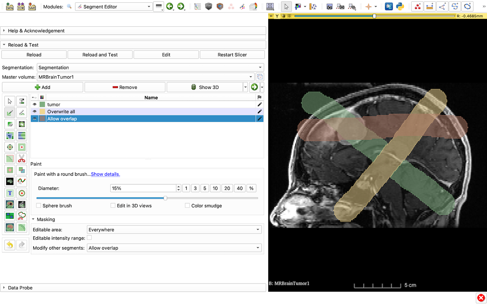
    
    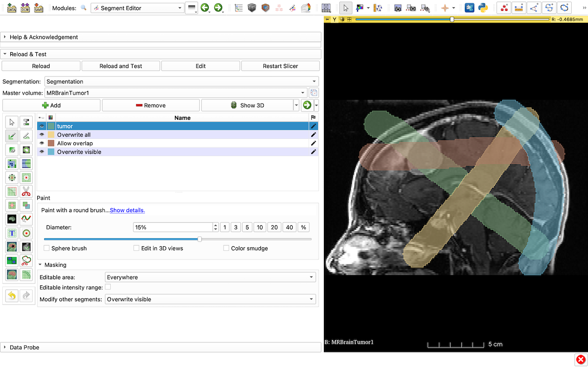 
    
  
------

### Part 2: Exploring `Segment Editor` Tools
We won't cover every tool in detail, but here are a few you should spend some time playing with: 
  
1. **Paint/Erase** are very useful as a starting point for some of the semi-automated methods. It is literally painting over pixels (or voxels). The important thing is to adjust the diameter and select between the sphere and circle brushes.
  * Try using the pait tool without changing anything: simply paint over a slice in any of the red/yellow/green slice views. Then, move between slices (mouse wheel on any of the red/yellow/green views or use the slider at the top of them). Then, change to a sphere brush and try again. When you use a sphere brush, you are painting/erasing in 3D. Note the spherical or disk-shaped brush in 3D view when you are painting in slice view. 
  
  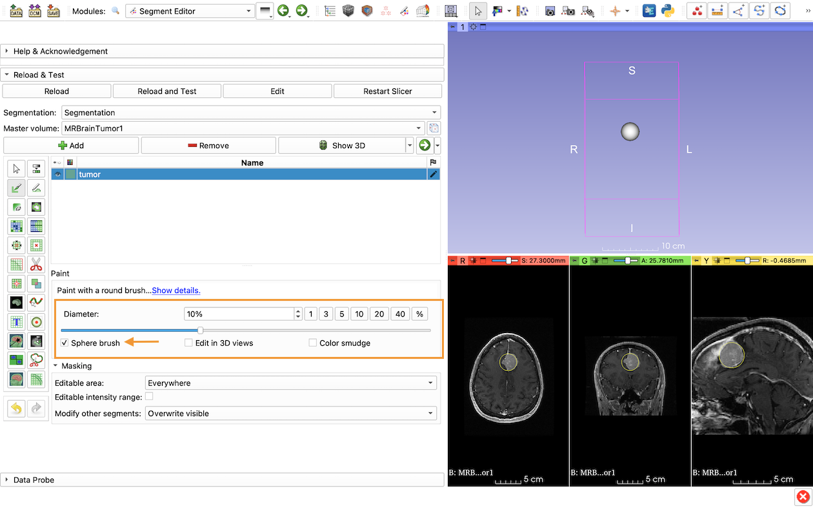
  
  * Click on the "Show 3D" button at the top. This creates a surface model visualization of your segmentation. 
  * Although it is possible to paint/erase in 3D, it will slow you down considerably because the 3D rendering needs to be updated as you edit it, and it is computationally expensive to do so. So, I recommend using it sparingly to check your segmentation or for limited operations (like the Scissors tool we'll play with in a minute).
  
  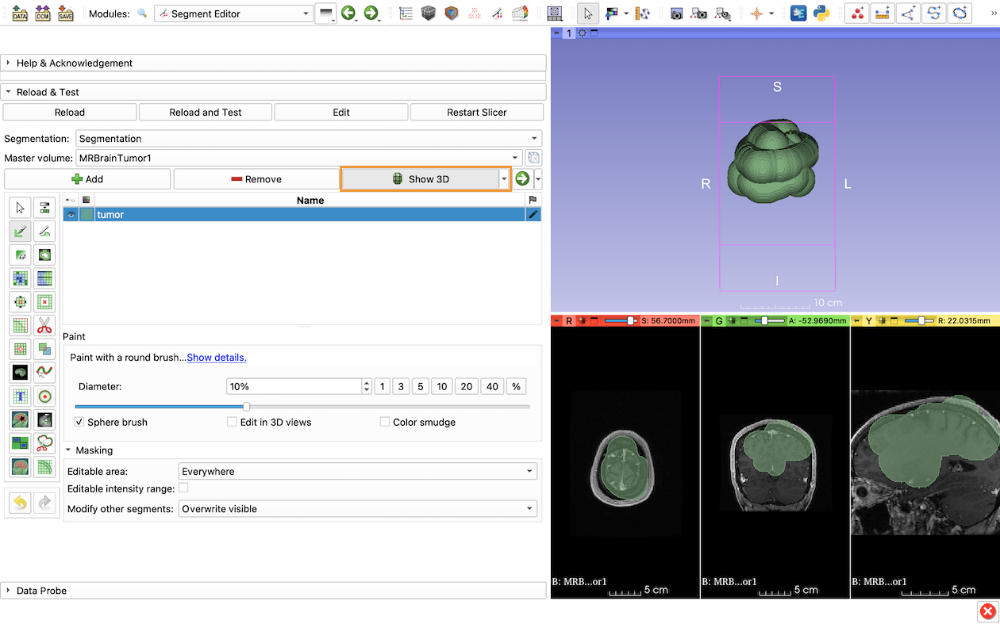
    
2. **Fill Between Slices** is a useful effect you can use in combination with other effects that work on one slice at a time. If you found that the *Paint*, *Level tracing* or *Grow from seeds* effects work on your segmentation task, you may want to use them to segment a 3D area of interest slice by slice but it may take a long time to do so. Don't despair! Fill Between Slices effect can cut down your work considerably. Instead of segmenting each slice, you only need to segment a couple and let this effect *Fill Between Slices*. 
  * Start with any tool you like (Paint, Level tracing, Grow from seeds) and segment the tumor on two axial slices that are not adjacent but also not too far apart. *Note: I've switched from the conventional view to the Four-up view here to make it easier to view the segmentation in the three slice windows.*
  
  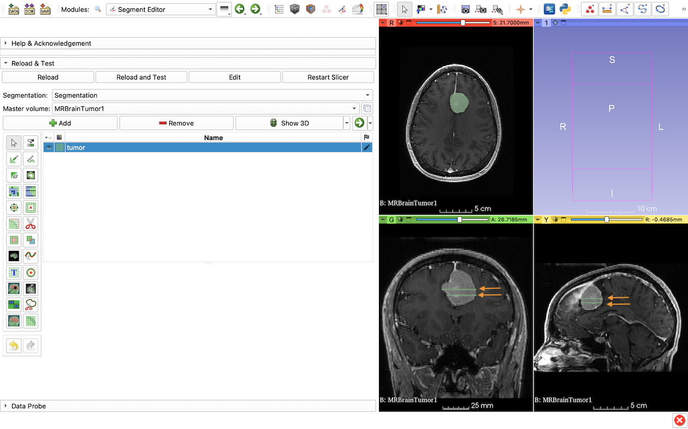 
  
  * Go to Fill between slices effect and click "Initialize". This effect *interpolates* between the slices in the selected segment (in our case Tumor segment) and fills between them. The borders of the filled 3D shape does not follow the intensity of the image, in other words, it is not smart. It shows you a preview of the filled segment in a more transparent color which you can adjust using the slider between inputs and results. 
   
   

   
   

  
  * Until you click *Apply* button, you can modify the inputs (i.e. slices you painted) and if the Auto-update check box is checked, the effect will update the filled region in the background. Lets keep painting slices. Notice how the proposed segmentation in more transparent green color updates each time you paint a new slice. Once you are finished, go back to Fill between slices and click apply which overwrites your segment (Tumor) with the proposed one.
  
   

   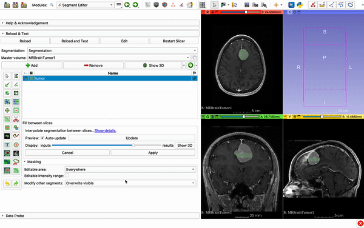
   

3. **Threshold** is one of my favorite tools to begin any segmentation. It creates segments based on an intensity range. In most modalities, the intensities of certain anatomical structures are known. It is also interactive, so you can play with the range until you found a working set. There are also automatic threshold methods that find the min/max values based on intensity histograms.
  * Click on Threshold and find a good range that works for the tumor in the image (orange arrows in the image below). Note how segmentation overlay on slices flashes while you change the range. 
  * **Automatic threshold** offers a few algorithms for selecting minimum and maximum intensities for the whole volume. Most algorithms find a cutoff point, and you can use it either as a minimum or a maximum for the threshold range by changing the option from the drop-down menu (grey box in the image below).
  
  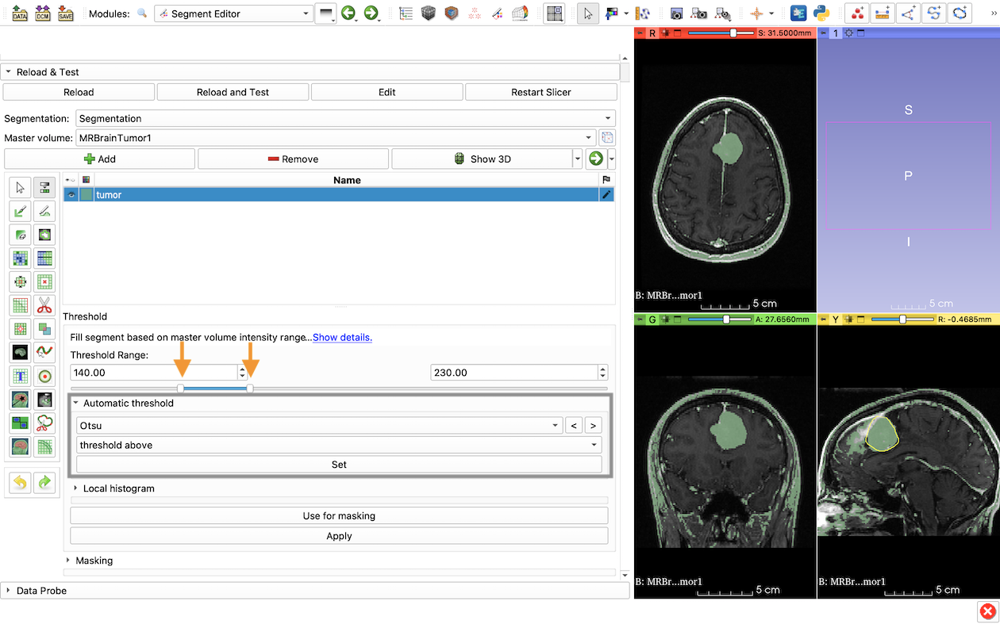
  
  * **Local histogram** shows you the intensity histogram of a selected image region and lets you select an intensity range on the histogram. This is useful when you want to select intensities based on a region, instead of the whole image as the automatic threshold does. By constraining the region, you can make sure the area of interest will end up being a a larger peak compared to the whole image histogram. You can use a box, a circle, a line or a free-shaped region (draw) to select a region on slice views. For example, you can use Draw tool to select the tumor region. The histogram will have several peaks, but since the tumor looks brighter, we can assume that the peak on the higher intensity range corresponds to tumor. The automatic thresholding algorithm is now applied to this region and range is updated. Alternatively, you can select the intensity range directly on the histogram.
  
  

4. **Local Threshold** adds more control to Threshold effect by allowing to select a region, visualizing the intensity histogram, using the histogram to pick the range of intensities for thresholding and adding "candidate" regions by Ctrl+clicking on the image. See [this thread](https://discourse.slicer.org/t/new-segment-editor-effect-local-threshold/9233) and [youtube video](https://youtu.be/cevlMLyhfK8) from Perk Labs introducing the effect.

5. **Islands**: Sometimes there are more than one structure in the same intensity range, if they are not "connected", it is easy to separate them. An island (connected component) is a group of pixels/voxels with the same label and that are "connected". Let's explore the options:
  * Keep largest island: removes all islands except the largest (defined as number of pixels/voxels) connected component.
  * Remove small islands: removes smaller islands (smaller than the "minimum size") and still ends up with one segment that can be multiple islands.
  * Split islands to segments: creates a new segment for each island that is larger than the "minimum size". This is useful if you have multiple islands you are interested in and want to decide on island-by-island. This creates a new segment for each island created.
  * Keep/remove selected island: let's you click on the part of the segmentation you want to keep. Keeps the island that includes the pixel you clicked, and removes rest of the islands from the segment. 
  * I am going to use "Keep selected island" and click on the tumor. 
  
  
  
  * Now I can visualize my island by clicking Show 3D and decide if I want to "Undo" or not. I have a fair bit of not-tumor in my island, but we will use the scissors tool to remove these in the next step. 
  
  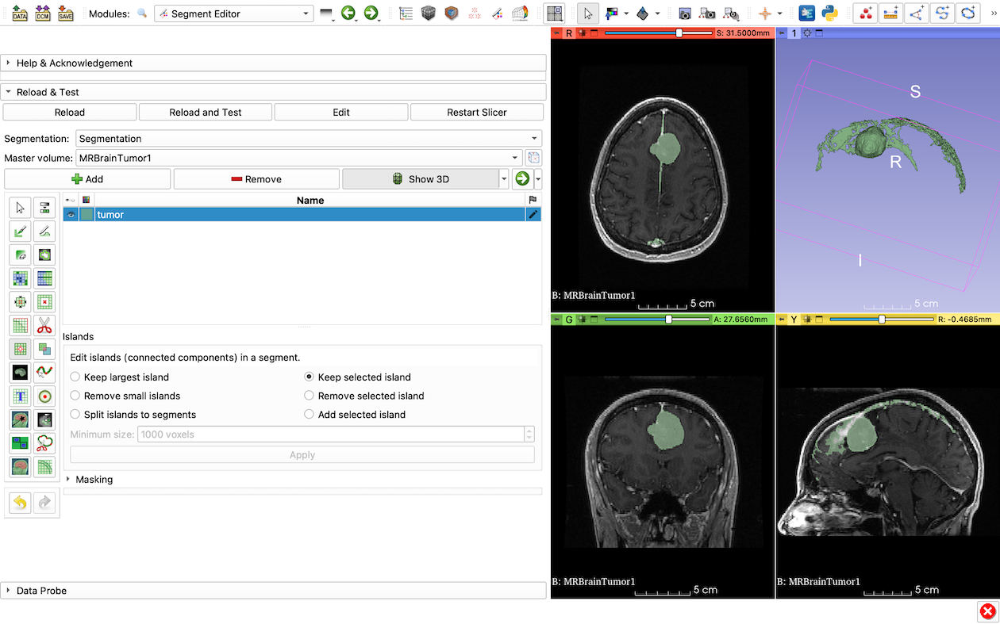

6. **Scissors** Now I want to clean the extra voxels from my segment, but I don't want to do that using eraser slice-by-slice. So scissors gives us more flexibility on what to remove. The idea is to select a region in any size and different forms and remove it. It has different options: 
   * Operation: Remove or keep or fill the area selected.
   * Shape: Shape of the tool that you use to make your selections.
   * Slice cut: You can remove/keep/fill regions in an unlimited "depth", in positive direction or negative direction. 
      * This needs a bit of explanation. In slice views, the axes are pre-determined, but in the 3D view, the 3rd unseen dimension (imagine the direction from the screen towards your face and towards behind the screen) is whatever orientation your rendering is. So when you select "Unlimited" in slice cut option, it creates a region in unlimited size in this 3rd dimension. If you are cutting in 3D view, it will remove/keep everything inside the region you draw, in front of it, and behind it. Positive and negative options divide this space into 2 in slice views, positive being the superior, right and anterior directions. Symmetric removes or keeps a region with the size you give (in physical coordinates not slices) around the slice you are operating on. It is easier to see the effect when you try the different options yourself. In the image below I used the scissors tool to clear away the non-tumor parts of my segmentation. 
   
   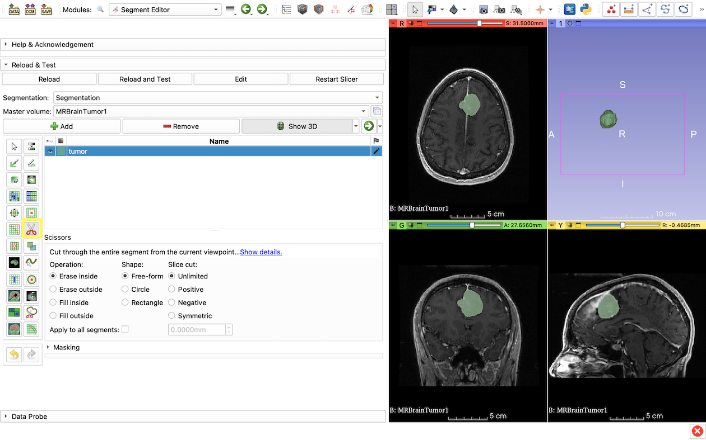

7. **Margin** tool lets you grow or shrink your segment with given margin size (in physical space not in slices). Remember your images may not have isotropic dimensions (in most clinical CTs axial slices tend to be thicker, 0.6mm or 1.25mm or 2.5mm, compared with sagittal and coronal slices,  0.35mm) so it can only go as small as the voxel size of your image. If you are working anisotropic data, consider using the `Crop Volume` module's isotropic voxel option to convert them to isotropic spacing. 
  * Extra tip: You can use the margin tool to smooth out your segmentation by growing and shrinking by the same (relatively small) margin size. 
 
8. **Hollow** tool lets you create a *hollow* segment with the thickness specified in the options and using the segment boundary as inside/outside or median border of the new segment.
 
 
 
9. **Wrap Solidify** tool creates a solid segment from the inner or outer surfaces of a solid object. Here, we will use it to fill out the large tumor cavity left by the Hollow tool. We will opt to create a new segment from it, instead of overwriting our previous segment. 
  
  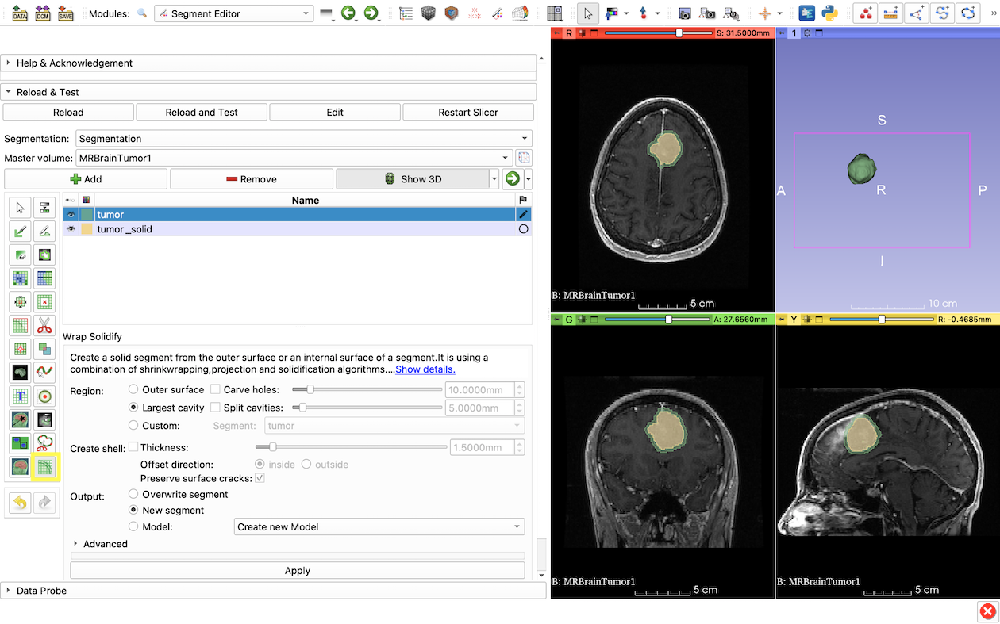
  
10. **Logical operations** tool lets you copy a segment from one segmentation to a new segmentation, add/ subtract segments together/apart (useful if Islands split your segment into two), take the intersection of two segments, invert a segment, fill (the segment will contain the whole image) or clear (the segment will be empty) a segment. In the image below I am using the *Add* operation to add the *tumor_solid* segment created with the Wrap Solidify tool back to the tumor segment. 

  

11. **Smoothing** tool applies binary smoothing to the segment and smooths the borders. There are different options (and a few binary operations actually) here. Click on "Show more" to read about them. 
  * The most commonly used smoothing filters are Gaussian and Median filters. 
  * Closing and Opening in the *Smoothing method* drop down menu have interesting effects, such as removing parts sticking out of your segment and filling holes. The size of parts to be removed and holes to be filled depends on the kernel size option of your tool. 

 12. **Mask volume** tool lets you use a segmentation or LabelMap to mask raw images and remove unnecessary objects for clean up. In the image below I've used ti to remove everything that wasn't part of my tumor segmentation. 

  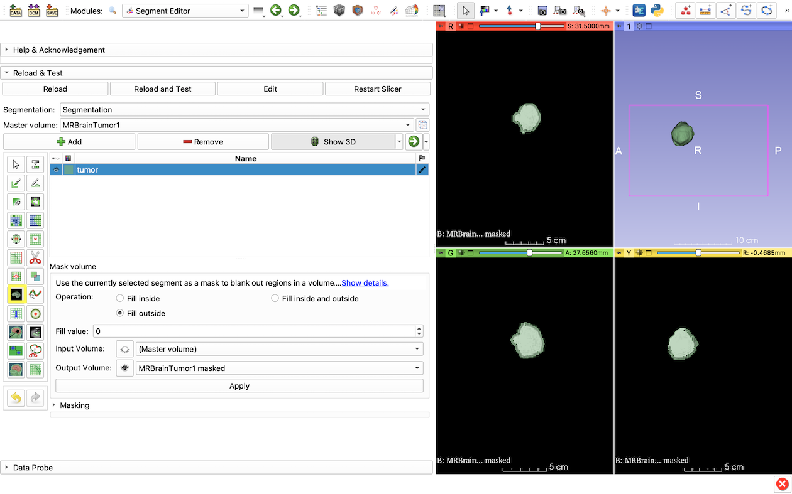  

13. **Grow from seeds** is similar to the *Fill Between Slices* tool, but goes a little farther than just filling between slicer. Instead the "seeds" will grow unitl they hit another seed or a particular intensity boarder. For this last tool, I'm switching to a different volume from the in the `Sample Data` module, the *CBCTDentalSurgery* volume. 

  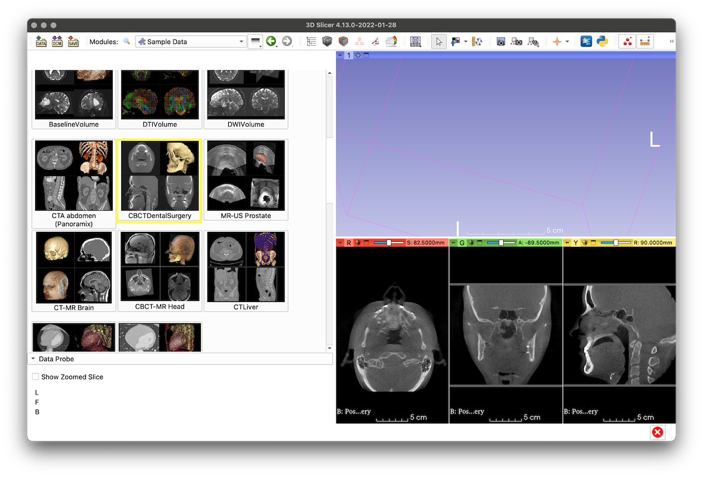
  
  * In the `Segment Editor` module I made 4 empty segments, then pressed the maximize button on the red slice (orange arrow in the image below)
  
  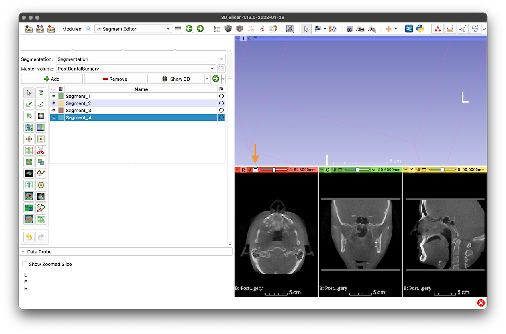
  
  * Next I selected the paint tool, but before I started paining I changed the masking options by switching the *Modify other segments* option to *Overwrite visible* and checking the *Editable intensity range* box. This will let us only paint voxels with the intensity values that exist in the teeth we are trying to segment. 
  
  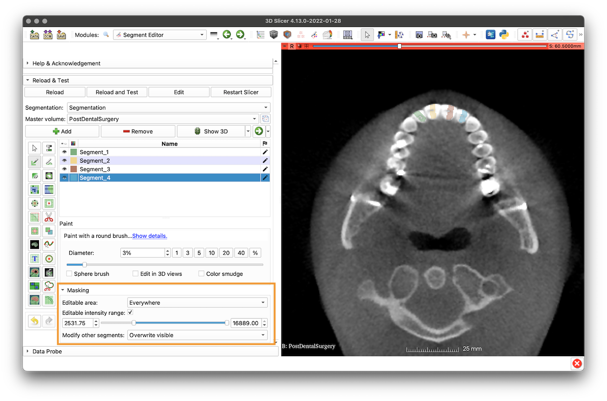
  
  * Now, just like we did in grow from seeds I have painted a slash every few slices (5 total slices in this example) on on each of the 4 teeth. The image below shows where I've painted in the 4 different viewing windows. 
  
  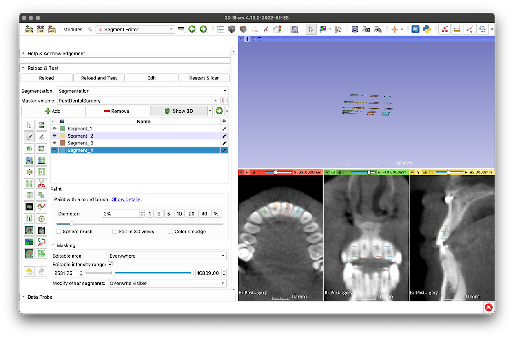
  
  * Now we can switch to the **Grow from seeds** tool. Hit the *Initialize* button (orange box in the image below), mine says update because I've already hit the button to initialize. To see the full results, move the display slicer all the way to the right and hit the *Show 3D* button. Mine isn't perfect but it's done a decent job with minimal imputs. I can use the display slider to go back to my input display and keep updating with the paint tool until I get a better segmentation. 
  
  

------

#### Memory usage considerations when segmenting

During segmentation memory consumption may increase considerably (anywhere from 6-15X depending on the segmentation effect being used). This can result in out-of-memory problems when large datasets are segmented on computers with insufficient physical memory (RAM). 

The simplest solution is to increase the virtual memory setting of the computer to very high value. This will make things work, but since virtual memory is slow compared to physical one, it will result in performance degradation.

In cases where you have an articulated specimen (e.g., a full fish skeleton), but you only want to segment cranial bones, then as oppose to using the full volume consider subsetting (or cropping) your volume. You can first use the `CropVolume` module (without interpolation) to extract the subset of the volume that contains the region you would like to segment. You can then segment the structures that you are interested using this cropped volume as the master volume. Using a cropped volume like this will reduce the memory burden of global operations such as threshold or island tools considerably. And because Slicer preserves the geometry of these individual segments, you can still overlay them correctly with the full volume if you need to. This can also be accomplished at the time of data import using the `ImageStacks` module. 

If you have to use the entire volume (i.e., crop volume as described above is not option) you can also choose to modify the segmentation geometry (orange square in figure below). By default Slicer uses the image spacing of the master volume as the segmentation resolution. By using the geometry settings **Oversampling** option you can increase or decrease this segmentation resolution without actually modifying the original volume. Note that because this is an oversampling factors, higher numbers mean higher resolution (in contrast to the `CropVolume` module). If you choose to use an oversampling of 0.5, you will reduce the data volume of your segmentation by a factor of 8. Likewise, if you choose oversampling as 2.00, you will increase the data volume of your segmentation by factor of 8. While it increases the memory consumption, oversampling will make segmenting thin structures (e.g., orbital walls, or flat bones) easier. It will also reduce the chance of these structures disappearing during smoothing or margin operations. However, be very careful using this on large datasets, since it will tremendously increase the memory consumption.   

Also, if you are working with datasets that have anisotropic voxel sizes (e.g., Z plane is lower resolution than XY planes), consider enabling the isotropic spacing option. 

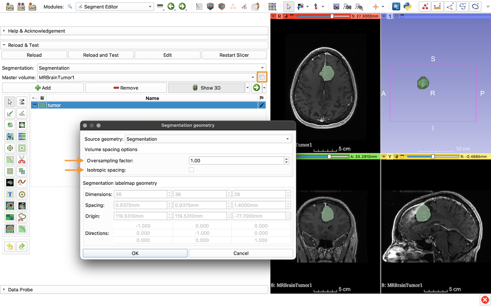

------

### Part 3: Using the `Segmentations` module

The `Segmentations` module goes hand-in-hand with the `Segment Editor` module. You can even easily switch to it by clicking on green arro button on top of the ``Segment Editor`` module (in the orange box in the image below). 

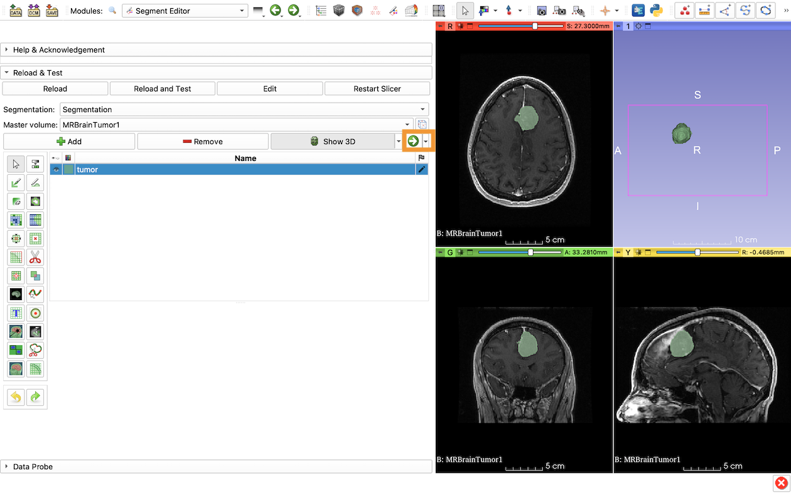

#### `Segmentations` module panel descriptions:
  * The top **Name** panel in the `Segmentattions` module lists all segments in your segmentation and lets you change the visibility, opacity, and color of each of the segments individually.
  * The **Display** panel controls the display properties for ALL segments at once. 
  * The **Copy/move segments** panel allows you to copy or move the segments in your segmentation to a new segmentation. 
  * The **Export/import models and labelmaps** panel exports your segments to a model or LabelMap WITHIN SLICER. You can export any segments or all segments as LabelMaps or Models here. If you are exporting a LabelMap, it may be important to select your reference volume (under the *Advanced* section of this panel), since the new LabelMap is actually a volume/image that needs a physical space (Origin, Spacing, Dimensions etc.). If you do not select a reference volume, the segmentation will be exported to smallest possible volume/image and you may not be able to easily use it as a mask with your original image. 
  * The **Export to files** panel exports all segments or all visible segments directly to a model or LabelMap file instead of to a Slicer node. 
  
------
  
#### LabelMaps
Let's export our segmentation as a LabelMap. Now our LabelMap is a speacial volume in the scene, check it out in ``Data`` module. You can save it as an image file (NIFTI or NRRD recommended). 

Let's go and check volume properties in `Volumes` module. Our image and LabelMap should have same dimensions and spacing, same physical space, but the actual values of voxels for the LabelMap should be 0 and 1. 

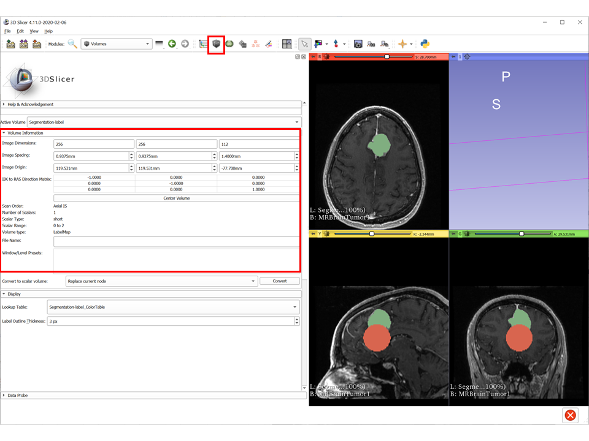

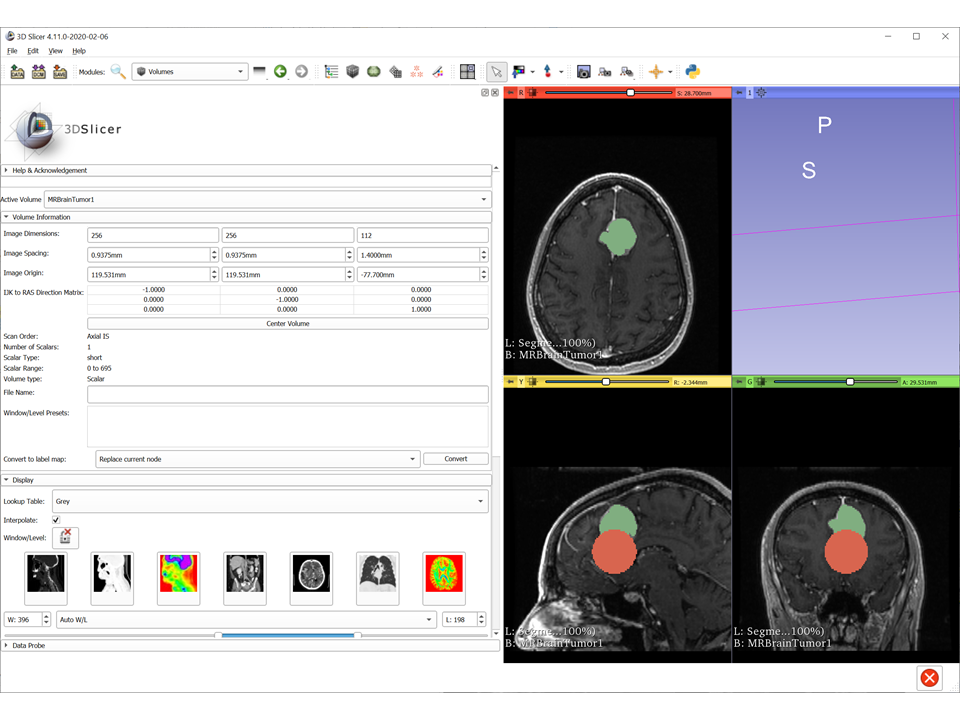

  * Note: If you save your segmentation as a LabelMap, the order of the segments will matter (they will have the labels 1,2,3..n based on the order they appear in the *Name* panel of the `Segmentations` module) and if you don't save your color map separately, they might be colored differently next time you load your LabelMap.

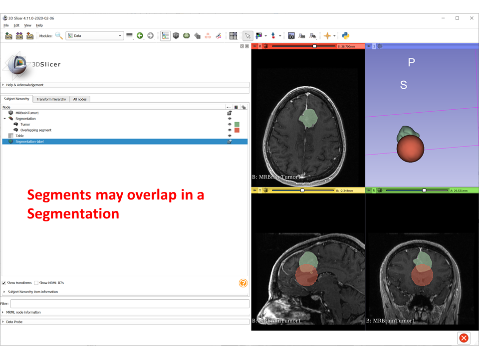

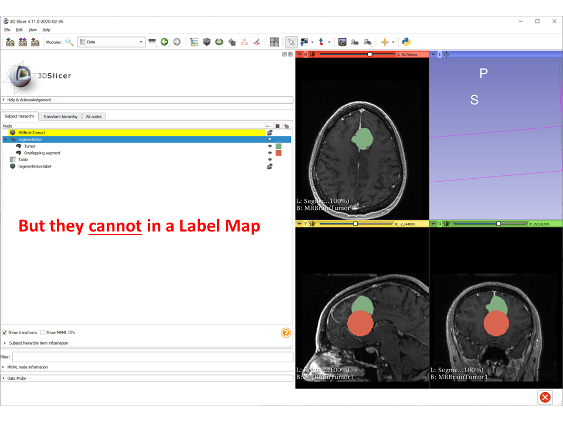
 
------
  
#### Models
Go back to `Segmentations` module and export a Model of your segment. You can leave the output node as it is and it will create a new model hierarchy. If your segment is relatively small, it should take a short time. 

This representation is not a volume anymore, it looks like the thing you saw when you hit Show 3D button in Segment Editor but this is not just a visualization. This is a new data structure with 3D points and polygons, a surface mesh. Go into the Data module and see it. You can turn off the visibility here and change the color etc. Slicer assigns the same name and color from the Segmentation. Models are not show in slice views. The color is again just for visualization and when you save the model, it is not written to the file. 
------

### Part 4: Additional tips, tricks, and more modules to check out
#### Extra modules to explore
Here we've accumulated a list of modules that are helpful for working with segmentations, models, and LabelMaps:

1. The `Models` module is similar to the `Segmentations` or `Volumes` modules. It lets you explore the properties of this data type and change visualization settings. You can turn the visibility on and off, change the opacity, see the data properties.
  *Play with the representation setting. Your model is a mesh. It has points and polygons. The default setting is to show the surfaces (polygons) but not the points or edges. You can change it if you'd like but surface is really the best visualization for this type of data. Seeing points and edges gives you an idea how "precise" your data is. It is ultimately based on the quality of the volume data you produced this mesh from. 
  * Another hidden setting here may change your life: the Visibility checkbox under the *Slice Display* panel. With this smooth closed surface of the tumor, it is not easy to appreciate because all faces are pointing outwards. By changing which sides are visible, you can change what you are seeing dramatically. Play with it. And remember this setting when you load a mesh/model and think it looks degenerated. Probably part of it is not visualized because of this setting. 

2. `Surface Toolbox` and `Dynamic Modeler` modules allow you to edit models similarly (but not in as much detail) to  how you can edit segmentations in the `Segment Editor` module. See the [Mesh Edits Tutorial]((https://github.com/SlicerMorph/Spr_2021/blob/main/Day_2/Surface_Toolbox/Mesh_edits.md) provides an introduction to these functions. 
) for some examples. 

3. `Segment Endocranium`. One of the main benefits of Slicer's python API is that we can create automated segmentation algorithms using the basic toolset that we covered today. For example, SlicerMorph's  `Segment Endocranium` uses a combination of thresholding, smoothing, wrap solidifying and island tools to automatically segment a cranial cavity and to produce an endocast.
  * Here's a video from the **SlicerMorph** team showing just how quick and easy it can be to go from a CT scan to an endocast that you can start working with:

4. The `ImportSurfaceToSegment` module allows you to convert a 3D model (STL/PLY/VTK/OBJ files) into a segmentation node. This will create a labelmap representation of the 3D model and a single segment, which you can edit in `Segment Editor` module.

5. The `Segment Statistics` allows you to extract quantitative information (such as volumes, moments of inertia, centroid positions, etc) from the segmentations and tabulate them.

6. The `SegmentRegistration` module allows you to linearly and/or deformably register segments from two different datasets using the Elastix registration framework. *Note this is a module you will have to install from the extension manager. 

7. The `Segment Cross-Section Area` module allows you to calculate, plot and tabulate the cross-sectional area of any segment as a function of slice number. 

------
  
#### Tips for cutting down segmentation time
* Get a really good 3 button mouse.
* Use a large (27" or larger), with 4K resolution. 
* Learn the keyboard shortcuts (for example move slices up and down through via f and b keyboard strokes) for segment editor.  
* For SlicerMorph, we find cycling through the effects clockwise (`` ` ``) and counter clockwise (`` ~ ``) fashion with repeated keystrokes to be a faster option. 
* Consider investing in a digitizer tablet. You can assign specific functions to your digitizer pen (e.g., erase effect to the back tip of the pen) as well as the buttons on the tablet itself. 

------
  
#### Useful Links
* [Segmentation Recipes](https://github.com/lassoan/SlicerSegmentationRecipes) from Andras Lasso, PerkLab
* [Endocast creation](https://slicermorph.github.io/Endocast_creation.html)
* [Segmenting oblique slices](https://lassoan.github.io/SlicerSegmentationRecipes/ObliqueSliceSegmentation/)
* Bonus pointer to [discussion on Segmentation to Finite Element Analysis](https://discourse.slicer.org/t/use-segmentations-in-cad-or-fem-software/1626) 
* [3D Slicer documentation for the `Segment Editor` module](https://slicer.readthedocs.io/en/latest/user_guide/modules/segmenteditor.html)
* [3D Slicer documentation for the `Segmentations` module](https://slicer.readthedocs.io/en/latest/user_guide/modules/segmentations.html)
* [The Perk lab at the Queens University develops most of the segmentation tools present in Slicer. They have an extensive video library on segmentation related tasks on youtube:](https://www.youtube.com/user/PerkLabResearch)
