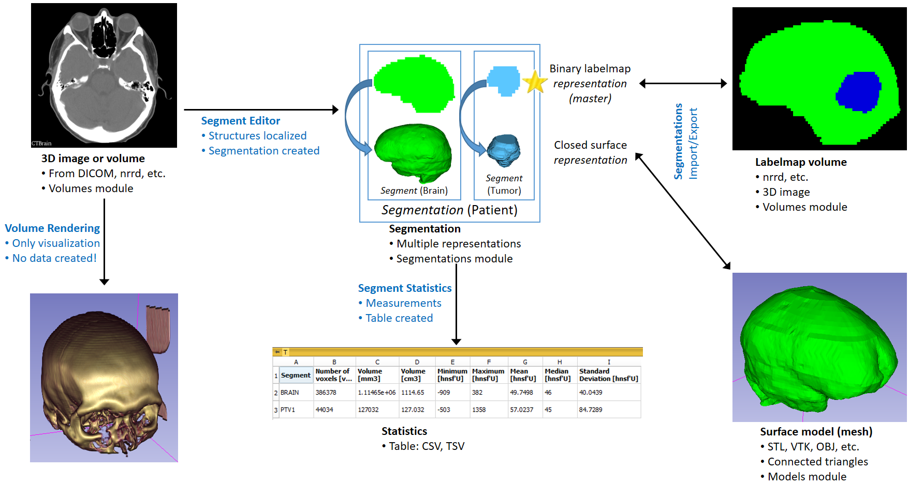

## Overview of Image Segmentation with 3D Slicer

In Slicer, there two complementary modules that are used hand-in-hand for segmentation tasks.

1. `Segment Editor: ` is the actual module for segmentation of volumes. Segmentation (also known as contouring) delineate structures of interest. Some of the tools in `Segment Editor` mimic a painting interface like photoshop, but work on 3D arrays of voxels rather than on 2D pixels. In addition to the core segmentation tools (such threshold, paint, logical operations etc) provided, **SegmentEditorExtraEffects** extension (already bundled with SlicerMorph) provides additional segmentation tools (such as Split Volume by segments or FloodFill effect etc).   
2. `Segmentations:` is the module that allows you to manipulate the segmentations generated by `Segment Editor`. Some of the key functionality is to import/export segmentations into **Label Map** or **3D Model** representation, adjust and edit display properties, copy/move segments across different segmentations, and so forth. 

In addition to these two core modules, there are couple supporting modules such as:

3. `Segment Statistics`, which allows you to extract quantitative information (such as volumes, moments of interia, centroid positions, etc) from the segmentations and tabulate them.
4. `Segment Comparison` allows you calculate various similarity indices for two different segmentations (e.g., compare segmentation results from one expert to the other). 
5. `Segment Registration` allows you to linearly and/or deformably register segments from two different datasets using the Elastix registration framework. 
6. `Segment cross-section area` module allows you to calculate, plot and tabulate the cross-sectional area of any segment as a function of slice number. 

If you are new to image segmentation, probably you should read the [official **Image Segmentation** documentation from Slicer.](https://slicer.readthedocs.io/en/latest/user_guide/image_segmentation.html). 

Even if you have previous experience with other 3D segmentation programs, it might be good to take a minute to read the Slicer specific functionalities and how different types of data types relate to each other (see figure below). As often new comers confuse volume rendering and segmentations and how different data representations relate to each other in Slicer. 

### Additional Resources for Image Segmentation in Slicer
* [Documentation for `Segment Editor` module](https://slicer.readthedocs.io/en/latest/user_guide/modules/segmenteditor.html)
* [Documentation for `Segmentations` module](https://slicer.readthedocs.io/en/latest/user_guide/modules/segmentations.html)
* [Perk lab at the Queens University develops most of the segmentation tools present in Slicer. They have an extensive video library on segmentation related tasks on youtube:](https://www.youtube.com/user/PerkLabResearch)
* [Slicer Segmentation Recipes repository.](https://lassoan.github.io/SlicerSegmentationRecipes/) While these all oriented towards medical segmentation, they are useful in learning specific tools and how to use them.

### Next steps

* Please go through [our Segmentation tutorial](https://github.com/SlicerMorph/Tutorials/blob/main/Segmentation/README.md)* . 

* [And then review how you can standardize your segmentation terms and colors for consistency in this introductory tutorial](https://github.com/SlicerMorph/Tutorials/blob/main/Segmentation/colors-and-terms/README.md)
