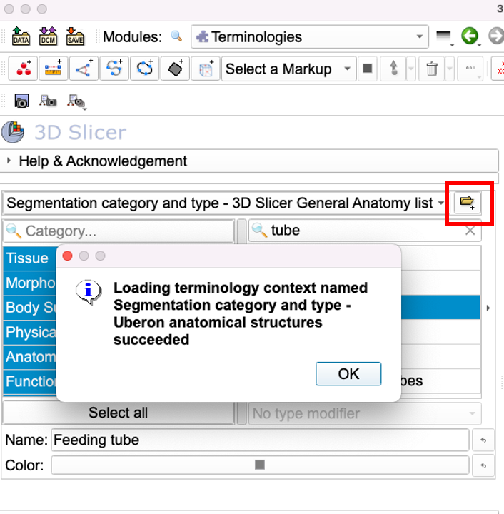
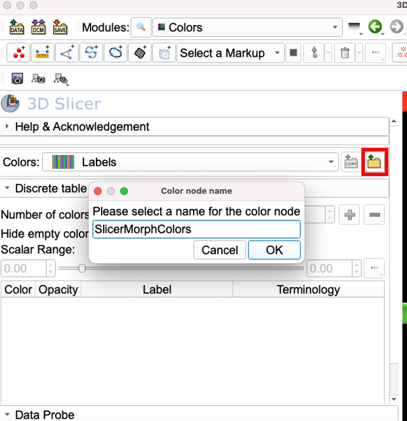
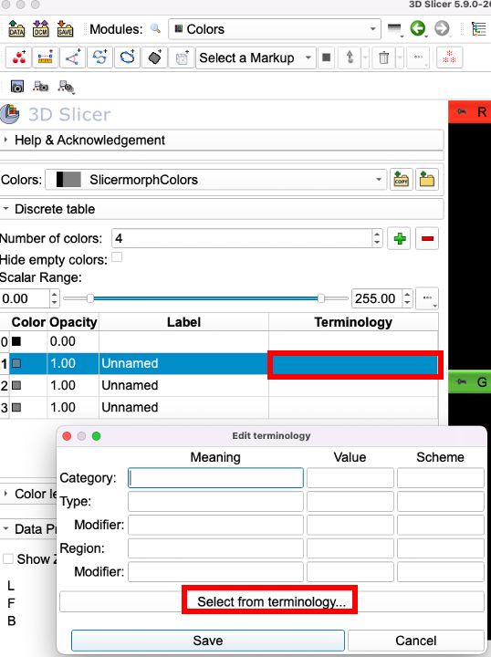
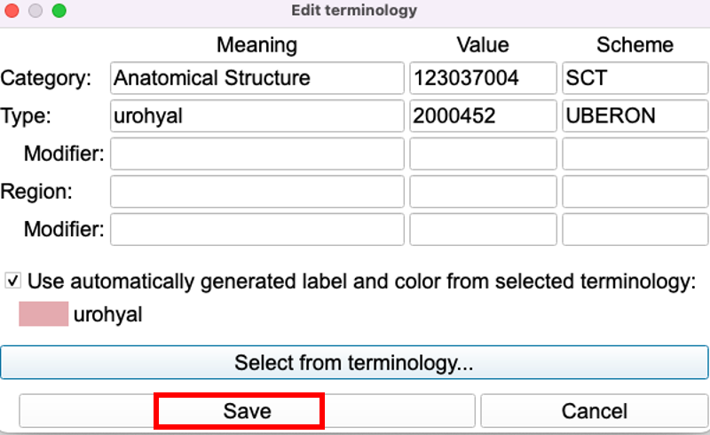
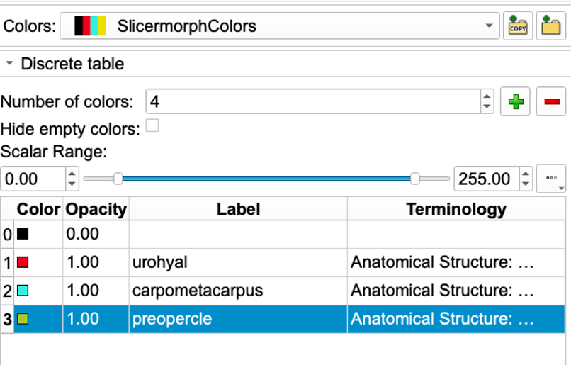
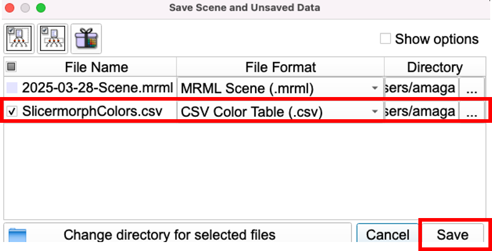
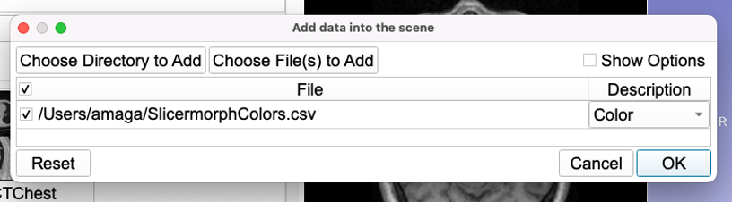
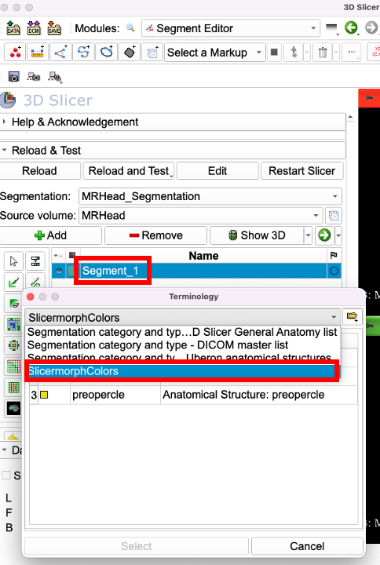

# Segment Colors and Terminology

While it is not strictly necessary, we encourage you to determine what structures you will segment and how you will name them and their visual settings **prior** to segmentation. There are couple reasons for them.

While keeping segment names as **Segment_1**, **Segment_2** and so forth is a possibility for small, individual projects, it is better to use proper terms to describe the contents of the segments. The issue with manually typing the segment names is, you can make typos, or use different capitalizations or spellings of the words. You also may not assign the identical colors, so the visual appearance of same structure in different scans might be slightly (or completely) off. Using a standadized terminology and creating a custom color table for your segments can help you deal with this problem.

3D Slicer comes preloaded with two sets of standard terminologies that can be used in segmentation. They are called: **3D Slicer Anatomy List**, and more broad and standardized **DICOM Master List**. Both of these can be found in the `Terminologies` module (CTRL+F, search for terminologies). DICOM Master list contains anatomical structures, tissues and other non-biological things (e.g, feeding tubes) that one can encounter in radiological imaging of human and veterinary patients. However, while terms in those terminologies can probably be sufficient to annotate mammalian anatomy, they are nowhere close to complete for all vertebrate structural diversity. Luckily, terminologies module allows adding new terminologies, which can be obtained from existing ontologies, like [UBERON](https://www.ebi.ac.uk/ols4/ontologies/uberon).

### UBERON 
UBERON is an integrated cross-species anatomy ontology representing a variety of entities classified according to traditional anatomical criteria such as structure, function and developmental lineage. The ontology includes comprehensive relationships to taxon-specific anatomical ontologies, allowing integration of functional, phenotype and expression data. We will refer you to the Uberon website for more information about this ontology. From our perspective UBERON simply serves a dictionary with standardized set of anatomical terms we might need in our segmentation tasks. The benefit is that we can trace the origins of the terms and what they describe. And if they are revised or split we can alter our own color maps accordingly. 

While UBERON distributes its full terminology in JSON format, we need it to be in a specific JSON format to be compatible with Slicer's Terminologies module. Each terms needs to have a color assigned to it and indication of what it represent (e.g., anatomical structure or tissue). Since we cannot assign unique colors to over 17,000 terms UBERON ontology contains, we randomly assigned a small set of colors to each of these terms. The custom color table will allow you to change these colors to whatever you like.

To obtain the full set of UBERON terms (converted mid 2024), [follow this link](https://raw.githubusercontent.com/SlicerMorph/terms-and-colors/refs/heads/main/uberon.full.json) and save the page as `uberon.full.json` somewhere on your computer.

## Importing UBERON to 3D Slicer.
1. Hit CTRL+F, and search for Terminologies.
2. In the Terminologies module click the `+` right of the terminology drop-down selector, and navigate to the `uberon.full.json` file you have downloaded previously. 

3. You should see a message like the one shown in the screenshot, confirming the successful import of the UBERON terms. 

## Creating a custom color table to be used during segmentation

In this exercise we will use three terms from UBERON to create a custom color table. Let's say structures we are interested are **Urohyal**, **carpometacarpus**, and **preopercle** (These structures do not make anatomical or systematic sense. We simply chose them, because they do not exist in the standard terminologies bundled with Slicer )

(NOTE: Custom color terminology table creation functionality is only available for Slicer releases 33573 or higher. Current stable 5.8.1 does not support this). 

1. Hit CTRL+F and search for Colors
2. Hit `Add empty color table node` button (top row, far right), and give you new color table a name (e.g., SlicerMorphColors)

3. Hit the `+` button three times to add three rows to your blank table. Do not directly edit the `Number of Colors` field. This field will change as you add more rows via the `+`. You can use the `-` button to delete extraneous row.

4. To enter your first term (`urohyal`), click the **Terminology** field of the 2nd row (with the index number of 1). It is important **not to enter anything accidentally to the top row with black color**. This is reserved for background color, which is always 0. Then, click the `Select from Terminology` button to fill the necessary fields in the window that popped up. 

5. This will bring up the terminology selector. From the dropdown, make sure you have chosen the **Uberon anatomical structures** terminology, not the default Slicer ones. Then in the right panel, type in the first few letters of the urohyal until it filters terms with urohyal. Choose the correct one (the first entry) and hit `Select` button. 

6. This will auto-populate the necessary fields in the `Edit Terminology` window with the unique identifier values from UBERON. Do not change anything, and hit `Save`.

7. You can now change the color of the term to your liking by clicking the color button. If any reason you need to change the displayed label (e.g., from the shown urohyal to something like Urohyal), you can. The unique identifier that was entered will allow you (or others) to trace the origin of this term as [the UBERON entry 2000452](https://www.ebi.ac.uk/ols4/ontologies/uberon/classes/http%253A%252F%252Fpurl.obolibrary.org%252Fobo%252FUBERON_2000452). Although, with the exception of few cases (where the formal UBERON term might be too long e.g., tetrapod frontal bone vs actinopterygian frontal bone), we suggest you keep the label as shown in UBERON ontology.

8. Repeat these steps for the two other terms (carpometacarpus, preopercle)

9. Once your color table is completed, remember to save (CTRL+S) it to a location you can find. 

## Using the custom color tables in segmentations.
To use your new SlicermorphColors table in the segmentation, simply drag and drop the resultant SlicermorphColors.csv (or whatever you called your color table) in the Slicer scene, and hit ok. This should be automatically recognized as a color object. Hit OK.

Proceed with your segmentation as usual. When you create your first segment, it will still show up as **Segment_1**. To rename, double-click the its name and the terminology selector window will popup. It will again default to Slicer's built-in terminologies (including the UBERON you have added). Click the terminology selector dropdown and the use the custom color table you have loaded into the scene (in my case it is called SlicermorphColors). And then from there choose the proper term you will like to assign. Repeat the same steps for all other segments you create.

## Sharing existing custom color-mapped anatomical terms

As you can see it does take a some clicks to create a custom color table. But once you create a list (or multiple lists broken down by clades or development or anatomy), you can share them with your students, colleagues or collaborators. This will allow everyone in the team to use the same terms and colors, and provide visually consistent segmentations, easing data sharing and reuse. 

Currently there is no automated way to share these custom color tables. To enable re-use, we have created a github repository, https://github.com/SlicerMorph/terms-and-colors that currently provides a few sample color tables. 

One that is of potential interest is the ["Colors of Skulls" collection created by Dr. Jaimi Gray](https://www.graysvertebrateanatomy.com/work/colorsofskullanatomy/) (University of Texas, formerly @UFL) during her work on the oVert project. It contains the most of the cranial bones in the tetrapod skulls mapped to unique colors. Using the same color coding, we converted this color table to Slicer's format and mapped them to their UBERON terms. This can be found at [in this link.](https://raw.githubusercontent.com/SlicerMorph/terms-and-colors/refs/heads/main/JaimiGrayTetrapodSkulls.csv) 

If you create a custom color table with anatomical terms, and would like to share with the community, you can submit a Pull Request (PR) from the github repository. 

