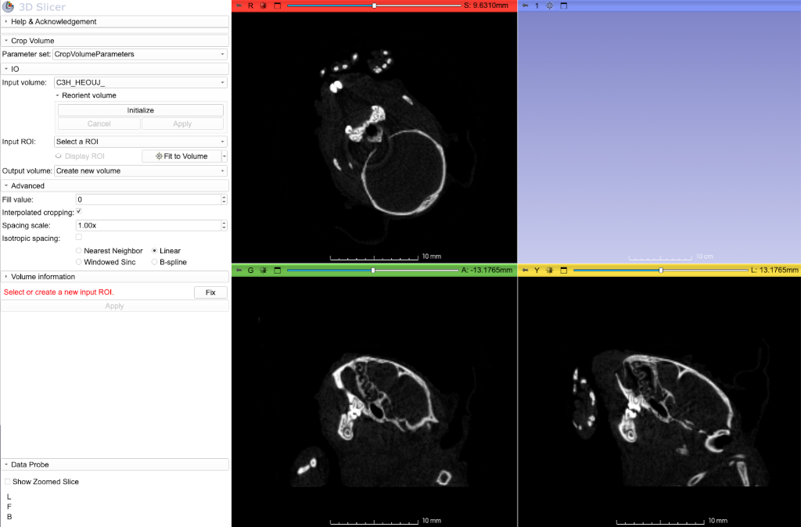
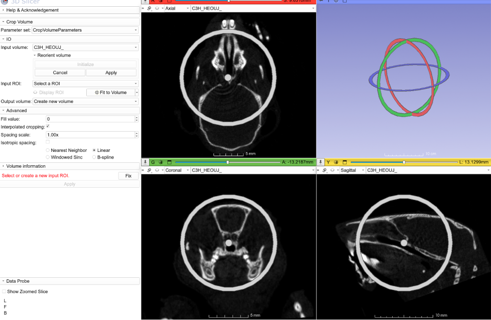
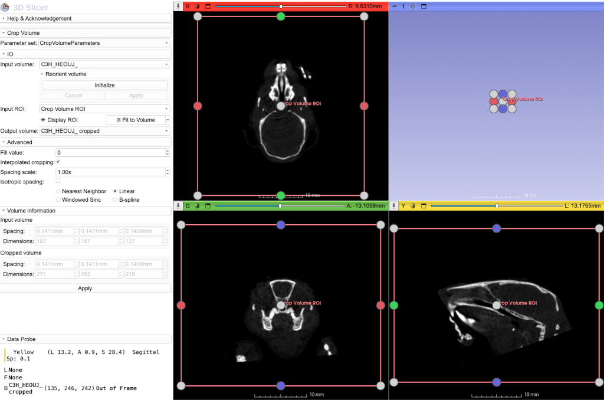

### Crop Volume
Regardless of whether you are only interested in a small subset of your volume, the entire volume (and volumes if you are working with more than one dataset in the same scene) is kept in the memory (RAM) in a Slicer session. During segmentation, memory consumption may increase 10X (e.g. if you have 1GB dataset, at times you may need 10GB of available RAM). For large volumes, you can greatly reduce your memory footprint and improve performance during segmentation, by creating a new volume that only contains the subset you are interested in. Alternatively, if you have to work with the full extend of the data, but encounter memory issue during subsequent operations, you may want to downsample your volume.  `CropVolume` is the easiest way of achieving downsampling (or alternatively supersampling) your volumes. 

Additionally, you can use the CropVolume module simulatenously reorient and resample your data (see below)

1. Load the Sample MicroCT data as shown in the `ImageStacks` module

2. Enter the settings shown below. If the ROI creates is too small, hit the **Fit ROI to Volume** button and hit Apply. Then choose to create a new volume that will contain the output of the operation. In my case I called it **left_side_damaged_reduced**, which will be reduced by 50% (Spacing Factor is 2) in each axis. Accordingly, the image spacing will doubled. Compare the reported input and output volume dimensions and spacing. This operation will result in 8 folds reduction in the data volume, at the expense of image detail. This is because spacing scale of 2 is applied to each axis, and since we have 3 axes, the resultant data is reduced 2^3 times, or 8 folds.

2. Now, repeat the procedure one more time, but this time set the limits of the ROI by modifying the small circular handles in slice views. I set my ROI to contain only the nasal region. Choose to create a new output volume (mine was called **Nasal_septum_and_turbinates**), and disable the interpolation. We do not need to interpolate the voxel intensity values, because we simply removing the data outside of our ROI and not doing anything else to the rest. Compare the resultant image dimensions and spacing of input and output volumes. Hit Apply. This procedure also reduces the data volume approximately 10 folds, but there is no reduction in the image quality. 

**Technical Note:** you don't have to use integer values as the Spacing Scale. For example, if you enter **1.25**, you reduce memory usage by factor of 2 (1.953 to be more precise) because 1.25^3 is approximately 2. You only degraded your data by 25% in this case.  

More detail about [`CropVolume` can be found here.](https://slicer.readthedocs.io/en/latest/user_guide/modules/cropvolume.html)

### Using CropVolume to Simulatenously Reorient and Resample your data

**Background:** Often specimens scanned using research imaging modalities like microCT are not oriented in the scanner to any anatomical or canonical coordinate system. When you bring such data into Slicer, one of the first things we would like to do is to reoriented them to proper anatomical planes so that we can more easily navigate the data. This is very easy to do in Slicer and is the functionality of the `Transforms` module. 

When you reorient your data via the `Transforms` or its interaction widget, Slicer calculates a linear transform (a 4x4 transformation matrix). Instead of immediately modifying the image data (called resampling), Slicer changes the Image Direction Matrix associated with the volume (see Volumes module tutorial). That way if you want to reorient your data in a new way a second, third of fifth time, you don't continuously degrade your data due to resampling twice, thrice or a fifth times. Each time Slicer will calculate the new transform matrix, and will make the necessary update in the Image Direction Matrix. When you save your data as NRRD file this matrix is also written as the part of the image header, so next time you load your volume, it is still correctly oriented.

While image directions are part of the NRRD specification, not every reader implements this functionality. For example if you load a NRRD file modified this way into FiJi you will still see the original directions because FiJi's NRRD import tool does not support Image Direction Matrix. In that case, you need to resample your data into this new orientation, and then save it. You can easily do this in Crop Volumes following this tutorial. 

1. Use ImportFromURL module or the Load Data From URL feature of SampleData module to obtain this file and load into Slicer: https://github.com/muratmaga/mouse_CT_atlas/blob/master/data/targets/C3H_HEOUJ_.nii.gz

2. Note that this specimen has an oblique view in all three views making it difficult to identify correct anatomical planes

 

3. Switch to the `CropVolume` module, and expand the **Reorient Volume** tab, and hit **Initialize**. This will enable interaction widgets in all slices views (gray circles), as well as in 3D view (colored circles). Use the gray circles until you reorient the mouse skull with respect to proper anatomical planes (red slice Axial, green slice Coronal, and yellow slice is Sagittal; see the screenshot). Once you are satistified, hit **Apply**

   

4. To create a new volume that's oriented and resampled in this way, first create an Input ROI like you normally do. But before hitting the **Fit to Volume** button, first click on the dropdown next to it, and choose **Align to World Axis and Resize** option and then hit **Fit to Volume**. This will result in large ROI that is aligned with the anatomical plans, and your output data will be resampled to this orientation when you hit **Appl**

**Note:** We suggest you use this method only when you need to export your data to an external software that does not support Image Direction Matrices, or you are certain that you will not going to change the orientation subsequently. Every resampling event degrades the data due to partial volume effect, and should be used sparingly. 
 

### IMPORTANT TECHNICAL NOTES

**Anisotropic data** If you are working with anisotropic voxels (i.e., different image spacing along different axes), you may want to enable **isotropic** option so that the resultant volume has isotropic spacing. Isotropic voxel alleviates some of the issues you may encounter with `Segment Editor` with anisotropic datasets. Images produced by medical CT scanners tend to have anisotropic spacing (usually Z axis is of lower resolution than X and Y). Most microCT scanner produce isotropic volumes. However, if you used the skipping slice option in the `ImageStacks` that will no longer be true after the import. 

**Do I need to downsample?** The answer to that depends on how much memory you have on your computer, how big is the volume you are working on and what you want to do with it. Consider a 3D volume that is 2000 slices, and 2000x2000 pixels in each slice, and voxel intensities are represented by 16 bit data (so 0-65535 range grayscale values). When the full volume is loaded without downsampling into Slicer, it will consume 16GB of memory (note that this is reported in the `ImageStacks` **Size** tab). If you want to visualize this volume you should have a GPU that has more than 16GB memory (since otherwise it won't fit into the texture memory). If you want to segment it you will need about 8-10X RAM than the volume (so you should have anywhere from 80-160GB of computer RAM). Also every semi-automated segmentation effect (e.g., threshold) will be applied to whole dataset, which means computations will take longer.  So you need a big, powerful computer. But if your use case is making high-quality rendering of only the skull, for example, then you can import the full volume at the **Preview** resolution via `ImageStacks`. Since this will reduce the data volume by factor of 64, you will have very managable dataset that you can explore quickly, define the ROI that you would like to import at full resolution carefully and then decide what resolution you can import it by looking at the **output size** of the `ImageStacks`. While `ImageStacks` has overlapping functionality with `CropVolume`, `ImageStacks` cannot crop interpolated ROI (ie. ROI under rotation or scaling), while `CropVolume` can. `ImageStacks` also also downsample either by 4X (preview) or 2X (half resolution), while `CropVolume` can downsample (or oversample) at any arbitrary scale.  

**Oversampling:** Oversampling (or supersampling) is opposite of downsampling. In some cases, you will want to oversample your dataset. For example, some thin structures can be only a voxel or two thick which would be problematic to segment or visualize. In such cases, oversampling the data is helpful. Oversampling will not increase the resolution (aka detail) in your data. It will simply subdivide the voxels. Oversampling by 2, will split a single cubic voxel into 8 smaller cubic voxels, so that some mathematical operations such as smoothing or dilation/erosion can work more effectively. However, this will increase the memory usage considerably and should be better applied to subsets of data. You will see more of this in `Segmentation` tutorial. 
