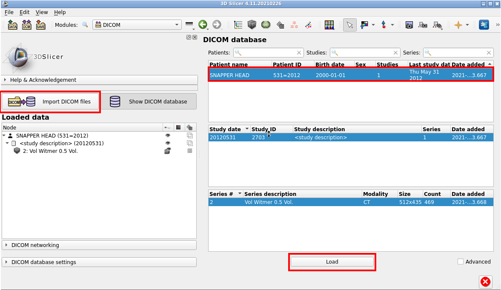

## Dealing with DICOMs

[DICOM is a complicated standard](https://www.dicomstandard.org/current) for storing and exchanging medical images. While it is ubiquitous for clinical imaging research, it is not a common format for high-resolution imaging of organismal structure via microCT.

Slicer has an extensive support for DICOM format through the [`DICOMBrowser` module.](https://discourse.slicer.org/t/new-dicom-browser-is-ready/8819). You need to understand a few things about DICOM data, particularly if you are working with clinical data. 

1. DICOM format may contain sensitive, private information even if the images themselves are of non-human species (e.g., data coming from vet clinics). 
2. DICOMBrowser will create a local database on your computer, which contains all the imported DICOM files and the associated metadata. If you are doing human subject research, make sure you have necessary privacy protections in place (particularly if this is a shared computer). 
3. Not all DICOMs are created equal. Slicer will not load any DICOM that's not compliant, and it will require patching them (correcting them). For more information see [the documentation about `DICOM Patcher` module.](https://slicer.readthedocs.io/en/latest/user_guide/modules/dicompatcher.html)

Because of these reasons, we actually suggest SlicerMorph users to use an external DICOM converter, which will take a DICOM series, strip the metadata and save it in a Slicer compatible NRRD (or NIFTI) format. The tool is called [DCM2NIIX](https://github.com/rordenlab/dcm2niix/releases), and is available as a command line tool for Windows, MacOS and Linux. Because it is a command line tool, it can be used to do bulk conversion of many datasets too. There is also a Slicer extension (DCM2NIIXGUI), which is bundled with SlicerMorph, but it is as almost easy to use the command line tool. It also will do some of the "patching" to correct non-compliant DICOM datasets, and can be faster than Slicer's DICOMPatcher module. 

We provide one small sample DICOM from MorphoSource. Find the dataset on MorphoSource https://www.morphosource.org/concern/media/000076039?locale=en

1. Unzip the contents of the archive to a folder. 
2. Go to `DICOM` module. Accept the message that a new DICOM database will be created (otherwise you can't import). 
3. Click on **Import DICOM files** and navigate to the folder where you extracted the archive. 
4. To load the DICOM series into Slicer, click "Snapper" and the "Load" button. Please read the warning and then hit OK to load the volume into Slicer.

