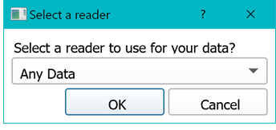
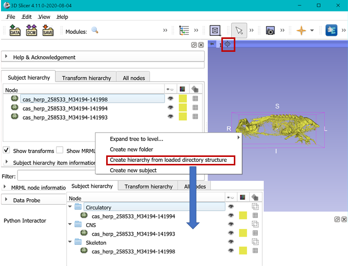
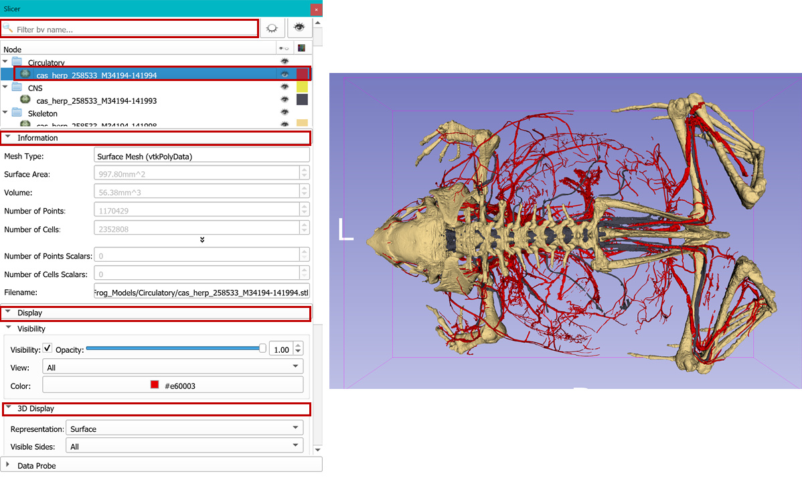
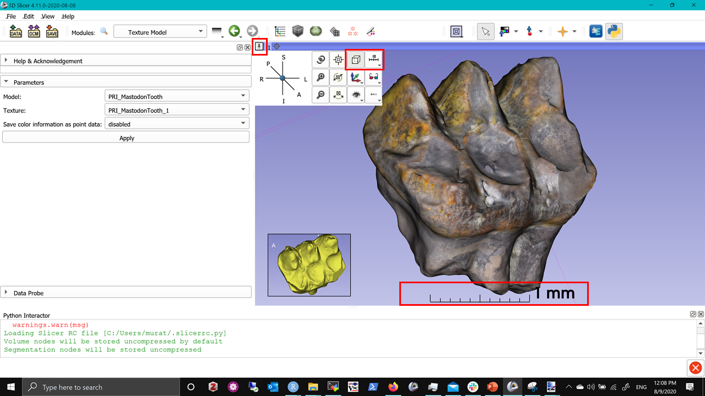

## Models Module

Slicer support STL/OBJ/PLY/VTK formats for 3D models (also called meshes). When loaded into SLicer, any model in one of these formats will be immediately visualized in 3D viewer. `Module` module provides a convenient interface:

-   to gather important information about the model such volume, area, number of vertices and polygons. (Information section)
-   to adjust Color, transparency, and visibility of model (Visibility) 
-   to adjust rendering option such as to display vertex edges, material type, shading etc (3D Display section) 
-   to display scalars (such as loading heat maps of statistical significance, or distances)

At the moment, this is the [official documentation for `Models` module](https://www.slicer.org/wiki/Documentation/Nightly/Modules/Models).  

**NOTE:** If your surface model has texture maps, it will not be loaded immediately along with the model. You can use the SlicerIGT extension (bundled with SlicerMorph) to import your texture maps (see below). 

Download the sample data called [MorphoSource-Frog-Models.zip](https://app.box.com/s/3dmwhcs579mm7ijo501c3l1uuppnypq8) and unzip to a folder on your desktop. Drag and drop the contents of this folder to Slicer. A popup window will ask what Data Reader you want to use to import them and select **Any Data**, and see that three models are now showing in your `Data` module, as well as in the 3D viewer (you may need to center the scene and zoom in).

-   Go to the `Data` module, and right-click an empty spot in the **Subject Hierarchy** view and select **Create Hierarchy from loaded directory structure** option. This will duplicate the directory structure in the disk in the `Data` module. This can be useful, if you already organized your data into some sort of hierarchical structure on your disk. 

-   Now go to `Models` module, and adjust the colors of the different models so that they are more easily distinguished in 3D view, and explore the diffent sections indicated above (information, visibility, material etc )

## Loading Texture and Working with Internet Data

SketchFab is a commerical website that you can find some interesting life-sciences data. Go ahead and [download this mastodon tooth in OBJ format](https://sketchfab.com/3d-models/vertebrate-mastodon-premolar-pri-064cdd8eead040f589a12621369aa770). If you do not have an account with SketchFab, you can download the same file zip file from [here.](https://app.box.com/s/ha1ctox0uav7xrz0q86el9m1d7fxj6yi)

-   Open a new instance of Slicer, or empty the scene (CTRL+W, note that this will remove all data loaded into Slicer without a reminder to save files. So use it at your own risk.)
-   Unzip the contents to a folder
-   Drag and drop 
    -   **PRI_MastodonTooth.obj** (3D Model)
    -   **PRI_MastodonTooth.jpg** (texture map)
-   Accept default, and notice that texture map is not loaded.
-   Search for `TextureModel` module in the module search bar, and switch to the module
-   Choose the model and texture options (there will only one of each), and hit APPLY
-   The model will now render with the texture information

### Issues with Data on internet
Click the little pin that brings the 3D viewer options. From there, 

-   Choose Orthographic projection (highlighted)
-   Enable Ruler in 3D.

Orthographic projection preserve distances so that same measurement taken in any orientation will report equal distances. Slicer's default is **Perspective** rendering, which results in more realistic looking 3D rendering, since the voxels further away from the camera is rendered smaller. 

If you are collecting data for  morphometrics, our suggestion is to use **Orthographic** rendering. An easy way to tell which projection you are using is to see if you can enable the ruler. Ruler works only with **Orthographic** projection (it is meaningless to show a ruler if distances are not preserved). 

So what's going on with this mastodon tooth, it is only few mms long, yet [mastodons' are huge](https://media.wired.com/photos/59328be3f682204f736969cb/master/w_660,c_limit/american-mastodon.jpg).

Congratulations you made your first acquantaince of many issues 3D model formats has. In this case, I suspect whatever software this model is generated from, it has been using a default unit different than Slicer's (which is mm). For example, cm to mm would cause 10X reduction in size, but unfortunately without external reference we can't be sure. [There are many other concerns using common 3D model formats, which tend to be lossy in terms information content such as no explicit unit definition, or coordinate system assumptions.](https://discourse.slicer.org/t/beware-of-the-stl-file-format/7642/3?u=muratmaga). For teaching purposes data like this is fine, however if your goal is doing morphometrics you should be very careful about including processed data like this for your research. 

