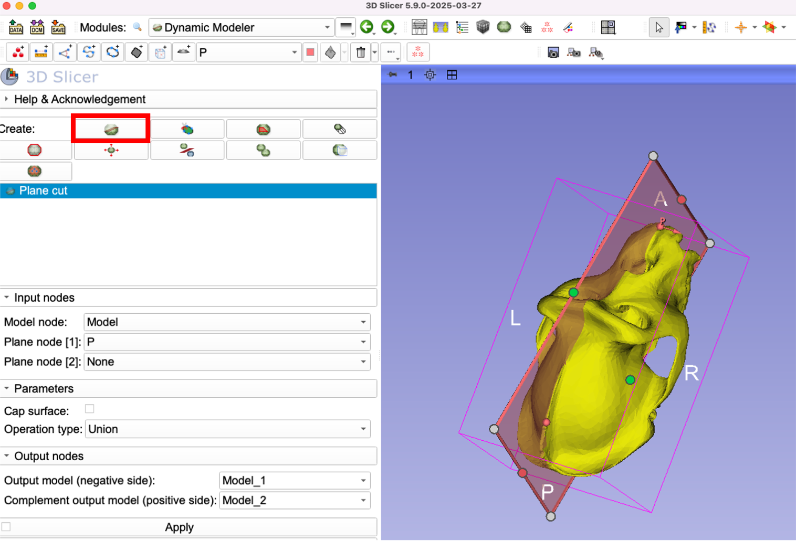
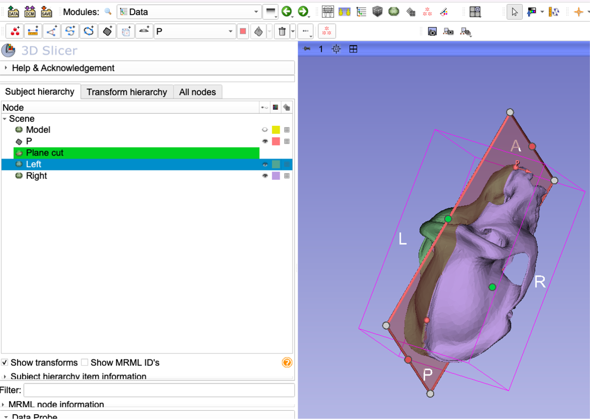

## Editing 3D Models in Slicer  

Slicer is not a polygon editing application like MeshLab or Mimics is. Still, it does provide some fundamental functionality (like decimation and smoothing) for editing surface model through its `Surface Toolbox` and cutting/splitting surfaces through the `Dynamic Modeler` module. Official documentation for these two modules can be found at:
* [Surface Toolbox](https://slicer.readthedocs.io/en/latest/user_guide/modules/surfacetoolbox.html)
* [Dynamic Modeler](https://slicer.readthedocs.io/en/latest/user_guide/modules/dynamicmodeler.html)

If neither of these two tools are sufficient, you can also import a 3D model as a segmentation an use the existing segmentation effects (e.g., Scissors tools) to edit and then re-export it as as new 3D model. SlicerMorph extension provides a module,  `ImportSurfaceToSegment`, to do that. Note that without the actual intensity volume,  segmentation geometry will be created arbitrary. As a consequence, it might be unnecessarily high-resolution slowing down the operation, even causing out of memory errors. You should really use this as a last-ditch effort, and instead try to obtain the original segmentation (and the intensity volume) that the model derived from to make these changes. 

### Surface Toolbox operations:  

1. Using the `ImportFromURL` module of SlicerMorph (SlicerMorph->Input and Output->ImportFromURL) load the gorilla skull model from the sample data. Data can be found at https://github.com/SlicerMorph/SampleData/blob/master/Gor_template_low_res.ply

2. Go to the `Models` module and expand the information tab. Observe the loaded model has slightly more than 102K points (vertices). We will now use the `Surface Toolbox` module to further downsample it.

3. Switch to `Surface Toolbox`. Set the input volume as the gorilla skull in your scene, create a new output volume. Choose **Decimate**, and keep the reduction at 80%. This means at the of this procedure, the number of vertices will be reduced by 80%. Hit Apply. When downsampling is completed, new model will be shown in the 3D view. Polygons should be very noticeable in this model.  

4. Go back to the `Models` module and then expand the Information section. Make sure the displayed information corresponds to the new model created, not the original one. The **Number of Points:** for the new model should have around 16K vertices. 

5. Go ahead and try other editing options such as smoothing, uniform decimation, mirror, scale etc. You can stack the procedures by clicking on them. (i.e., they will be run back to back). However, if run multiple operations on your model and results do not come out good, you might have some difficulty tracing back which operation(s) might have caused the issue. Early on run the operations one by one to observe their outcome, and then provide the output of the previous operation as the input of the next one. 

### Dynamic Modeler Operations

An recent addition to Slicer is the `Dynamic Modeler` tool, which provide functionality to cut/crop models with Markups and other objects.  Currently, the functionality is limited to cutting 3D models with various markups (such as a Plane or a curve). But even with these, it is actually fairly powerful. Using the same gorilla model above, we will demonstrate how you can split the model into left and right halves. 

6. Create a new plane that goes through the sagittal plane of the specimen using the `Plane Markup`. For easier operation, you should set the **Plane Setting** under the `Markups` module to **Three Points** instead of the default **Point Normal**. See the [Markups-1 tutorial](https://github.com/SlicerMorph/Tutorials/blob/main/Markups_1/README.md) if you need to refresh where to find that setting.   

7. Switch to the `Dynamic Modeler` module and then choose the **Plane Cut**  (the leftmost icon on the top raw). Choose the input model as the gorilla and the plane the one from the previous step. Uncheck **Cap Surface**, and leave the `Operation Type` as **Union**. Then, create two output nodes called **left** and **right** (it doesn't matter whether you specify left for negative model or positive. It is arbitrary at this point and we will fix it later ), and hit **Apply**. 

8. Visually nothing will happen. We will need to rearrange the scene to changes. Go to `Data` module. Turn off the visibility of the input model (gorilla one). Change the colors of the left and right models different from each other and the original model for better visibility. Turn on/off one by one and if necessary reverse the labels to match the side of the skull they are representing. 

9. Experiment with the other effects using the similar approach. E.g., give `Curve cut` a try to extract an arbitrarily shaped polygon. 

### ImportSurfaceToSegment

SlicerMorph provides a convenience function to import a surface model into Slicer as a segmentation node, so that you can use the `Segment Editor` to directly edit the mesh. Note that all the intensity based tools (such as Level Tracing, Thresholding, etc) won't be of use in this case, as there is not underlying intensity image for this segmentation. However, you can use tools like `Scissors` to clean up extranous material from an existing mesh. 

10. Save the gorilla model from the first step to the disk. `ImportSurfaceToEdit` wants to read the data from disk, instead of Slicer scene. To do that, go to `Data` module, right-click on the gorilla model object and choose **Export to File ** and save it on your Desktop (or somewhere you can find easily) in PLY format. 

11. To use the tool, go to **SlicerMorph->ImportSurfaceToSegment** then click on the `...` button next to *Select surface to edit* button, and navigate to the file you saved in the previous step and hit `Apply`.

SlicerMorph will process the data, and when it is done it will automatically switch to the `SegmentEditor` with the model showing up as a single segment. You can then try the scissor tool (or others) and edit the segmentation. When you are done and ready to export the segmentation back as a model, go to the `Data` module find the segmentation object, and right-click on it and choose **Export Visible Segments to Models** and choose an 3D model format (PLY or OBJ suggested)

**NOTE:** Slicer know offers a similar functionality. Our `ImportSurfaceToSegment` module predates this functionality. The reason while we maintain and use it because it is slightly faster. In core Slicer functionality, you need to first convert the 3D model as a segmentation (same right-click menu in `Data` module as described above ) and then convert that segmentation into a labelmap representation (again right-click menu in `Data`), which then will serve as the **Source Geometry** of the segmentation. `ImportSurfaceToSegment` does both of these steps for you and immediately switches to Segment Editor. The benefit of Slicer's approach is that you have control over the resultant labelmap geometry (if it is too fine resolution you can downsample, if it is too coarse you can supersample it). With `ImportSurfaceToSegment` we try to guess this based on the vertices of the models, but not always find the optimum value. 
