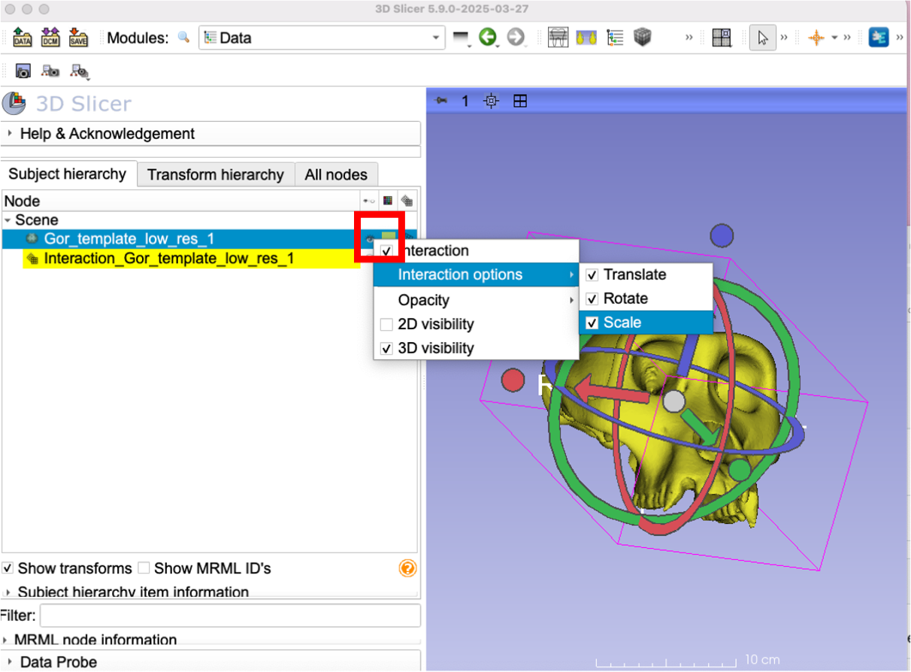
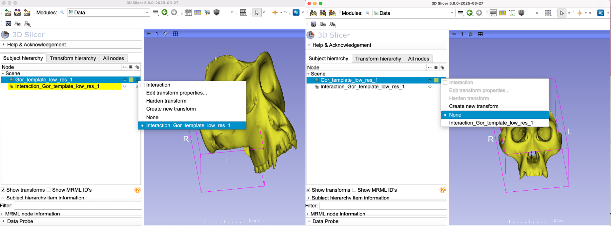

## Transforms
Being able to transform any of the data nodes (volumes, models, markups and ROIs) is one of the most powerful features of 3D Slicer. `Transforms` is a complex module with many different options that are dependent on the type of the transform (e.g., linear or non-linear). You can find the official user documentation at https://slicer.readthedocs.io/en/latest/user_guide/modules/transforms.html

We will be using the `Transform` module mostly to manually align a volume or a 3D model, e.g., to bring scans/specimens into some sort of anatomical orientation. We will also be covering the recently introduced method of **interacting** with transforms. For full functionality, see the user manual above. 

Let's look at the basic of the `Transform` module:

1. Go to `ImportFromURL` Module, and paste this address `https://github.com/SlicerMorph/SampleData/blob/master/Gor_template_low_res.ply` to the URL section of the module to load the gorilla skull into Slicer. (If you already have saved it you can drag and drop)
2. Go back to the `Data` module
3. Right-click on eye icon next the 3D model node and enable **Interaction**. This will automatically create a linear transform object (in this case called Interaction_Gor_template_low_res_1) and enable 3 axis spinners, and arrows. Spinners allow you to **rotate** the object, while arrows allow you to **translate**. By default these two transformations are enabled. If you also would like to **scale** your object up and down, you can right-click the eye icon again, and this time go to the Interaction Options and enable Scale. Translation, Rotation and Scaling are all linear transformations. 
Note: while the screenshot shows the interactions only in the 3D viewer, they are also visible in the slice views if you enable them from the same popup context menu. 

4. Go ahead and play with these settings and test their functionality. Notice that if you use the gray center circle, you can **translate** the center of the object freely in 3D space. Directional arrows simply gives you more control in the travel direction. When you are done, right-click on the eye icon and disable the interactions. 
5. You can notice that the grid icon on the right side of the visibility is now rotated. This is a visual indication that the object is being transformed. You can right click on the grid icon and see the transform object being applied (in this case Interaction_Gor_Template_low_res_1). If you want to restore the object back to its "untransformed" original, simply choose "None". Screenshot below shows the same object being transformed (left) and displayed without a transform
6. If you want to preserve the object in its transformed state, you can first set the transformation to be applied, and then click **Harden Transform**. 

**Note:** Hardening will change your data. So make sure that you really want to do. You can always invert a linear transform (if you still have the applied transformation), but other transform types (e.g., certain non-linear transforms) may not be invertible. 

7. Don't forget to save the newly transformed model. (alternatively you can also save the transform and keep reapplying to the original)

### On your own
Import a sample microCT stack (or load an existing NRRD, if you already saved it) into a blank scene and try the same functionality. 
