# Volume Rendering: from histogram to transfer function

Volume rendering shows a scan in 3D directly, without segmenting it first. Every voxel is given a color and an opacity based on its intensity, and the 3D view is built by looking through all of the voxels at once. The rule that turns intensities into colors and opacities is called the **transfer function**. Designing a good one is the whole art of volume rendering.

This tutorial builds up in four steps:

1. **The Volumes module.** Its histogram shows which intensities are in the scan, and its threshold and window settings can drive the volume rendering directly, as a simple ramp. This is the quickest way to understand what a transfer function does.
2. **The Volume Rendering module.** Presets, and your own opacity and color curves, when one ramp is not enough.
3. **Saving, reusing and sharing** a transfer function you like, with the **VR Preset Hub** module.
4. **MicroCT data.** Why its intensities are not calibrated like those of a medical CT, and how much the result depends on the dynamic range of the scan.

## Data

Open the **Sample Data** module and click **CTChest**. It is a CT scan of a human chest. CT intensities are in Hounsfield units (HU): air is about −1000, fat about −100, water 0, soft tissue 0–100, and bone from about 200 to over 1000.

## Part 1: Volume rendering from the Volumes module

### 1. Look at the histogram

Open the **Volumes** module. Under **Display**, expand **Histogram**.

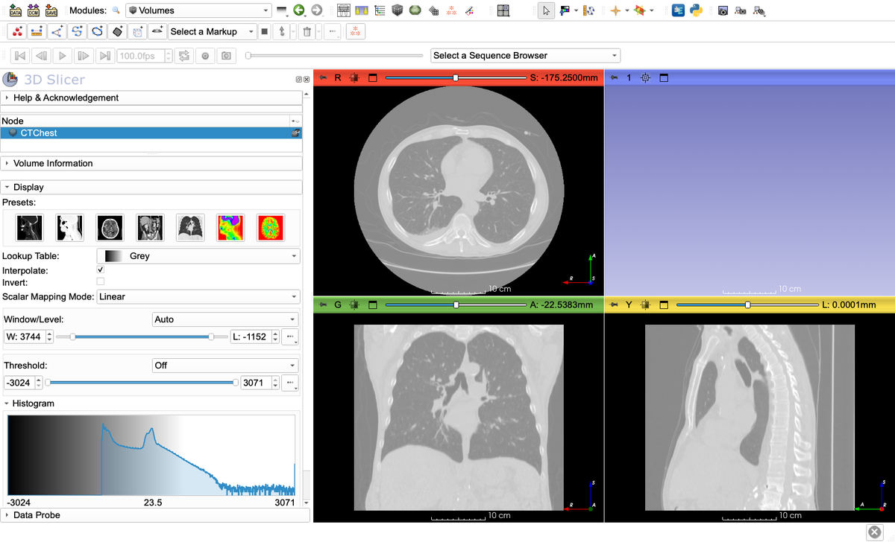

The histogram shows how many voxels there are at each intensity, from the lowest (−3024) to the highest (3071). The first peak is the air in the lungs, and the second is soft tissue. Bone is the long, low tail to the right. The grey shading behind the histogram is the current window: intensities below it are shown black in the slice views, those above it white.

### 2. Set the window and threshold to bone

1. Under **Window/Level**, type **W 1000** and **L 400**. This window (−100 to 900) spreads the grey levels over the bone intensities.
2. Set **Threshold** to **Manual**, and set its range to **200** – **3071**. The slice views now show only the voxels in that range: the bone.

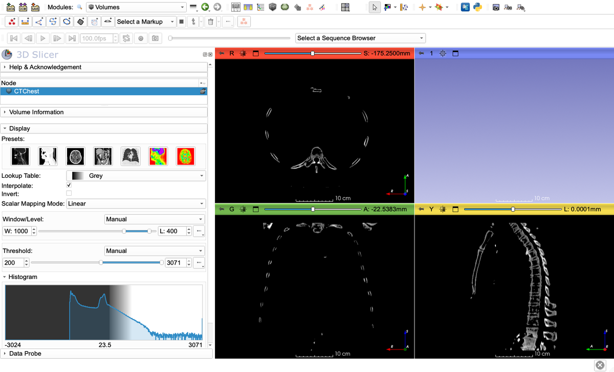

### 3. Show the volume rendering, driven by these settings

In the volume list at the top of the module, right-click the eye icon next to `CTChest`:

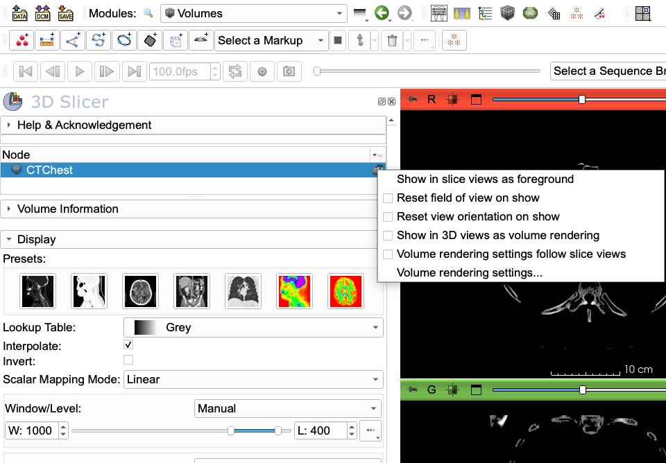

1. Check **Show in 3D views as volume rendering**. The volume appears in the 3D view, with a preset that Slicer picks for it.
2. Right-click the eye icon again and check **Volume rendering settings follow slice views**. The volume rendering now follows the settings of the Volumes module.

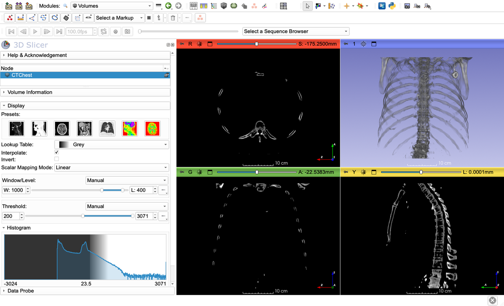

This is how the Volumes settings turn into the volume rendering:

- **Opacity** comes from the **threshold**. Intensities below the lower threshold are fully transparent. From the lower to the upper threshold, the opacity rises in a straight line (a *ramp*) from 0 to 1. Intensities above the upper threshold are transparent again. With **Threshold Off**, the ramp runs over the whole intensity range.
- **Color** comes from the **lookup table** and the **window**: each intensity gets the color it has in the slice views.

### 4. Adjust the ramp

The bone looks ghostly. The ramp runs from 200 all the way to 3071, so bone of 300–1000 HU, most of the skeleton, gets an opacity of only 3–28%. Set the upper threshold to **1000**, and the same bone becomes 13–100% opaque:

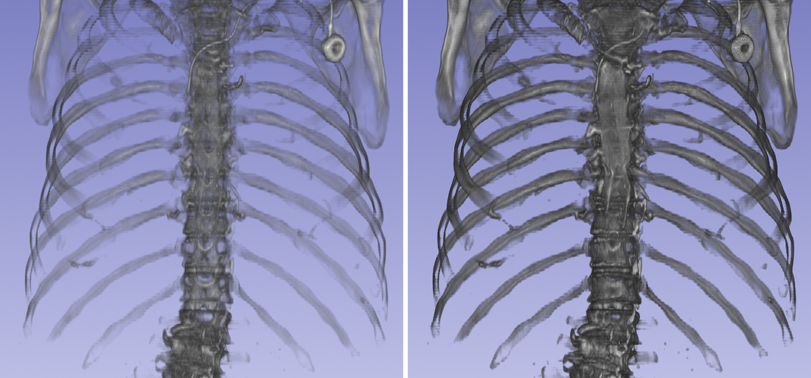

*Left: threshold 200–3071. Right: threshold 200–1000.*

Do not set the upper threshold below the tissue you want to see: everything above it becomes transparent. Use the histogram to find where the tail of the tissue ends. In this scan, 99% of the voxels above 200 are below 1074.

### 5. Change the colors

Change the **Lookup Table** to **Iron**. The volume rendering changes color too.

To see the transfer function that the Volumes module has made, open the **Volume Rendering** module and expand **Advanced… → Volume properties**. **Synchronize with Volumes module** is checked. The **Scalar Opacity Mapping** is the ramp from 200 to 1000, and the **Scalar Color Mapping** follows the Iron lookup table. (The **Preset** box above still shows the name of the preset that the rendering started with. It no longer applies.)

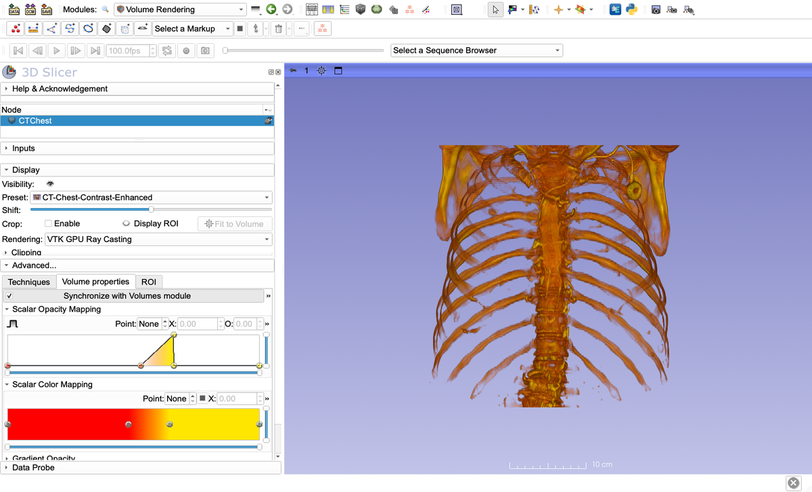

### 6. What one ramp cannot do

A ramp gives more opacity to higher intensities, and nothing else. Try to show the soft tissue as well: lower the threshold to −300, and the skin becomes an opaque shell that hides the skeleton:

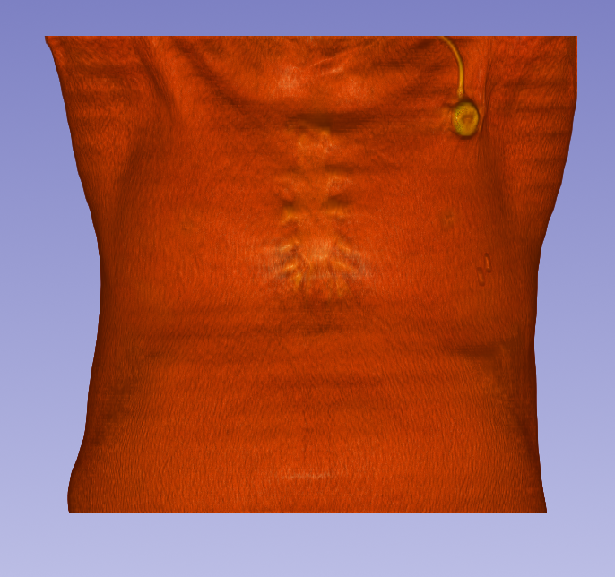

To see through soft tissue to the bone, soft tissue needs a *low* opacity and bone a *high* one, with a gap between them. That needs a transfer function with more than one ramp, which is what the Volume Rendering module is for.

## Part 2: The Volume Rendering module

Stay in the **Volume Rendering** module. Under **Advanced… → Volume properties**, uncheck **Synchronize with Volumes module**. From now on, the volume rendering has its own transfer function, and changes in the Volumes module no longer affect it.

### 1. Start from a preset

Under **Display**, click **Preset** and choose **CT-Chest-Contrast-Enhanced**. Presets are ready-made transfer functions for common types of scans:

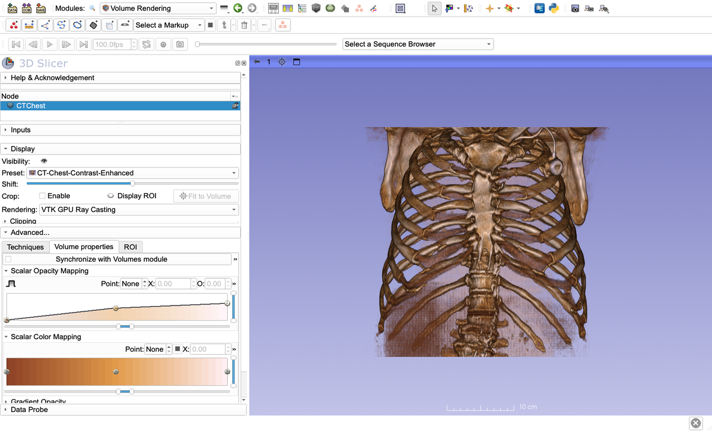

Its opacity rises gently over a wide range of intensities, and its colors go from dark brown (soft tissue) to ivory (dense bone). For microCT, the **uCT-Bone-8bit**, **uCT-Bone-16bit** and **uCT-Skull** presets are good starting points.

**Shift** moves all points of the transfer function to lower or higher intensities together. Use it when a preset is almost right for your scan, but the intensities of your scan are a bit different, as they often are between microCT scanners and settings. Here the preset is shifted by −250 (left: the skin appears) and by +250 (right: only the densest bone is left):

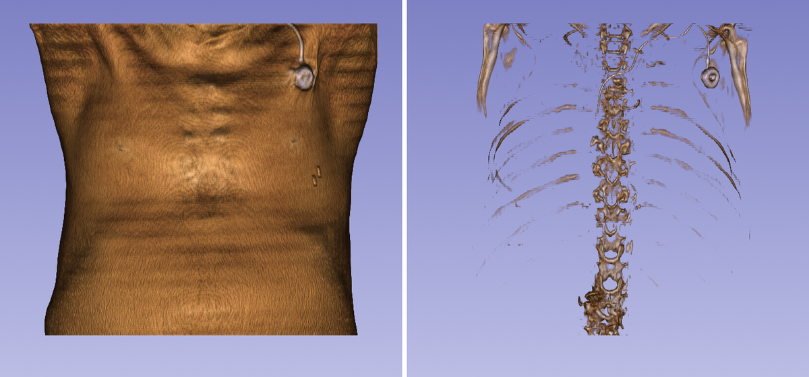

### 2. Design your own transfer function

Expand **Advanced… → Volume properties**. Each of the three curves can be edited:

- Click on an empty spot of a curve to add a point, and drag points to move them.
- For exact values, select a point with the **Point** box and type its intensity in **X** and its opacity in **O**.
- The slider below each curve zooms its intensity axis, so that you can work on the range you need.

Here we set the curves to show the soft tissue faintly and the bone solidly:

| Intensity (HU) | −3024 | −250 | −120 | 80 | 150 | 200 | 450 | 3071 |
|---|---|---|---|---|---|---|---|---|
| **Opacity** | 0 | 0 | 0.05 | 0.05 | 0 | 0.3 | 0.85 | 0.95 |

The **Scalar Color Mapping** goes from reddish brown for soft tissue (−120 to 80) to ivory for bone (600 and up).

Soft tissue with an opacity of only 0.05 is still a fog, because there is so much of it along every ray (left). The **Gradient Opacity** curve fixes this. The *gradient* is how fast the intensity changes at a voxel: small inside a uniform tissue, large at its boundary. Setting the gradient opacity to 0 for small gradients (up to 40) and 1 for large ones (from 150) makes the inside of tissues transparent and keeps their surfaces (right):

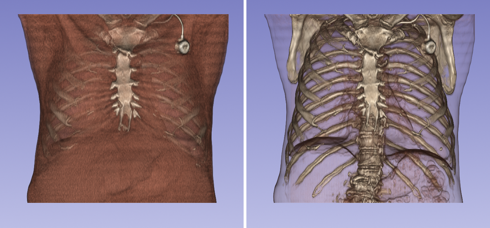

The three curves of the result:

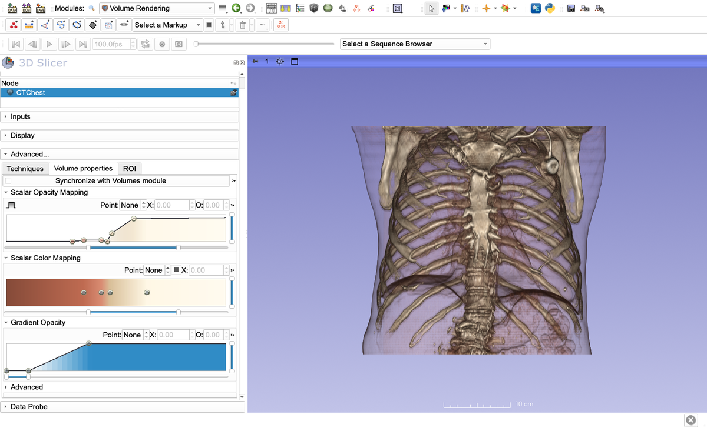

### 3. Crop

To look inside, cut part of the volume away. Under **Display**, check **Crop: Enable** and click the eye icon of **Display ROI**. Drag the handles of the box that appears; everything outside it is hidden. **Fit to Volume** resets the box. Here the front of the chest is cut away:

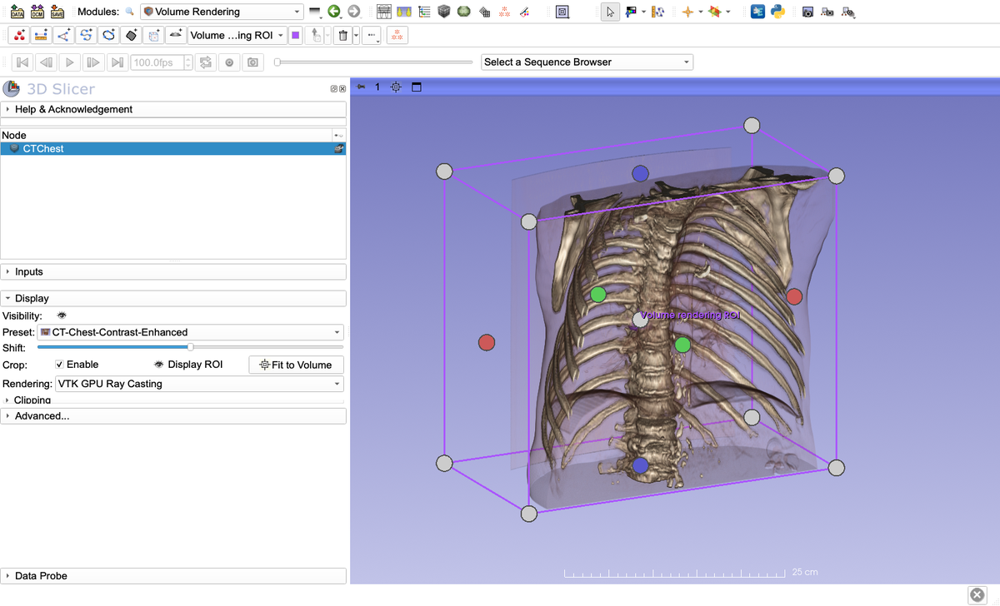

### 4. Rendering and quality

- **Rendering:** **VTK GPU Ray Casting** is much faster, and is the one to use if your computer has a graphics card. **VTK CPU Ray Casting** always works, including over remote connections without graphics acceleration, but it is slow.
- **Advanced… → Techniques:** **Quality** (**Adaptive** lowers the quality while you rotate the view, to keep it responsive; **Normal**; **Maximum**), the **GPU memory size** to use, and the **Technique**: **Composite With Shading** (the normal rendering), or **Maximum**/**Minimum Intensity Projection**.
- The graphics card limits the size of the volume that can be rendered: every dimension of the image must be smaller than the card's maximum 3D texture size, which is 2048 on some cards (particularly on Macs). See the [Slicer forum](https://discourse.slicer.org/t/what-spec-gpu-is-required-for-gpu-volumentric-rendering/1596) for details, and the [Volume Rendering documentation](https://slicer.readthedocs.io/en/latest/user_guide/modules/volumerendering.html) for all settings.

## Part 3: Save, reuse and share your transfer function

### 1. Save it

The transfer function is stored in a *volume property* node, shown under **Inputs → Property** in the Volume Rendering module (here still called `CT-Chest-Contrast-Enhanced`, after the preset it started from). Give it a name that says what it is for: open the **Property** list and choose **Rename current Volume Property**. We called it `CTChest_skin_bone`.

Choose **File → Save Data**. The volume property is saved as a `.vp.json` file, in Slicer's format for transfer functions. Uncheck the other rows if you only want to save the transfer function:

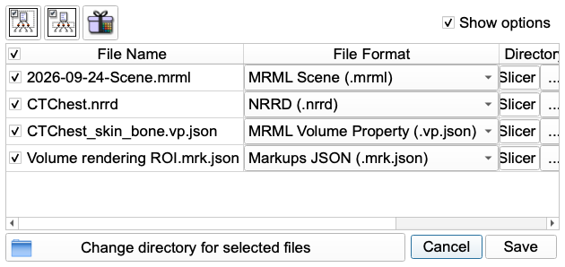

### 2. Reuse it

Drag the `.vp.json` file into Slicer; it is loaded as a volume property. In the **Volume Rendering** module, select the volume, and under **Inputs**, choose the file's volume property as **Property**:

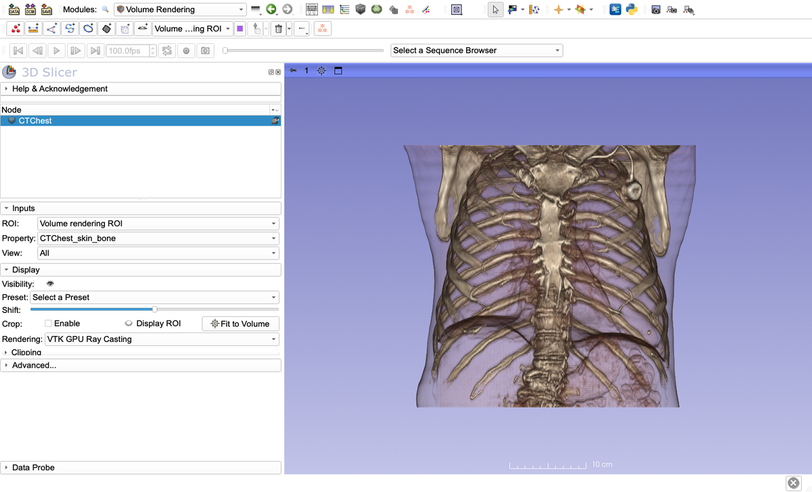

A transfer function works on another scan if its intensities mean the same thing. CT scans in Hounsfield units are calibrated, so a transfer function made for one usually fits the next. MicroCT scans usually are not (see Part 4); expect to adjust the transfer function with **Shift**. If two volumes use the same volume property, editing it changes both renderings.

### 3. Share it, and use presets made by others

The **VR Preset Hub** module (**Modules → SlicerMorph → Utilities → VR Preset Hub**) connects to a community gallery of transfer functions, the [SlicerMorph VPs catalog](https://github.com/SlicerMorph/VPs).

**Share.** On the **Share** tab, choose your volume property, give it a short name, a description and your GitHub name, and pick the 3D view to take the preview image from. **Submit preset to GitHub** opens a pre-filled GitHub issue in your browser; submitting it adds your transfer function to the gallery. You need a free GitHub account.

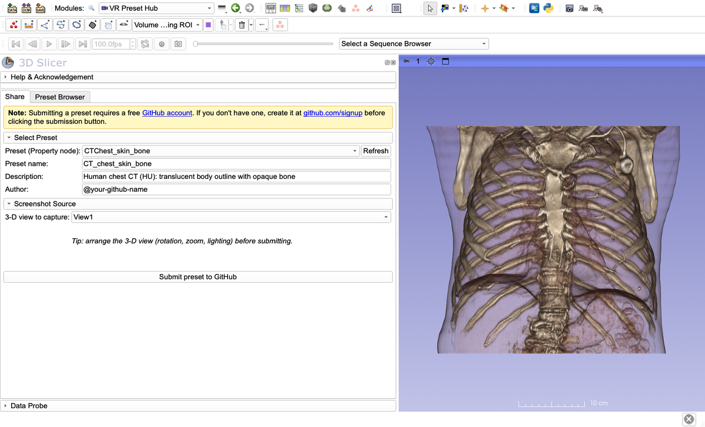

**Browse.** On the **Preset Browser** tab, click **Refresh Catalog**. Select a preset to see its preview and description. **Import into Scene** adds it as a volume property (choose it under **Inputs → Property**, as above), and **Apply to Active Volume** applies it to the current volume right away. **Revert to Original** undoes the last Apply.

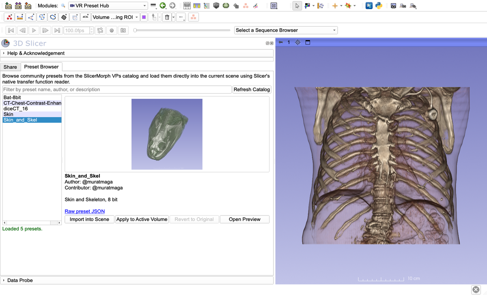

The presets in the gallery were made for particular kinds of scans; read the description. A preset for 8-bit microCT will not fit a CT scan in Hounsfield units without a large shift. See the [VR Preset Hub tutorial](../../VRPresetHub/README.md) for details.

## Part 4: MicroCT data: uncalibrated intensities and dynamic range

### Medical CT is calibrated, microCT usually is not

Medical CT scanners are calibrated to Hounsfield units: air is −1000 and water is 0 on every scanner, so each tissue has about the same intensity in every scan. That is why a preset such as **CT-Bone** works on any medical CT, and why the thresholds in Part 1 could be given as numbers.

MicroCT scans (from lab scanners, or synchrotrons) are usually not calibrated. The intensity of a voxel depends on the X-ray energy and filters, the detector, the reconstruction settings, the size of the specimen and how it was prepared (e.g. how strongly it was stained). The reconstructed values are then often rescaled when the scan is saved, for example to 8-bit, over a range that the operator chooses. The same bone can be, say, 90 in one scan and 200 in the next. So microCT presets cannot work everywhere the way **CT-Bone** does: the **uCT** presets, and the presets in the VR Preset Hub gallery, are starting points that you will usually need to shift and adjust for each scan.

### Dynamic range: what the scan allows

How well a transfer function can separate tissues also depends on the scan's *dynamic range*: how many different intensity levels it has, and which tissues those levels are spent on. CTChest has 3,252 different intensities. An 8-bit scan has at most 256, and how they are used was decided when it was saved. The histogram shows this at a glance.

To see it, load two 8-bit microCT scans from [MorphoDepot](https://github.com/MorphoDepot), a mouse skull (10 MB) and a contrast-stained mouse embryo (50 MB). Paste this into the Python console (**View → Python Console**):

```python
import SampleData
base = "https://js2.jetstream-cloud.org:8001/swift/v1/MorphoDepot-volumes/muratmaga/"
nodes = SampleData.downloadFromURL(
    uris=[base + "mus-musculus-skull/Mmusculus_skull.nrrd", base + "mus-musculus-E15/E15-Atlas.nrrd"],
    fileNames=["Mmusculus_skull.nrrd", "E15-Atlas.nrrd"],
    nodeNames=["MouseSkull", "E15"])
```

Show one volume rendering at a time: hide the CTChest rendering first (right-click its eye icon in the Volumes module and uncheck **Show in 3D views as volume rendering**). Then, for each scan, expand the histogram in the Volumes module, set a threshold, and turn on the volume rendering with **follow slice views**, as in Part 1.

**Mouse skull** ([MorphoDepot/mus-musculus-skull](https://github.com/MorphoDepot/mus-musculus-skull)), threshold 40–255:

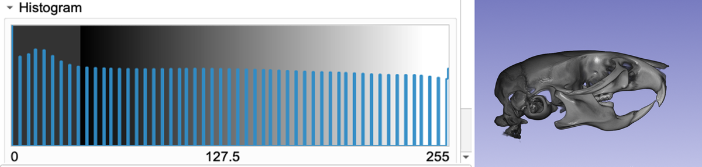

The histogram is a comb. Only 54 of the 256 levels are used, about 5 apart: the intensities were stretched from a narrower range when the image was saved. 90% of the voxels are exactly 0: everything below bone intensity was set to 0, so the scan contains nothing but bone. At the other end, the densest bone and the teeth were cut off at 255 and all have the same value. The ramp renders the skull well, but no transfer function can show soft tissue in this scan, the bone densities come in only about 50 steps, and the densest parts cannot be told apart.

**Mouse embryo** ([MorphoDepot/mus-musculus-E15](https://github.com/MorphoDepot/mus-musculus-E15)), stained with iodine so that soft tissues show up (diceCT), threshold 30–255:

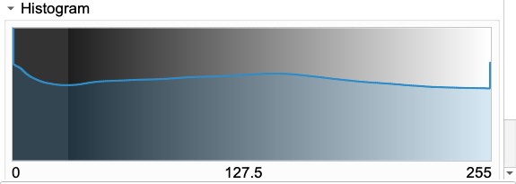

All 256 levels are used, but apart from the background at 0, the histogram is one broad hump without separate peaks: the tissues overlap in intensity. The same kind of ramp shows only the opaque surface of the embryo (left). Skin and internal organs have similar intensities, so a transfer function cannot make the skin transparent while keeping an organ of the same intensity opaque. Cropping the volume in half (Part 2) shows the organs (right); to show a single organ in 3D, segment it.

Two things flatten this histogram. First, with only 256 levels, tissues whose intensities differ only slightly end up in the same few levels. Saved as 16-bit, smaller tissues with a distinct intensity, such as the liver, would more likely show up as their own small peaks, and a transfer function could pick them out. Second, this embryo is not a real specimen. It is an atlas: a synthetic, average embryo, made by registering scans of several embryos to each other with ANTsPy and averaging them. Averaging smooths the intensities, and small misalignments between the embryos blur the boundaries between tissues, so its intensity distribution is not representative of a single real scan. Expect the histogram of a real diceCT scan to be noisier, but also to have more distinct features.

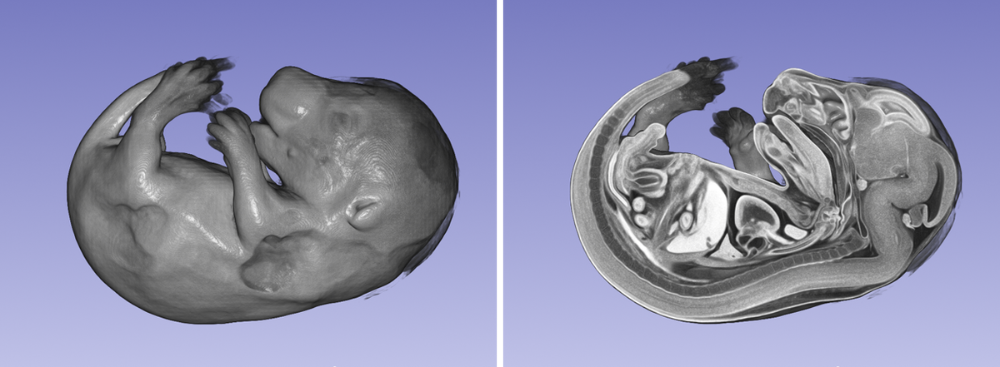

### What to take from this

- **Look at the histogram first.** Separate peaks: the tissues can be separated by a transfer function. A comb: few levels to work with. One broad hump: the tissues overlap, and a transfer function alone cannot separate them.
- **Expect to adjust every transfer function to every microCT scan**, starting from a preset or from your own saved one, with **Shift** and the curves.
- **Describe the data when you share a preset**: the type of scan, bit depth and staining (the description field of the VR Preset Hub), so that others know which scans it fits.
- **If you reconstruct the scans yourself**, save them as 16-bit images, or at least choose the saved range so that it includes all the tissues you want to show.

### Find more scans on MorphoDepot

Both scans come from [MorphoDepot](https://morphodepot.org), an open platform where 3D specimen scans (CT, microCT and other volumes) are shared together with their segmentations, each in its own GitHub repository (Maga et al., 2026). It is a good source of real microCT data for practicing volume rendering:

- **Browse the datasets** on the [RepoClerk dashboard](https://repoclerk.morphodepot.org), or in the [MorphoDepot GitHub organization](https://github.com/MorphoDepot). The two scans used here are in the [Mouse Anatomy Collection](https://github.com/MorphoDepot/collection-2716acfd).
- **Load them into Slicer** with the **MorphoDepot** extension (install it from the Extensions Manager). Its **Search** tab lists the repositories. See the [MorphoDepot tutorial](../../MorphoDepot) for how to open a scan with its segmentation, and how to contribute segmentations yourself.
- **Use the segmentations.** Where a transfer function cannot separate tissues, a segmentation can. The E15 repository comes with a segmentation of 50 organs and tissues; show a single organ in 3D by displaying its segment.
- **Compare with a 16-bit scan.** Most MorphoDepot scans are 8-bit. The diceCT scan of a cow eyeball ([MorphoDepot/bos-taurus-diceCT-eyeball-2026](https://github.com/MorphoDepot/bos-taurus-diceCT-eyeball-2026)) is a real, 16-bit specimen; look at how its histogram differs from the E15 atlas (it is a large download, 1.2 GB).

## Practice

The turtle CT from the [DICOM tutorial](../DICOM), with carapace, skull and soft tissue, is a good scan to practice on. Try to show the skull and the soft tissue at the same time.

## References

- Maga, A. M., et al. (2026). Forking anatomy: How MorphoDepot applies the open-source development model to 3D digital morphology. *Methods in Ecology and Evolution*. https://doi.org/10.1111/2041-210x.70342
