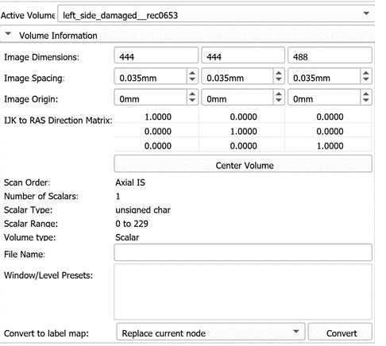
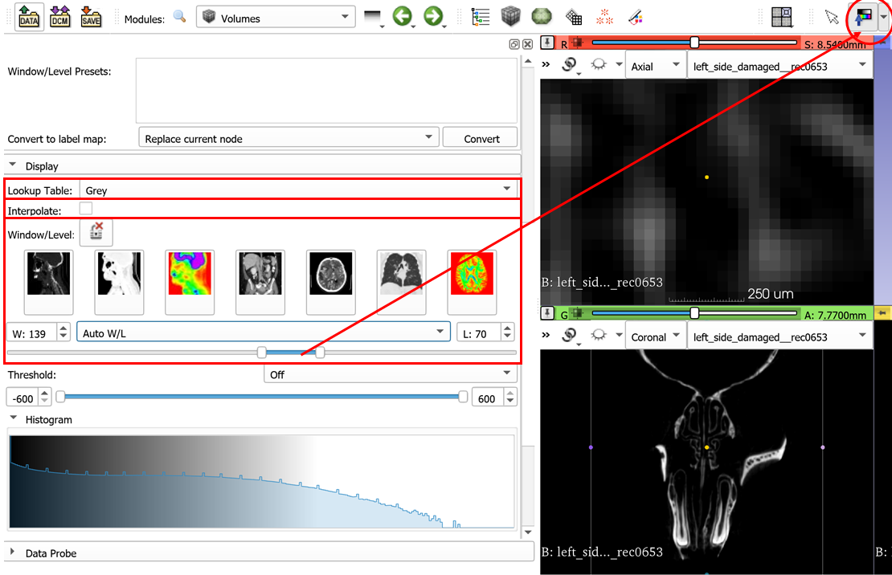
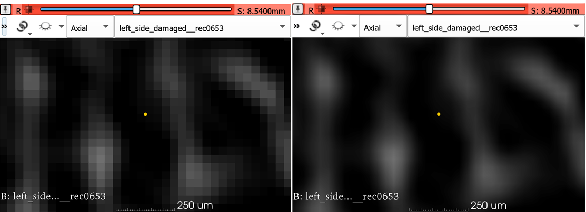

### Volumes

1. Follow the instructions from the `ImageStacks` tutorial to import the Bruker MicroCT sample data provided by SlicerMorph. 

2. Go to `Volumes` module and review the **Volume Information** section to see where volume dimensions, image spacing and data type are reported (along with image geometry ).

3. Next, go down to the **Display** section. This is where the lookup table (LUT) for volumes can be set. Greyscale is the default LUT for scalar volumes, but you can manually change this to more exotic LUTs. Contrasting LUTs such as  **Green** or  **Red** can be useful when you want to superimpose two volumes (e.g., a contrast-enhanced scan for soft-tissue, and a normal CT) and visualize the results.

4. Window/Level slider lets you adjust the contrast of the image. This does not impact the voxel values, simply changes the contrast. You can also use the topbar icon to adjust the W/L. Expand the dropdown for W/L related functionality (e.g., choose a specific region for better contrast)

5. Review the **Interpolation** option and note that voxel boundaries are blurred when interpolation is enabled, which is the default setting in Slicer. While this results in smoother looking images in slice views, you may want to disable the interpolation during manual segmentations, particularly if you need to follow voxel boundaries for your task. **Note:** Interpolation option has no effect on the 3D rendering of the volume, it only impacts the slice views.

