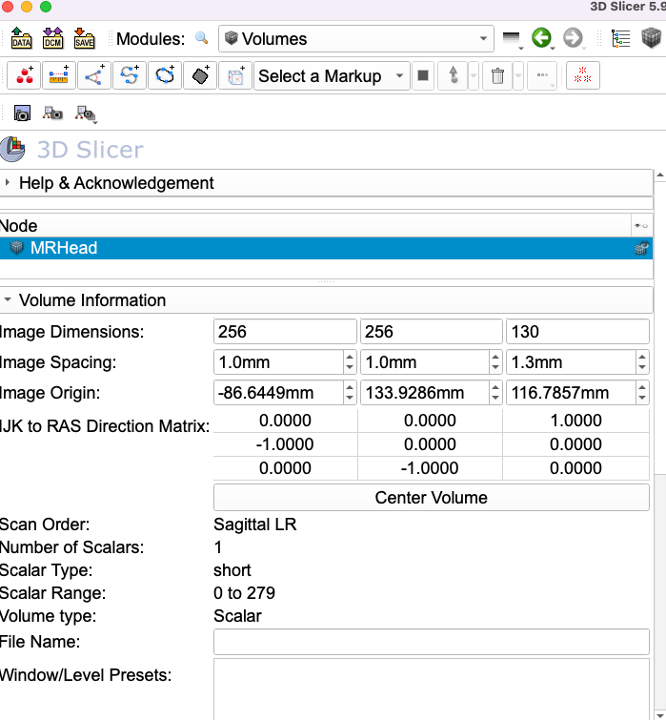
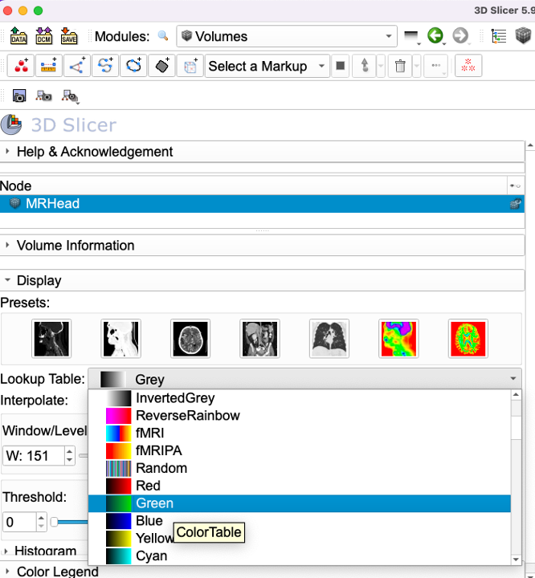
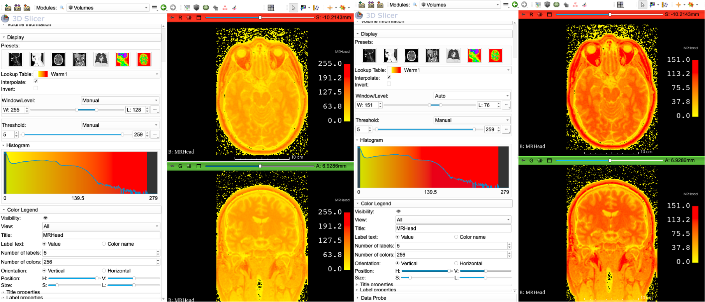

### Volumes

Official Slicer documentation about the `Volumes` module can be found at: https://slicer.readthedocs.io/en/latest/user_guide/modules/volumes.html. Here we will take a quick look at some of the important functionality provided by this module.

1. Download the MRHead dataset from the `Sample Data` module. 

2. Go to `Volumes` module and review the **Volume Information** section to see where volume dimensions, image spacing and data type are reported (along with image geometry ).

3. Next, go down to the **Display** section. This is where the lookup table (LUT) for volumes can be set. Greyscale is the default LUT for scalar volumes, but you can manually change this to more exotic LUTs. Contrasting LUTs such as  **Green** or  **Red** can be useful when you want to superimpose two volumes (e.g., a contrast-enhanced scan for soft-tissue, and a normal CT) and visualize the results. For this exercise we will use the **Warm1** LUT.

You can invert the order of colors in the existing LUT by checking the box next to `Invert` option. Inverting the LUT might be useful in image where the background is lighter color (e.g., histology slides or certain microscopy datasets).

Review the **Interpolation** option and note that sampling grid boundaries are blurred when interpolation is enabled, which is the default setting in Slicer. **Note:** Interpolation option has no effect on the 3D rendering of the volume, it only impacts the slice views.

4. **Window/Level** slider lets you adjust the brightness and contrast of the image and controls what intensity range will be mapped to the selected color table. **L:** sets the center value, while **W:** sets the width (i.e., range of displayed values). Changing L or W  do not impact the voxel values, simply changes the displayed contrast for better perception. You can also use the mouse modes icon (in the top toolbar) to adjust the W/L: Horizontal mouse movements adjust width, while vertical mouse movements adjust the level. You can also select a specific region in the slice views via the mouse, which then Slicer will use the values contained in that region to calculate the W/L. 

For more detailed explanation about why we need W/L adjustment for better perception, as well as how Slicer auto-calculates that range [see the relevant section in user manual.](https://slicer.readthedocs.io/en/latest/user_guide/user_interface.html#adjusting-image-window-level) 

5. **Threshold** allows the user to select the intensity regions that will be displayed in the slicer when that image set as foreground in slice views. By default full data range in the image is displayed. You can manually adjust that lower and upper bounds to be threshold. 

6. **Histogram** provides a visual output of these settings. The curve displays the frequency of intensity values in the data. Three values displayed at the horizontal indicates, minimum, mean and maximum values of the intensities. The color of the histogram comes from the chosen LUT and how it is mapped to the values in the dataset based on the W/L and threshold setting. If threshold is specified the color table will be cropped (e.g., see the dark areas on the left and right side in the screenshot below that indicates only values between 5 and 259 is being displayed, even though the full range of values are 0 to 279).
7. **Color Legend** allows you to control the visibility of the color legend along with its visual appeareance (size, number of colors etc). 

The screenshot below compares two W/L settings applied to the same dataset using the same color LUT and threshold settings. The left one use the width of 255 that is equally spaced out for the 255 values retained in the image after the threshold. The one on the right is the automatically calculated W/L setting. It maps the same intensity distribution by dividing the same color map to 151 values. A consequence of this is, voxels with intensity values of 151 and higher will have identical color (bright red). So we will not be able to distinguish those voxels visually. But as the histogram shows there are far more voxels that have intensity values of 151 and lower. So by compressing the color map to this region, the right image provides a better contrast between neighboring voxels with lower intensities (at the expense of not being able to distinguish fewer number of voxels with intensities higher than 151).  

