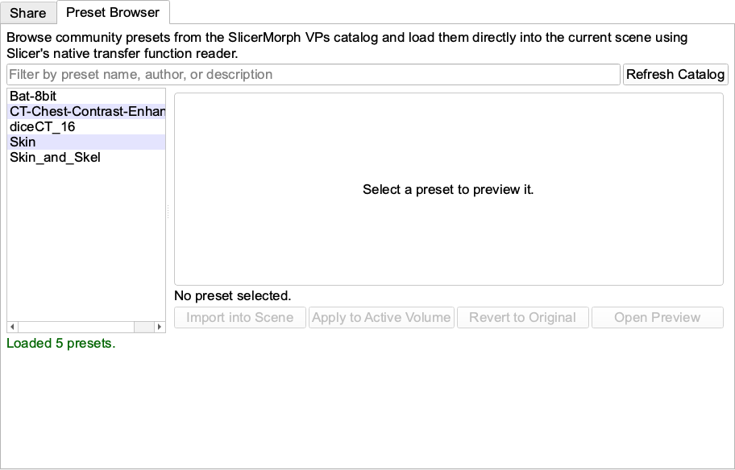
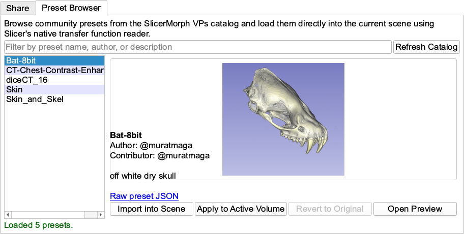
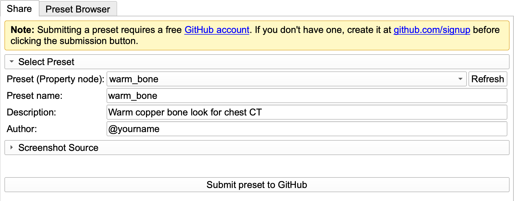
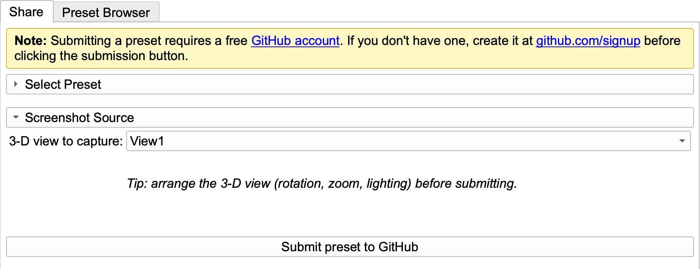

# VR Preset Hub

`VR Preset Hub` lets you share your volume-rendering (VR) presets with the SlicerMorph community and load community-contributed presets directly into your scene. Presets are stored in the [SlicerMorph/VPs](https://github.com/SlicerMorph/VPs) repository and exchanged as small `.vp.json` files (Slicer's native volume-property / transfer-function format) accompanied by a preview image.

The module has two tabs:

* **Preset Browser** — browse, preview, and load community presets.
* **Share** — package one of your own presets and submit it to the community catalog through a pre-filled GitHub issue.

> **Note:** Submitting a preset requires a free [GitHub account](https://github.com/signup). Browsing and loading presets does not.

In a couple of clicks you can restyle your own volume with a community preset — select a preset in the **Preset Browser** and click **Apply to Active Volume**:

*Before: your volume with its original rendering, with a community preset selected in the Preset Browser.*

*After: clicking **Apply to Active Volume** restyles your volume with the selected community preset.*

----

## Preset Browser

Use this tab to find a preset built by others and apply it to your own volume.

1. Open the `VR Preset Hub` module (`Modules` > `SlicerMorph` > `Utilities` > `VR Preset Hub`) and switch to the **Preset Browser** tab.
2. Click **Refresh Catalog** to fetch the latest list of presets from the SlicerMorph VPs repository.

3. (Optional) Type in the filter box to narrow the list by preset name, author, or description.
4. Click a preset in the list to see its preview image, author, contributor, description, and a link to the raw preset JSON.

5. Load the preset using one of the buttons:
   * **Import into Scene** — adds the preset to the scene as a volume-property node without changing any volume. Useful if you want to apply it yourself from the `Volume Rendering` module. (Double-clicking a preset in the list does the same thing.)
   * **Apply to Active Volume** — imports the preset and immediately applies it to the volume rendering of the currently *active* volume. The module creates default volume-rendering nodes if the volume does not have them yet, so make sure the volume you want is set as the active volume first.
   * **Revert to Original** — restores the volume-rendering property that was active before your most recent **Apply to Active Volume**. It is enabled only after an Apply, and reverts a single step.
   * **Open Preview** — opens the full-size preview image in your web browser.

----

## Share

Use this tab to contribute one of your own presets to the community catalog.

### Before you start
* Load a volume, enable volume rendering, and dial in a preset you like in the `Volume Rendering` module. The item you share is a `VolumeProperty` node, so give it a recognizable name in the Volume Rendering module's *Property* dropdown.
* Make sure you have a free [GitHub account](https://github.com/signup); you will need it for the final step.

### Steps
1. Open the `VR Preset Hub` module and switch to the **Share** tab.
2. Under **Select Preset**, choose your preset from the **Preset (Property node)** dropdown. If it is not listed (for example, you just created or renamed it), click **Refresh** to re-scan the scene.

3. **Preset name** auto-fills from the selected volume's name. Change it to something short and descriptive (for example `warm_bone`) rather than leaving a built-in preset name — this is the name everyone will see in the gallery, so give it some thought before submitting. Only letters, digits, `_`, and `-` are allowed.
4. (Optional) Add a one-line **Description**, and your name or GitHub `@username` as the **Author**, if you want to be acknowledged.
5. Under **Screenshot Source**, pick the 3-D view to capture for the preview thumbnail. Arrange the view (rotation, zoom, lighting) exactly the way you want it to appear in the gallery before continuing.

6. Click **Submit preset to GitHub**. The module will:
   * export your preset to a temporary `.vp.json` file and capture a square preview `.png`,
   * upload both files to cloud storage, and
   * open a **pre-filled GitHub issue** in your browser.
7. In the browser, simply click **Submit new issue** — the issue body is already filled in, so no editing is needed.
After a few minutes, your preset will be displayed in the [SlicerMorph/VPs gallery](https://github.com/SlicerMorph/VPs#readme).
