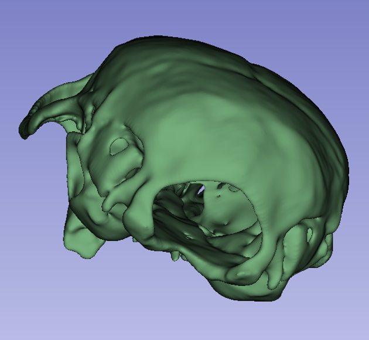
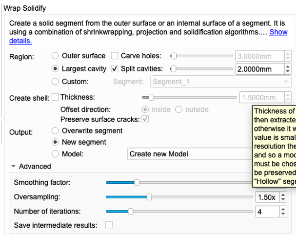
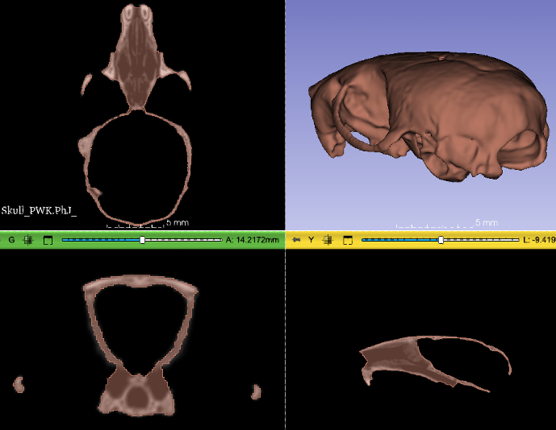
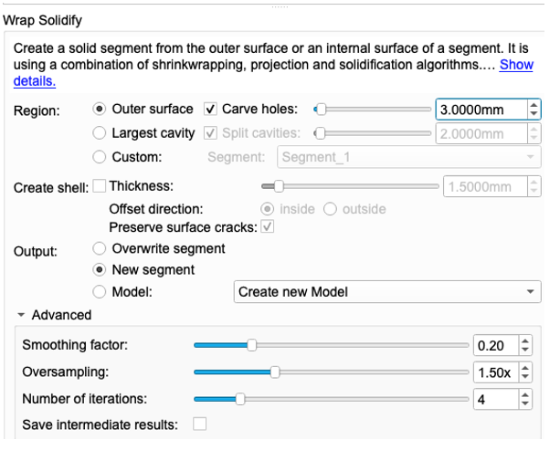
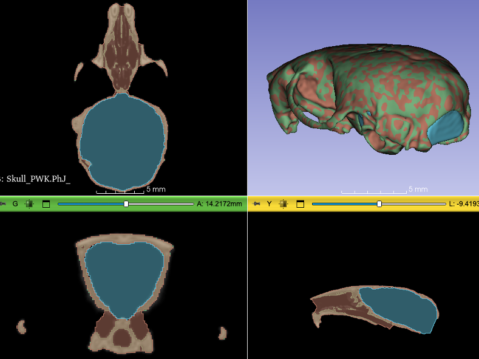
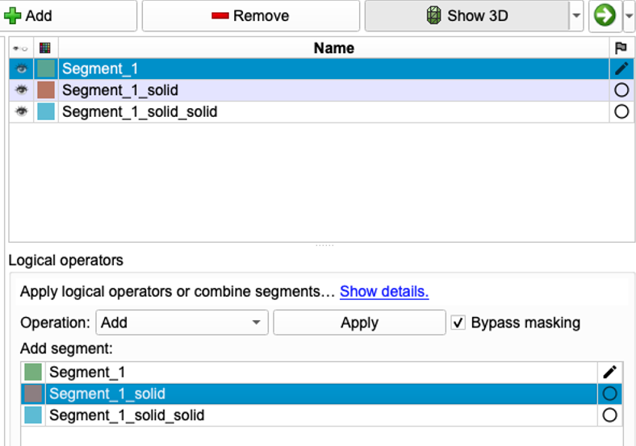
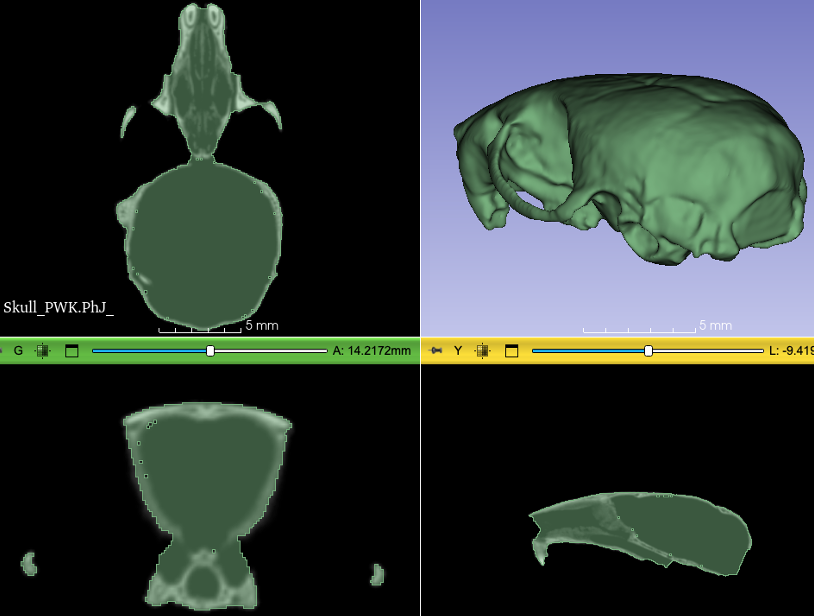

# Creating Watertight Models with SurfaceWrapSolidify

## Background
When converting segmentations into 3D models, sometimes is necessary to fill internal holes and create a **watertight** (or sometimes called solid) 3D model. This is typically necessary in 3D printing to avoid complex internal structure that may interfere with printing operation. But it is also sometimes necessary for shape analyses in situations like:

1. If internal voids are not filled, each surface will have an internal and external wall, which may confuse automated shape analysis. For example, if an automated shape analyses needs to move points along a surface normal (to project them) it may erroneously use the interal surface to project to. 

2. Certain geometric analysis requires 3D models to be **manifold**. For practical purposes, manifold in this context means each edge should be connected to exactly 2 polygons. Moreover, the model should not include any holes.

SurfaceWrapSolidy extension, which adds the WrapSurfaceSolidy effect to the `SegmentEditor` that makes this very easy through shrinkwrapping. For simple geometries like individual long bones, pelvis, hemi-mandibles the operation is often a single-click, and we refer the extension documentation: https://github.com/sebastianandress/Slicer-SurfaceWrapSolidify. However, skulls require special attention as it requires to use different options.

## Creating a Solid 3D models of a mammalian skull
In general, there are more than one hole in a skull. We need to fill not just the endocranial space, but nasal passages, choana and many other small holes. We will use a low-resolution mouse skull CT scan as an example.

First, obtain the necessary volume using the `ImportFromURL` module of the SlicerMorph, and paste this URL: https://github.com/SlicerMorph/SampleData/blob/master/A_J_.nrrd

Make sure that SurfaceWrapSolidify extension is installed. If not, go to the Extension Manager and install it. 

1. Start the segmentation procedure by creating an empty segment and initial segmentation of the skull using the threshold effect. Set the minimum threshold to 25 and the maximum to 255 and apply to create the segmentation.

2. Use the `Island` effect with the Keep Largest Island option to remove left over clusters. It is important that you have only one structure for the rest of the steps. 

3. Switch to the `Wrap Solidify` effect of Segment Editor. We will first fill the nasal cavity and the choana. Set these options: **Outer Surface**, Carve holes is **checked** and set to 3.0mm. Set the **Output** to option to New Segment. and hit apply (Figure 2).

4. At this point you should obtain a segmentation that looks roughly like this

5. Now we will fill the endocranial space. For this, set the option to **Largest Cavity** and make sure that Split Cavities is **checked** and set to 2.0mm. Keep the **Output** option as New Segment. Hit apply 

6. At this point, you should have a segmentation with three segments: One for the outline of the skull, second one for the nasal cavity, and the third the endocranial space. The remaining step is to merge all of these as a single segment from which we can create our "watertight" model. 

7. To merge the segments, we will use the `Logical Operators` effect, spefically the `Add` option. Click on the first segment (skull outline), then from the list of segments choose Segment_2 and hit Apply. Then choose Segment_3 and hit Apply. Your Segment_1 now should be just the green outline of the skull with interior spaces filled in (Figure 5)

8. Notice that in my screenshot, I have a few tiny holes left inside the endocranial space. To fill these holes, I will use the `Smoothing` effect witht the **Closing** option. For these small holes kernel size of 5x5x5 voxels will be sufficient. Hit apply. 

9. To export the watertight model, turn off the visibility of the other segments, then go to the Data module and right-click on the segmentation and choose "Export Visible Segments as Models". 

These parameters work for mouse sized skulls. If you are working with larger (or smaller) organisms, you will need to adjust the specific parameters for carving holes and splitting cavities accordingly. 

Also, when you are confident with the parameter selection, you can change the **Output** from New segment to Overwrite segment. That way you can get rid off the the `Logical Operations` step to add all segments into one. However, during experimentation it is better to keep output in different segments so that you can compare outcomes. 