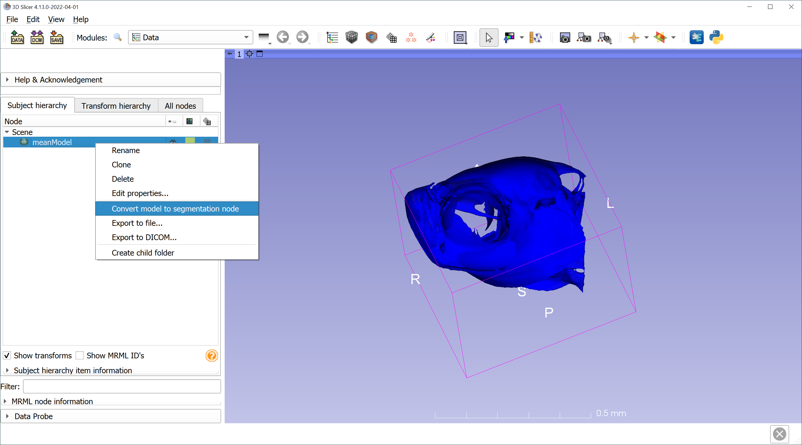
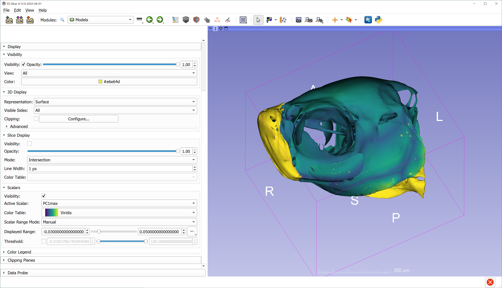

# How to create heatmaps on models using R and 3D Slicer
This tutorial steps you through how to create models and heatmaps in Slicer that show the difference between the mean shape and shapes at an extreme of a principal component axis from a PCA. If you've analyzed your data in R, we've also included how to create the models in R, but all steps of this process can be done in Slicer!

Things you will need to be able to do this on your own dataset: 
  - full landmark dataset
  - a reference model - this can be an average image or just a single model from your dataset
    - Depending on your computer and the size of your model, you may need to decimate your model (make it smaller), which you can do in the `Surface Toolbox` module in 3D Slicer.
  - Landmarks for your reference model

-----
### Creating models using the GPA module in Slicer
If you create your models using the `GPA` module you do not need to use R.

Run the `GPA` module on your set of landmark points. Then load in your 3D reference model to visualize your analysis. See the `GPA tutorials` pages for more information about how to use the GPA module. 

In the visualization tab of the `GPA` modue, warp your 3D referene model to the maximum deformation of your PC axis of interest. Then go to the `Data` module and right click the TPS deformed model and export is as PLY. Repeat for the minimum deformation for your PC axis of interest. 

-----
### Creating models in R 
1. Load your libraries and dataset into R. I am using the parser function from the `SlicerMorphR` package to load in my dataset called *log*.

```
library(SlicerMorphR)
library(geomorph)
library(Morpho)
library(Rvcg)
  
log = parser("./2022-06-10_10_28_41/analysis.log")
```
2. Run our GPA and PCA using the `geomorph` package

```
gpa = gpagen(log$LM) 
pca = gm.prcomp(gpa$coords)
```
3. Load in reference model and define the mean shape from gpa analysis

```
ref_model = vcgImport("./skull.ply") 
ref_LMs = read.markups.fcsv("./skull.fcsv")
mean_shape = mshape(gpa$coords)
```
4. Create and save the mean shape model
```
mean_model = tps3d(x=ref_model, refmat = ref_LMs, tarmat = mean_shape, threads = 10)
open3d()
shade3d(mean_model, col='blue', alpha=.8)
writePLY('./meanModel.ply')
```
5. Use the same calls to make a model of the mouse at the extreme positive end of PC1 using the shapes from our PCA. The difference here is the reference model (x) is now the mean model we created in the previous step, and the target matrix is the max PC1 matrix from our PCA. 
```
PC1_max = tps3d(x=mean_model,
                refmat = mean_shape,
                tarmat = pca$shapes$shapes.comp2$max,
                threads=10)
open3d()
shade3d(PC1_max, col='blue', alpha=.8)
writePLY('./PC1max.ply')
```

### Creating heatmaps in Slicer
1. Load the mean shape model(meanModel in this example) into Slicer. In the data module right click the model and select ‘convert model to segmentation node’. Go get a cup of coffee, this step takes a minute. 



2. Once the segmentation is created, right click it in the data module and select ‘export visible segments to binary label map’. This will serve as the volume file so that you can modify the segmentation you created in step 1.

3. Use the `Segment Editor` module to modify the segmentation in any way you would like. For example, maybe you want to use the scissors tool to cut off any areas of the segment where you don't have many points and therefore wish to exclude from the heatmap. In the image below you can see I've cut out the jaws of my fish skull (blue areas). Once you have the segmentation the way you want it, use the wrap solidify tool to create a solid model. Make sure only the solid segment is visible before going to the next step. 


4. Use the segmentations module to export a model using only visible segments (in advanced options). In the data module export everything to file so you don’t have to do steps 2-4 again!

5. Clear the scene, then load in the models for you mean shape, solid model, and PC extreme model. 

6. Open the python interactor and copy/paste this script into the interactor. This will also take a bit of time to run. I would suggest entering the functions first separately and then copying the remainder of the calls once you have defined the functions. 

```
def getDistanceArray(templateNode, currentMeshNode, signedDistanceOption):
  distanceFilter = vtk.vtkDistancePolyDataFilter()
  distanceFilter.SetInputData(0,templateNode.GetPolyData())
  distanceFilter.SetInputData(1,currentMeshNode.GetPolyData())
  distanceFilter.SetSignedDistance(signedDistanceOption)
  distanceFilter.Update()
  distanceMap = distanceFilter.GetOutput()
  outputNode=slicer.mrmlScene.AddNewNodeByClass("vtkMRMLModelNode","ouputDistanceMap")
  outputNode.SetAndObservePolyData(distanceMap)
  return outputNode
 
def applyMask(mask, distanceMapNode, arrayName):
  maskExtent = mask.GetPolyData()   
  pointsPolydata = distanceMapNode.GetPolyData()
  selectEnclosedPoints = vtk.vtkSelectEnclosedPoints()
  selectEnclosedPoints.SetInputData(pointsPolydata)
  selectEnclosedPoints.SetSurfaceData(maskExtent)
  selectEnclosedPoints.Update()
  # generate array clipped by mask
  distanceArray = distanceMapNode.GetPolyData().GetPointData().GetArray('Distance')  
  maskedDistanceArray = vtk.vtkDoubleArray()
  maskedDistanceArray.SetNumberOfComponents(1)
  maskedDistanceArray.SetName(arrayName)  
  for i in range(distanceArray.GetNumberOfValues()): 
    if selectEnclosedPoints.IsInside(i):
      pointDistance = distanceArray.GetValue(i)
      maskedDistanceArray.InsertNextValue(pointDistance)
    else:
      maskedDistanceArray.InsertNextValue(100)
  distanceMapNode.GetPolyData().GetPointData().AddArray(maskedDistanceArray)
  
# get nodes frpm scene
maskNode=getNode('meanModel_solid')
fullTemplateNode=getNode('meanModel')
warpNode=getNode('PC1max')

# get dense distance map
distanceMapNode=getDistanceArray(fullTemplateNode, warpNode, True)

# mask distance array with model
# output stored in array of distanceMapNode
outputArrayName = warpNode.GetName()
applyMask(maskNode, distanceMapNode, outputArrayName)

```
7. Once the script runs successfully you will see a new model called 'outputDistanceMap', in the `Models` module select this model. Then scroll down in the scalars section of the module, check the visibility box, and take note of the *Displayed Range* values so that you can manually change them in the next step. 

8. Use the *Active Scalar* drop down menu to select the PC1max option (or whatever your second model was named). Then use the *Scalar Range Mode* drop down to select *manual* for the scalar range mode. Now update the *Displayed Range* values to whatever they were when you first opened the module in step 7. 



9.You can play with different color tables and dispaly ranges from here, but at this step you have your heat map sans areas where there are no landmark points. If you scroll down further in the models module you will see options for visualizing the color legen. Note that these distances are procrustes distances, not real world distances. 

