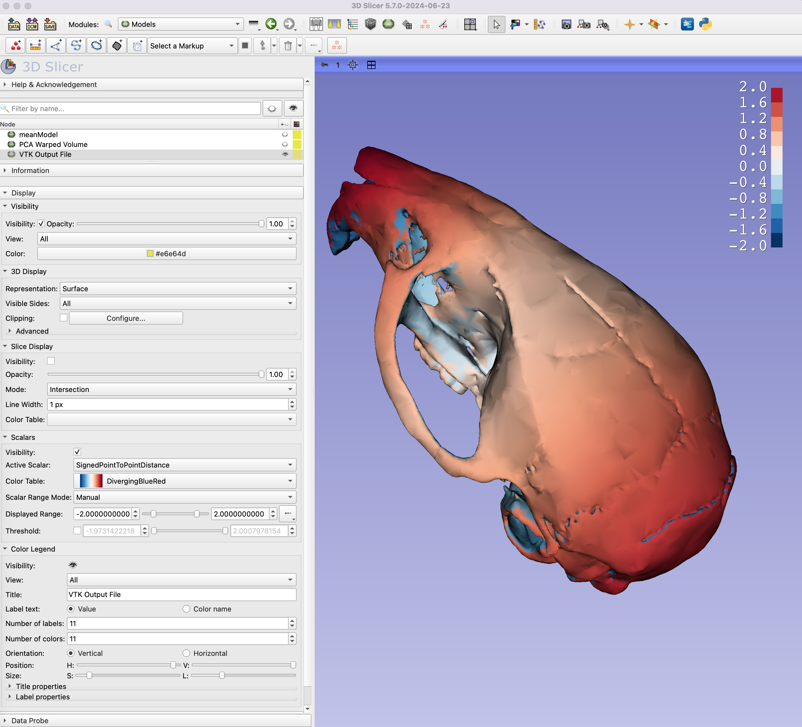

# How to visualize heatmaps of surface difference in 3D Slicer
This tutorial steps you through how to create models and heatmaps in Slicer that show the difference between the mean shape and shapes at an extreme of a principal component axis from a PCA. 

If you want to run the tutorial as written, you need to download (or git clone) the https://github.com/SlicerMorph/Mouse_Models repository. Or you can use your own data. If you choose to use your own dataset, these are the things you will need: 
  - full landmark dataset
  - a reference model - this can be an average image or just a single model from your dataset
    - Depending on your computer and the size of your model, you may need to decimate your model (make it smaller), which you can do in the `Surface Toolbox` module in 3D Slicer.
  - Landmarks for your reference model
  - Install the Model To Model Distance Extension from the extension catalogue
  
-----
## Creating PCA shape models using from the GPA module
Navigate to the GPA module, select all landmarks in the LM folder of the mouse_models repo you have downloaded. For heatmaps to have physical meaning, you need to execute your analysis with Boas coordinates option enabled. This will make sure that the scale of data is preserved during the PCA decomposition. If you leave the Boas coordinates option unchecked, then the heatmap values will be in the unitless procrustes distances. Set your output folder and other options as usual and execute the GPA + PCA. 

For input if you have selected all LMs as instructed, then GPA module will report as the FVB_NJ specimen as the sample closest to the consensus shape. We will use its 3D model (and its corresponding LM) as our reference model. For your own data, make sure you choose the sample reported to be closest to the mean shape.

Go to the `Interactive 3D Visualization` tab of GPA module and choose the 3D model visualization option. Navigate to the `FVB_NJ_.ply` file  and `FVJ_NJ_.fcsv` file as reference model and LM, respectively, and hit Apply. What this step would do is to transform the original FVB_NJ model in the mean shape model of the study. This mean shape model will provide the basis of heatmap visualization. Now slide the PC1 axis all the way to the +100 side. This will deform the mean model to the maximum of PC1. This would be the model we will calculate and visualize its difference from the mean model. We need to save these two models. To do that go to the `Data` module and:

1. Right-click on the `FVB_NJ_` 3D model object and choose "Export To File". In the popup window, set the filename to **meanModel.ply** and specify the output folder and export format (ply), and then hit export
2. Right-clik on the 'PCA Warped Volume' and and choose "Export To File". In the popup window, set the filename to **PC1_Max.ply**, specify the output folder, export format (ply), and **make sure that Apply Transforms option is checked (important!)** then hit export. 

Now, you have all the necessary ingredients to create distance heatmaps.

## Creating heatmaps in Slicer
1. Make sure you have installed the `Model to Model Distance` extension, and restarted your Slicer session for changes to take effect. 

2. Load both meanModel and PC1_Max models into your scene. 

3. Switch to the `Model to Model Distance` module.

4. Set **Source model** as PC1_Max, **Target model** as meanModel, and the **VTK Output File** as Create New Model. 

5. Set the Distance option to **Corresponding point to point** option, and then hit `Apply`.

6. Switch to the `Models` module. 

7. Turn off visibility of all models, but the newly created **VTK Output File**.

8. Expand the Scalars tab, and check Visibility, and set the Active Scalar to **Signed Point to Point Distance**.  

9. Expand the Color Legend tab, and turn the Visibility on. 

10. You can change the color table from the default Viridis to **Diverging Blue Red** for more striking colors. 

11. You can control the color bar values, by manipulating the Displayed Scalar Range (you have to switch from auto to manual) 

12. You can also control the number of values and how many colors they are to be mapped by manipulating the correspondign fields in the Color legend tab. If Boas coordinates was checked when the GPA/PCA was executed, units of these heatmaps are the same as original data (in this case millimeters). If not checked, then these values will be in procrustes distances

